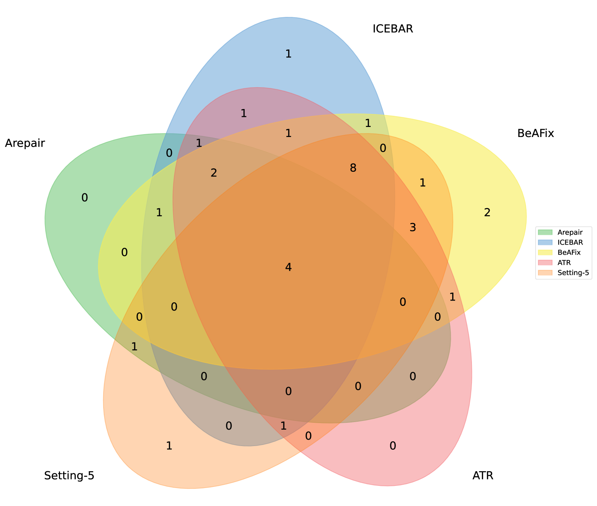
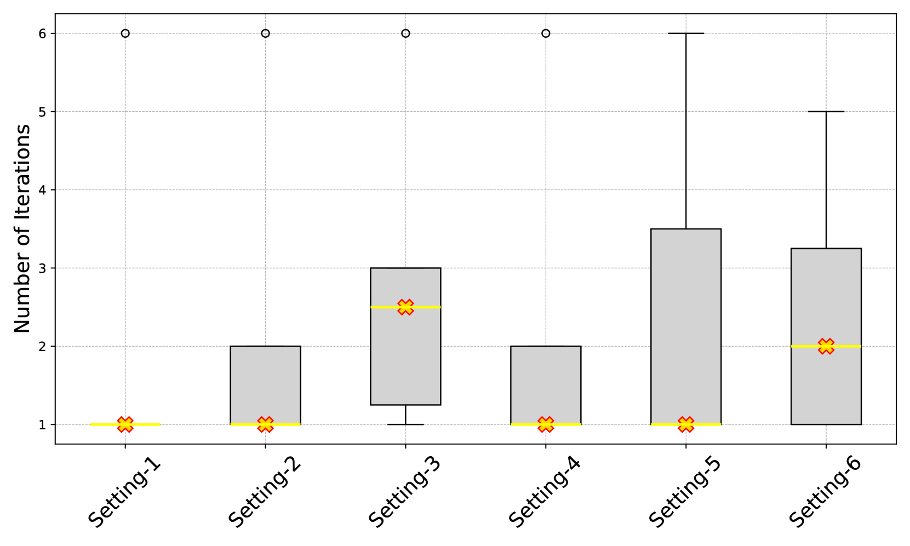
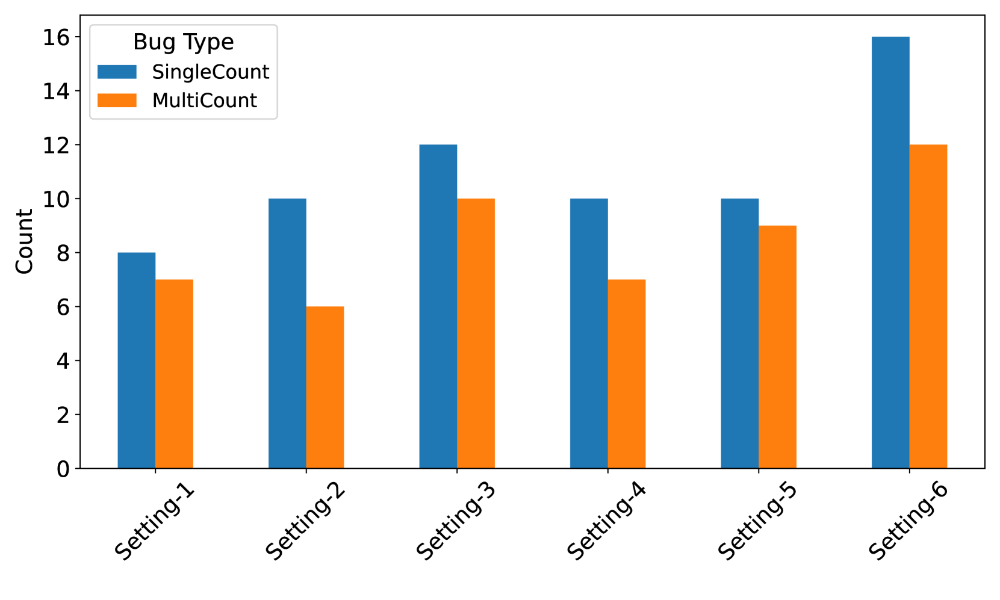
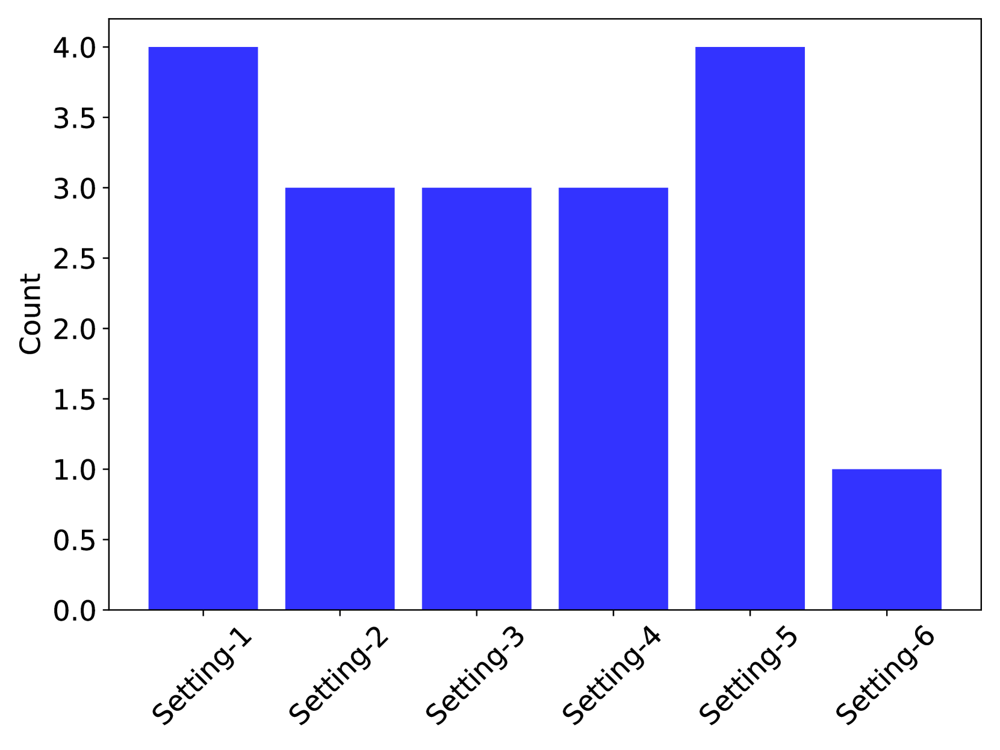
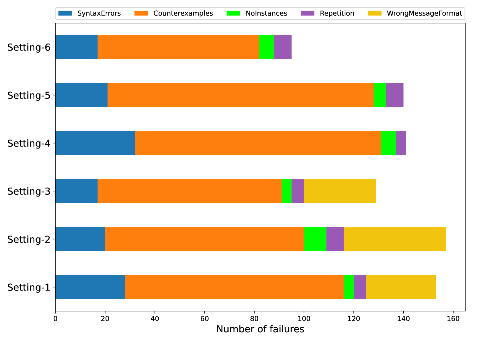
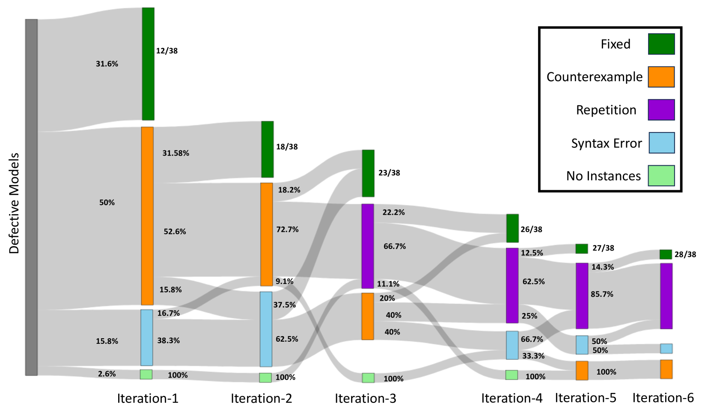
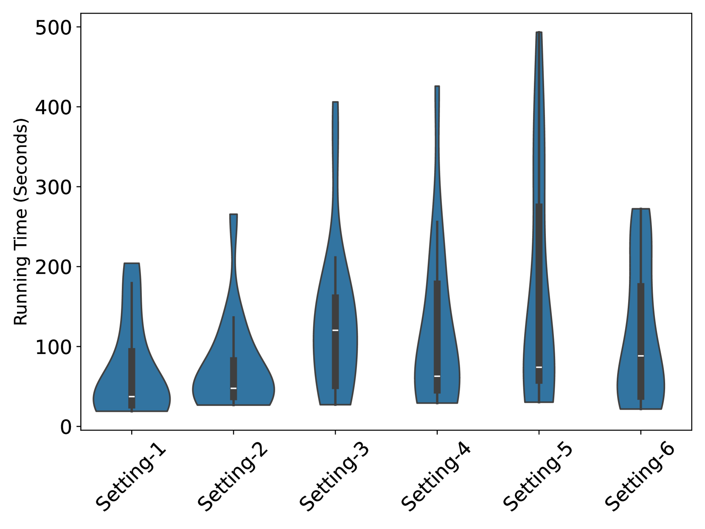
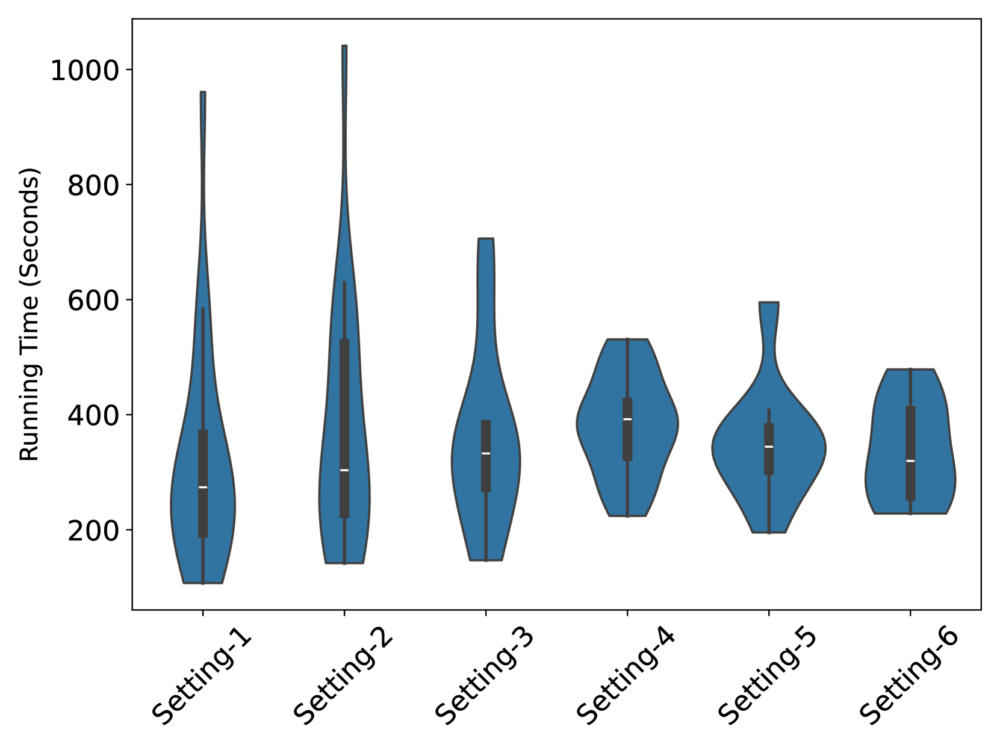
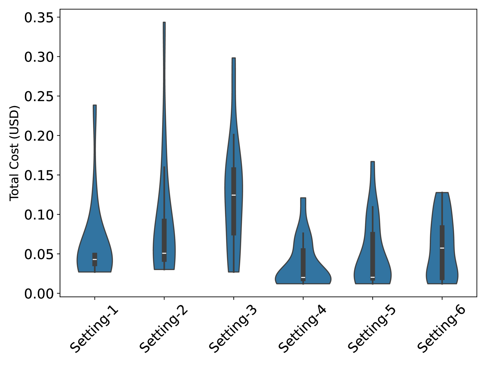
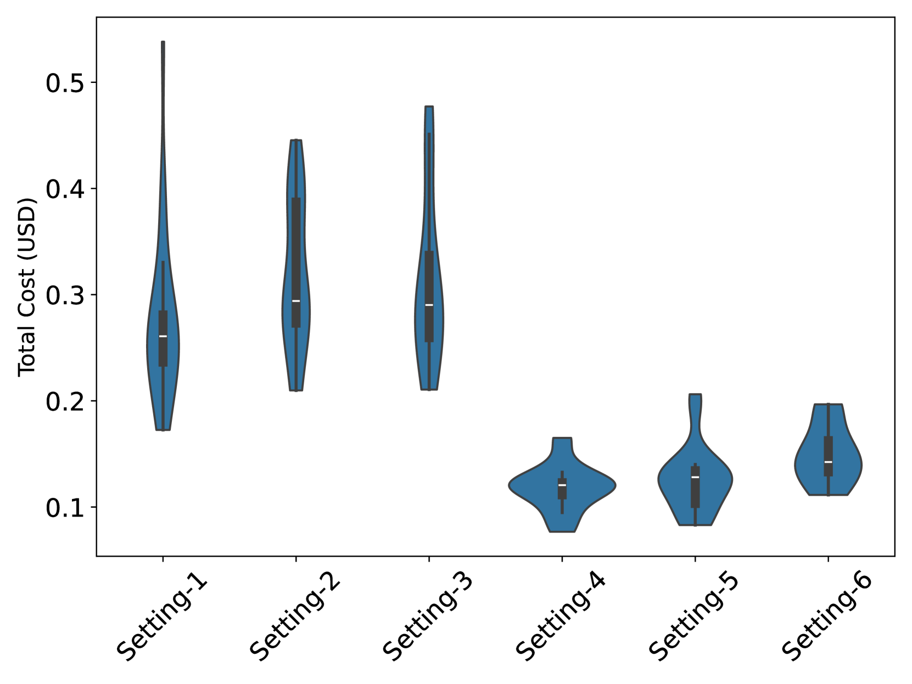

# 本文通过实证研究，评估了预训练的大型语言模型在修复声明式形式规范方面的有效性。

发布时间：2024年04月16日

`分类：Agent` `软件工程` `自动程序修复`

> An Empirical Evaluation of Pre-trained Large Language Models for Repairing Declarative Formal Specifications

# 摘要

> 自动程序修复（APR）因其致力于自动修正程序错误而成为一个备受关注的实用研究领域。当前的 APR 方法多集中于命令式编程语言如 C 和 Java，但对声明式软件规范语言的解决方案需求日益增长。本论文对大型语言模型（LLMs）在修复 Alloy 声明式规范中的能力进行了深入探讨，Alloy 是一种用于软件规范的正式语言。我们设计了一个创新的修复流程，融合了双代理 LLM 架构，包括一个修复代理和一个提示代理。经过广泛的实证评估，我们对比了基于 LLM 的修复方法与当前 Alloy APR 技术的优劣，评估基于一系列全面的基准测试。研究发现，尤其是 GPT-4 系列的 LLMs 在修复效率上超越了现有技术，尽管这会导致运行时间和令牌使用的小幅增加。本研究为自动修复声明式规范领域的发展做出了贡献，并突显了 LLMs 在此领域的光明前景。

> Automatic Program Repair (APR) has garnered significant attention as a practical research domain focused on automatically fixing bugs in programs. While existing APR techniques primarily target imperative programming languages like C and Java, there is a growing need for effective solutions applicable to declarative software specification languages. This paper presents a systematic investigation into the capacity of Large Language Models (LLMs) for repairing declarative specifications in Alloy, a declarative formal language used for software specification. We propose a novel repair pipeline that integrates a dual-agent LLM framework, comprising a Repair Agent and a Prompt Agent. Through extensive empirical evaluation, we compare the effectiveness of LLM-based repair with state-of-the-art Alloy APR techniques on a comprehensive set of benchmarks. Our study reveals that LLMs, particularly GPT-4 variants, outperform existing techniques in terms of repair efficacy, albeit with a marginal increase in runtime and token usage. This research contributes to advancing the field of automatic repair for declarative specifications and highlights the promising potential of LLMs in this domain.

[Arxiv](https://arxiv.org/abs/2404.11050)