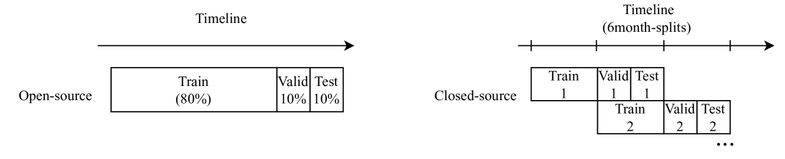
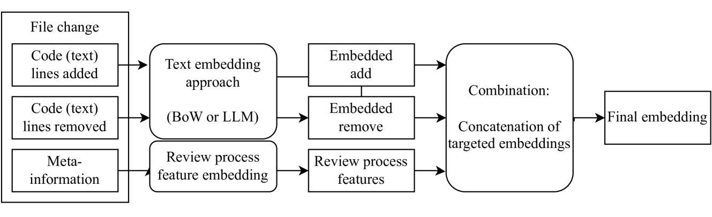

# 实际应用中对代码审查活动进行预测的经验性研究

发布时间：2024年04月16日

`Agent` `软件工程` `代码审查`

> An empirical study on code review activity prediction in practice

# 摘要

> 代码审查作为软件质量保障的关键一环，审查者面临着理解和评估代码更改的艰巨任务，以确保其质量并防止新错误出现。这个过程往往耗时且枯燥，所需的工作量取决于提交的代码本身以及作者与审查者的经验，通常审查反馈的等待时间在15到64小时之间。我们通过对29位专家的初步用户研究发现，在审查环境中重新排序变更的文件有助于提升审查质量：评论数量增加了23%，文件级热点的精确度和召回率也分别提升了13%和8%。因此，本文致力于通过预测补丁中哪些文件需要评论、修订，或是成为热点（即被评论或修订），来协助审查者。我们评估了两种文本嵌入技术（词袋模型和大型语言模型编码）以及审查过程中的特征（基于代码规模和历史的特征），在三个开源和两个工业数据集上的实证研究显示，结合代码嵌入和审查过程特征的方法，其效果优于现有技术。所有任务的F1分数（中位数为40-62%）均显著优于现有最佳方法（提升幅度从1%到9%）。

> During code reviews, an essential step in software quality assurance, reviewers have the difficult task of understanding and evaluating code changes to validate their quality and prevent introducing faults to the codebase. This is a tedious process where the effort needed is highly dependent on the code submitted, as well as the author's and the reviewer's experience, leading to median wait times for review feedback of 15-64 hours. Through an initial user study carried with 29 experts, we found that re-ordering the files changed by a patch within the review environment has potential to improve review quality, as more comments are written (+23%), and participants' file-level hot-spot precision and recall increases to 53% (+13%) and 28% (+8%), respectively, compared to the alphanumeric ordering. Hence, this paper aims to help code reviewers by predicting which files in a submitted patch need to be (1) commented, (2) revised, or (3) are hot-spots (commented or revised). To predict these tasks, we evaluate two different types of text embeddings (i.e., Bag-of-Words and Large Language Models encoding) and review process features (i.e., code size-based and history-based features). Our empirical study on three open-source and two industrial datasets shows that combining the code embedding and review process features leads to better results than the state-of-the-art approach. For all tasks, F1-scores (median of 40-62%) are significantly better than the state-of-the-art (from +1 to +9%).

[Arxiv](https://arxiv.org/abs/2404.10703)