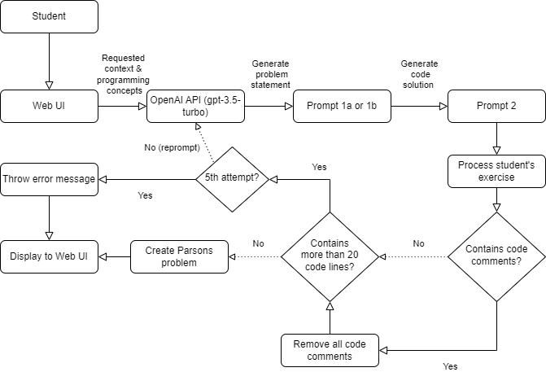
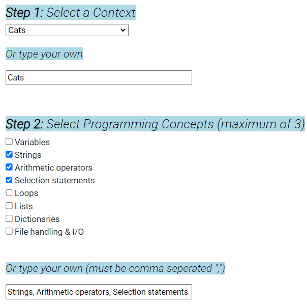
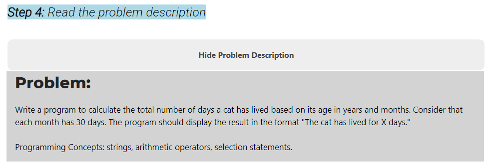
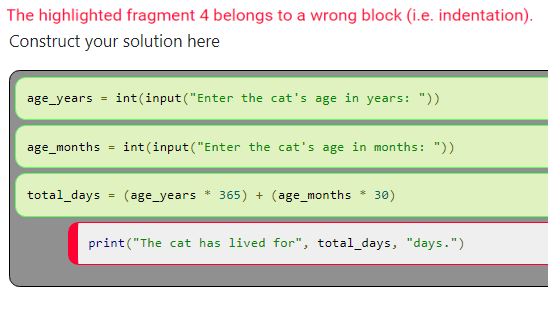

# 通过定制上下文和概念，实现个性化帕森斯问题的自动化解决方案。

发布时间：2024年04月16日

`LLM应用` `编程教育` `人工智能教育`

> Automating Personalized Parsons Problems with Customized Contexts and Concepts

# 摘要

> Parsons 问题帮助编程新手在学习编码时搭建了有效的学习框架。但是，创造出既高质量又能满足广泛兴趣的大量 Parsons 问题，对教师而言是个不小的挑战。大型语言模型（LLMs）或许能解决这一难题，它们允许学生根据个人兴趣，即时生成涵盖初级编程课程全范围的 Parsons 问题。本文介绍了 PuzzleMakerPy，这是一款利用 LLM 生成无限多上下文化的拖放编程练习的教育工具，这些问题以 Parsons 问题的形式出现，适合初级程序员作为辅助学习材料。我们在一门大型初级编程课程中部署了 PuzzleMakerPy 并进行了评估，发现个性化问题描述的上下文框架极大地吸引了学生，而且能够针对编程主题进行定制，对他们的学习非常有帮助。

> Parsons problems provide useful scaffolding for introductory programming students learning to write code. However, generating large numbers of high-quality Parsons problems that appeal to the diverse range of interests in a typical introductory course is a significant challenge for educators. Large language models (LLMs) may offer a solution, by allowing students to produce on-demand Parsons problems for topics covering the breadth of the introductory programming curriculum, and targeting thematic contexts that align with their personal interests. In this paper, we introduce PuzzleMakerPy, an educational tool that uses an LLM to generate unlimited contextualized drag-and-drop programming exercises in the form of Parsons Problems, which introductory programmers can use as a supplemental learning resource. We evaluated PuzzleMakerPy by deploying it in a large introductory programming course, and found that the ability to personalize the contextual framing used in problem descriptions was highly engaging for students, and being able to customize the programming topics was reported as being useful for their learning.

[Arxiv](https://arxiv.org/abs/2404.10990)