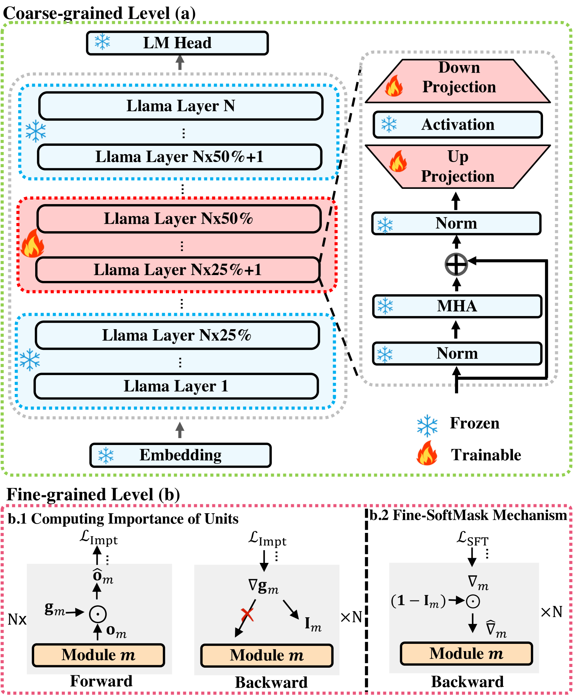
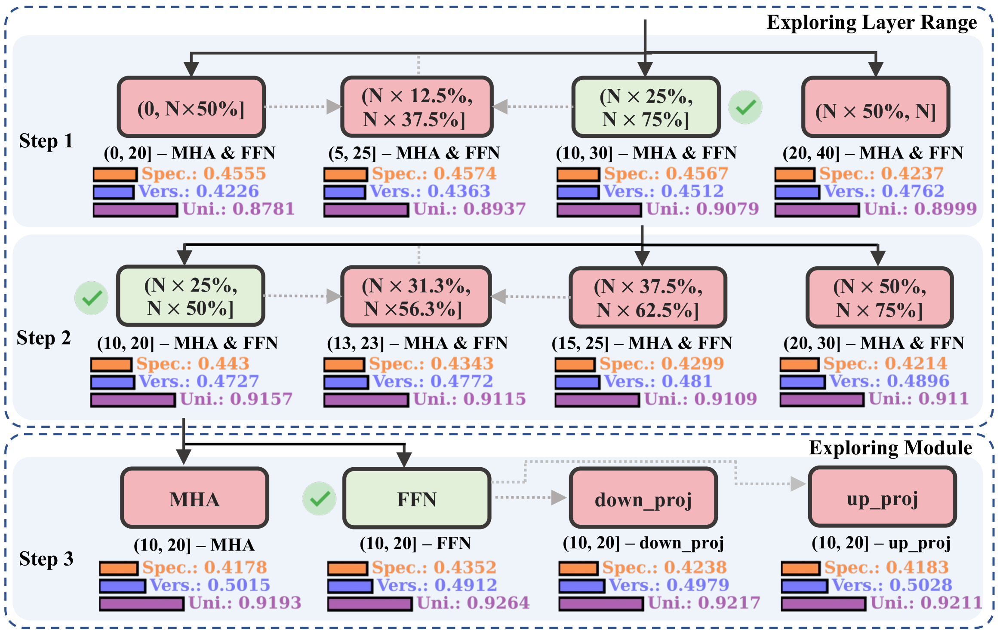
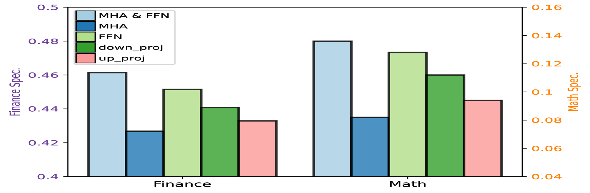
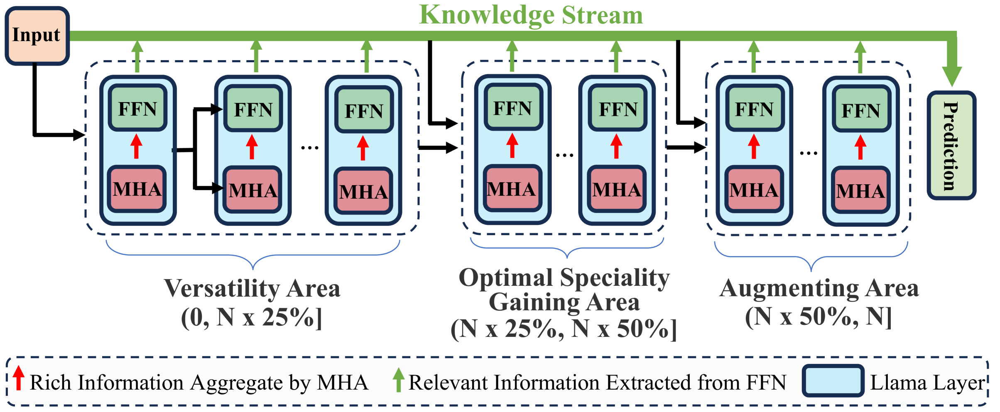
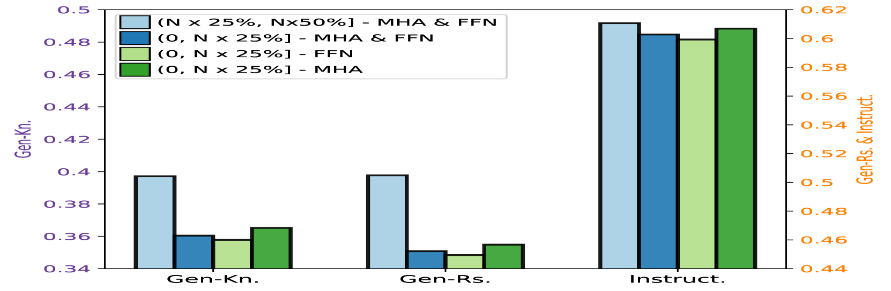
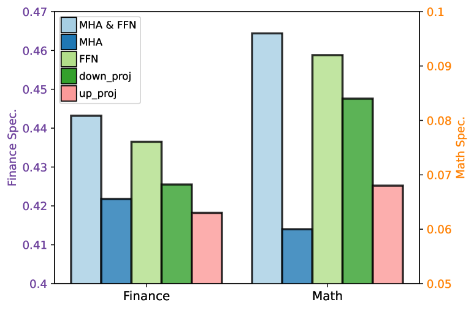
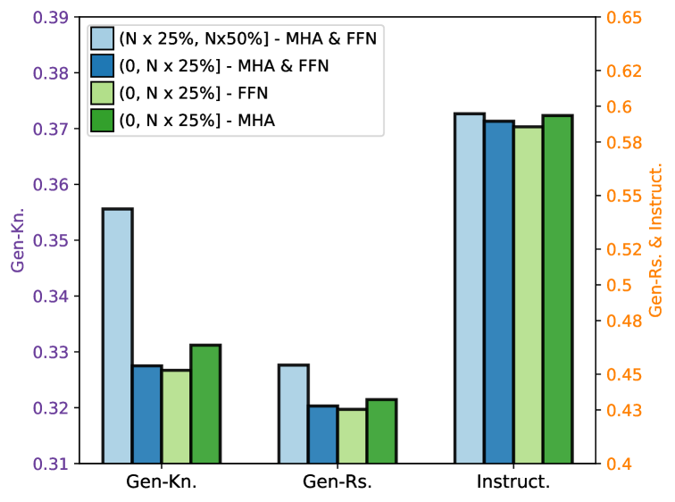
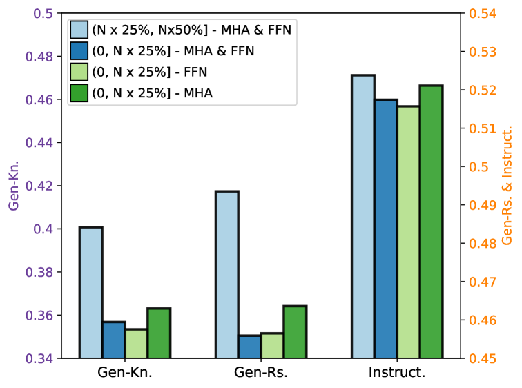
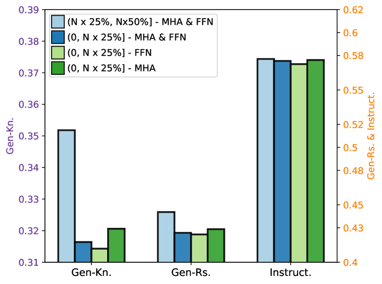

# 为了兼顾专业性与通用性，本文提出了一种由粗到细的监督微调框架，旨在优化大型语言模型的性能。

发布时间：2024年04月16日

`LLM理论` `多任务学习` `模型调整`

> Balancing Speciality and Versatility: a Coarse to Fine Framework for Supervised Fine-tuning Large Language Model

# 摘要

> 对齐的大型语言模型（LLMs）如同多面手，轻松应对各类实际任务。它们还应具备专业特长，在某项应用中表现卓越。但通常，为了提升专业性而进行的额外数据微调，会导致之前掌握的多功能性遭受灾难性遗忘（CF），影响模型在不同任务上的表现。为解决这一问题，我们引入了CoFiTune，一个由粗到细的调整框架，旨在平衡模型的专业性与多功能性。在粗层面，通过实证树搜索算法精准定位并更新对专业性能至关重要的模块，同时保持其他参数固定；在细层面，软遮罩机制控制对LLMs的调整，有效缓解CF问题，同时保持专业性不受损。综合评估显示，CoFiTune在各项任务和不同模型规模上均显著优于传统基线方法。与全参数微调相比，CoFiTune在13B规模的模型上实现了约14%的多功能性提升，且仅造成轻微的专业性损失。进一步分析还揭示了LLMs中的信息传递机制，为我们的方法的有效性提供了理论支持。相关代码已在 https://github.com/rattlesnakey/CoFiTune 上发布。

> Aligned Large Language Models (LLMs) showcase remarkable versatility, capable of handling diverse real-world tasks. Meanwhile, aligned LLMs are also expected to exhibit speciality, excelling in specific applications. However, fine-tuning with extra data, a common practice to gain speciality, often leads to catastrophic forgetting (CF) of previously acquired versatility, hindering the model's performance across diverse tasks. In response to this challenge, we propose CoFiTune, a coarse to fine framework in an attempt to strike the balance between speciality and versatility. At the coarse-grained level, an empirical tree-search algorithm is utilized to pinpoint and update specific modules that are crucial for speciality, while keeping other parameters frozen; at the fine-grained level, a soft-masking mechanism regulates the update to the LLMs, mitigating the CF issue without harming speciality. In an overall evaluation of both speciality and versatility, CoFiTune consistently outperforms baseline methods across diverse tasks and model scales. Compared to the full-parameter SFT, CoFiTune leads to about 14% versatility improvement and marginal speciality loss on a 13B model. Lastly, based on further analysis, we provide a speculative insight into the information forwarding process in LLMs, which helps explain the effectiveness of the proposed method. The code is available at https://github.com/rattlesnakey/CoFiTune.

[Arxiv](https://arxiv.org/abs/2404.10306)