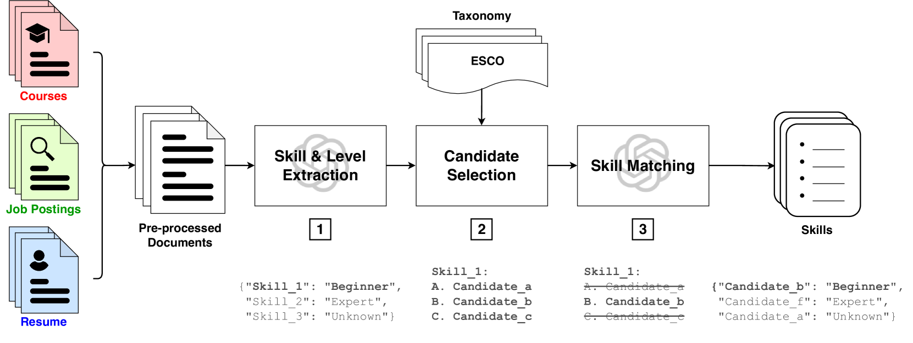
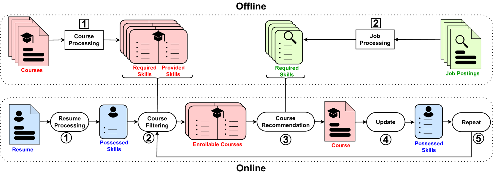

# 课程推荐系统在设计时必须顾及就业市场的需求。

发布时间：2024年04月16日

`分类：LLM应用` `教育技术` `就业市场分析`

> Course Recommender Systems Need to Consider the Job Market

# 摘要

> 现行的课程推荐系统多依赖于学习者与课程的互动、课程内容、个人偏好以及讲师、机构、评分和用户反馈等课程信息来做出推荐。但这些系统常忽视了就业市场技能需求的演变这一关键要素。本文着眼于学术界与业界合作的视角，致力于构建一个能够反映就业市场技能趋势的课程推荐系统。面对就业市场的迅猛变化和课程推荐系统研究的当前进展，我们提出了课程推荐系统应对这些变化所需的关键特性，包括可解释、有序、无需监督、与就业市场和用户目标相匹配。我们还探讨了实现这一目标所面临的挑战和研究问题，如从职位广告、课程描述和简历中无监督地提取技能，以及预测与学习者目标和就业市场相一致的推荐，并设计相应的评估指标。此外，我们介绍了一个初步系统，该系统利用大型语言模型（LLMs）进行技能提取，并通过强化学习（RL）与就业市场保持一致，以克服现有课程推荐系统的局限。我们利用开源数据进行了实证研究，展示了该系统的有效性。

> Current course recommender systems primarily leverage learner-course interactions, course content, learner preferences, and supplementary course details like instructor, institution, ratings, and reviews, to make their recommendation. However, these systems often overlook a critical aspect: the evolving skill demand of the job market. This paper focuses on the perspective of academic researchers, working in collaboration with the industry, aiming to develop a course recommender system that incorporates job market skill demands. In light of the job market's rapid changes and the current state of research in course recommender systems, we outline essential properties for course recommender systems to address these demands effectively, including explainable, sequential, unsupervised, and aligned with the job market and user's goals. Our discussion extends to the challenges and research questions this objective entails, including unsupervised skill extraction from job listings, course descriptions, and resumes, as well as predicting recommendations that align with learner objectives and the job market and designing metrics to evaluate this alignment. Furthermore, we introduce an initial system that addresses some existing limitations of course recommender systems using large Language Models (LLMs) for skill extraction and Reinforcement Learning (RL) for alignment with the job market. We provide empirical results using open-source data to demonstrate its effectiveness.

[Arxiv](https://arxiv.org/abs/2404.10876)