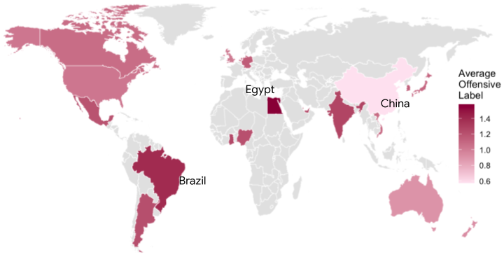
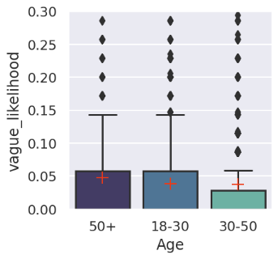
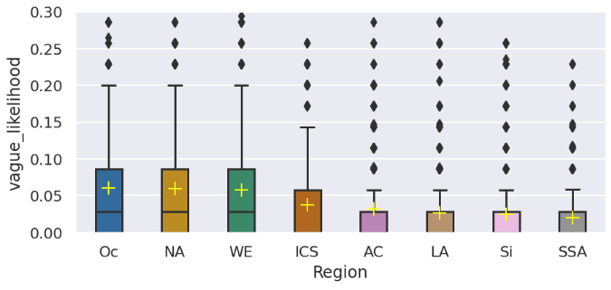
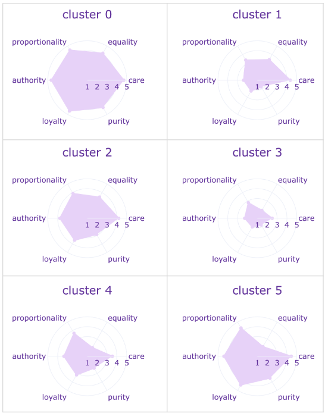
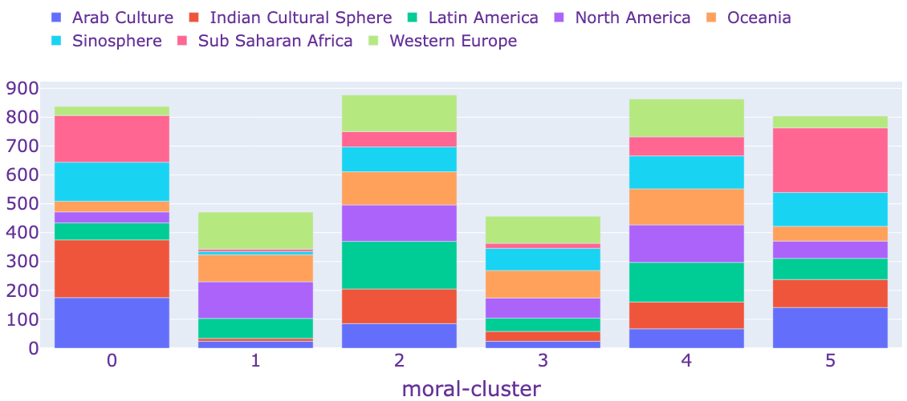
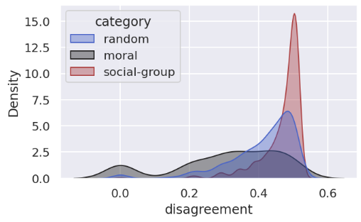
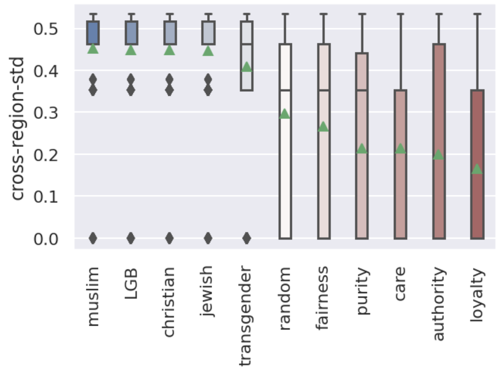
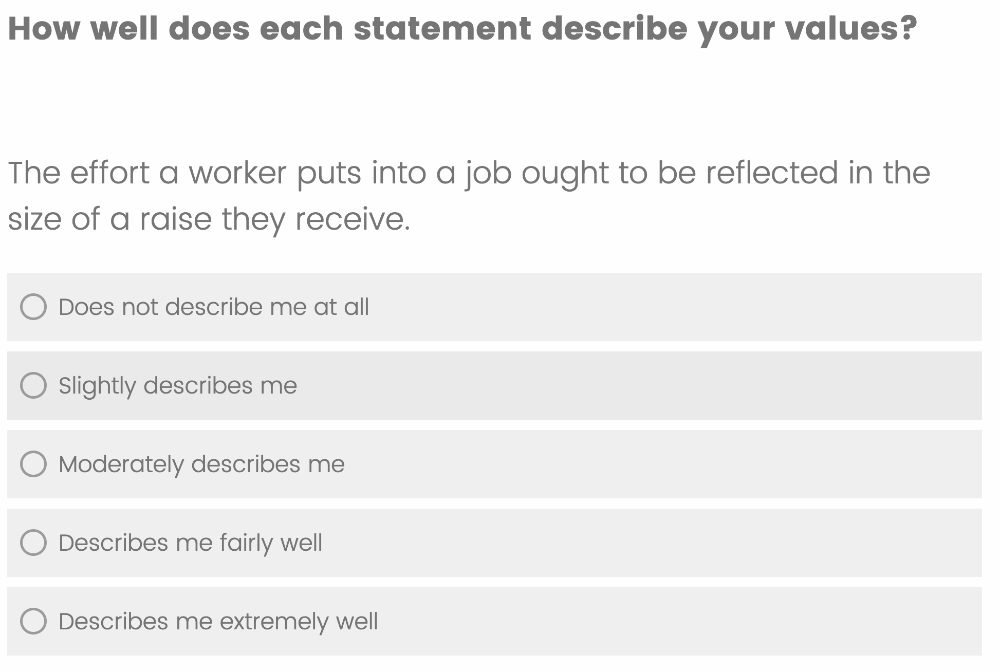
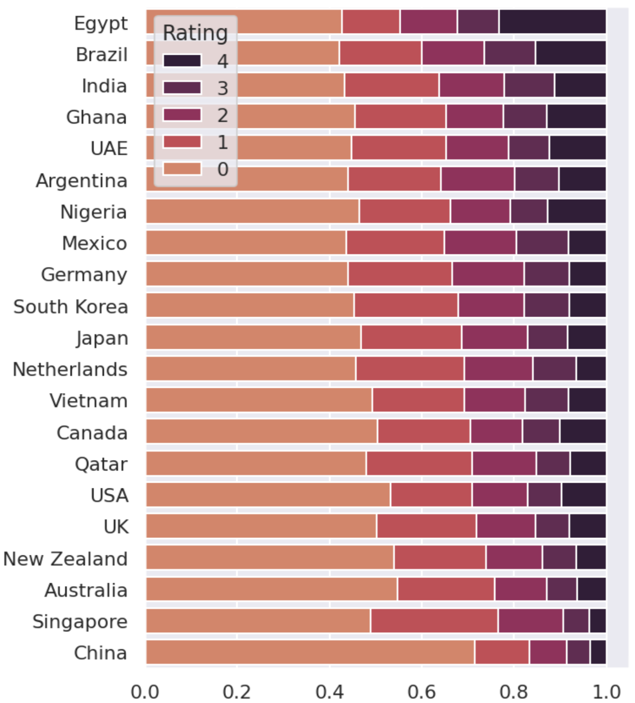
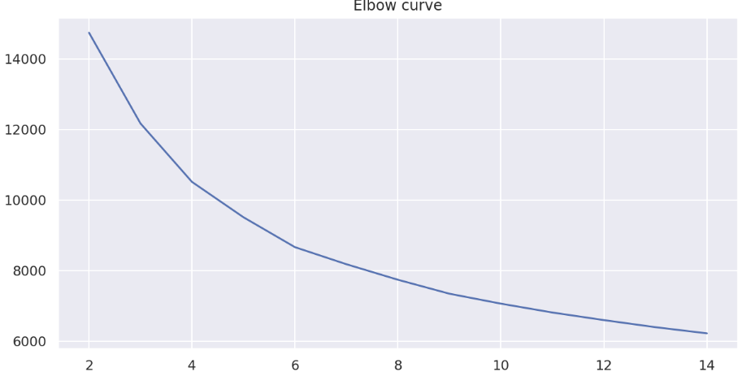

# D3CODE：揭示跨文化数据中关于冒犯性识别与评估的分歧。

发布时间：2024年04月16日

`分类：Agent

这篇论文讨论了在语言技术发展中，人工标注的重要性以及标注者的主观性问题。论文提出了一个大规模的跨文化平行标注数据集，旨在充分考虑不同社会文化群体的价值观多样性，以开发多元文化、文化敏感的NLP模型。这篇论文的研究重点在于构建和分析数据集，以及探讨如何利用这些数据集来改进NLP模型，因此可以归类为Agent。` `跨文化研究`

> D3CODE: Disentangling Disagreements in Data across Cultures on Offensiveness Detection and Evaluation

# 摘要

> 人工标注在语言技术发展中至关重要，但数据收集时标注者的主观性往往被忽略。近期西方背景下的研究开始关注这一问题，但多聚焦于年龄、性别或种族差异，忽略了同一人口统计群体内个体价值观的多样性及其对感知的影响。为了在NLP流程中充分考虑这些因素，我们需要构建包含不同社会文化群体广泛平行标注的数据集。本文提出了\dataset数据集，这是一个大规模的跨文化平行标注数据集，涵盖了超过4500句带有攻击性语言的句子，由来自21个国家、代表8个地理文化区域的4000多名标注者进行平衡性别和年龄的标注。该数据集记录了标注者基于六个道德基础的道德价值观：关怀、平等、比例性、权威、忠诚和纯洁。我们的研究揭示了标注者感知中的显著区域差异，这些差异受到个人道德价值观的影响，为开发多元文化、文化敏感的NLP模型提供了宝贵的见解。

> While human annotations play a crucial role in language technologies, annotator subjectivity has long been overlooked in data collection. Recent studies that have critically examined this issue are often situated in the Western context, and solely document differences across age, gender, or racial groups. As a result, NLP research on subjectivity have overlooked the fact that individuals within demographic groups may hold diverse values, which can influence their perceptions beyond their group norms. To effectively incorporate these considerations into NLP pipelines, we need datasets with extensive parallel annotations from various social and cultural groups. In this paper we introduce the \dataset dataset: a large-scale cross-cultural dataset of parallel annotations for offensive language in over 4.5K sentences annotated by a pool of over 4k annotators, balanced across gender and age, from across 21 countries, representing eight geo-cultural regions. The dataset contains annotators' moral values captured along six moral foundations: care, equality, proportionality, authority, loyalty, and purity. Our analyses reveal substantial regional variations in annotators' perceptions that are shaped by individual moral values, offering crucial insights for building pluralistic, culturally sensitive NLP models.

[Arxiv](https://arxiv.org/abs/2404.10857)