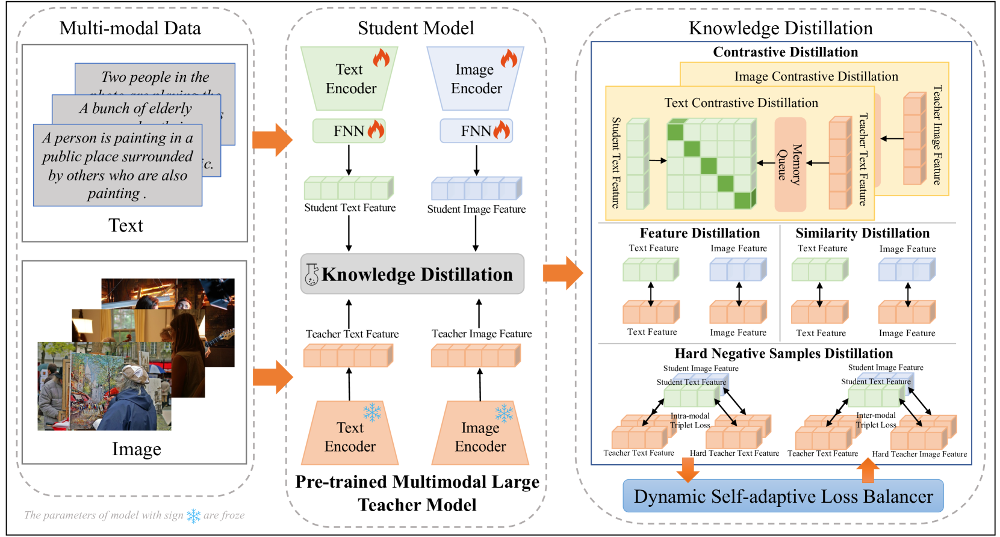
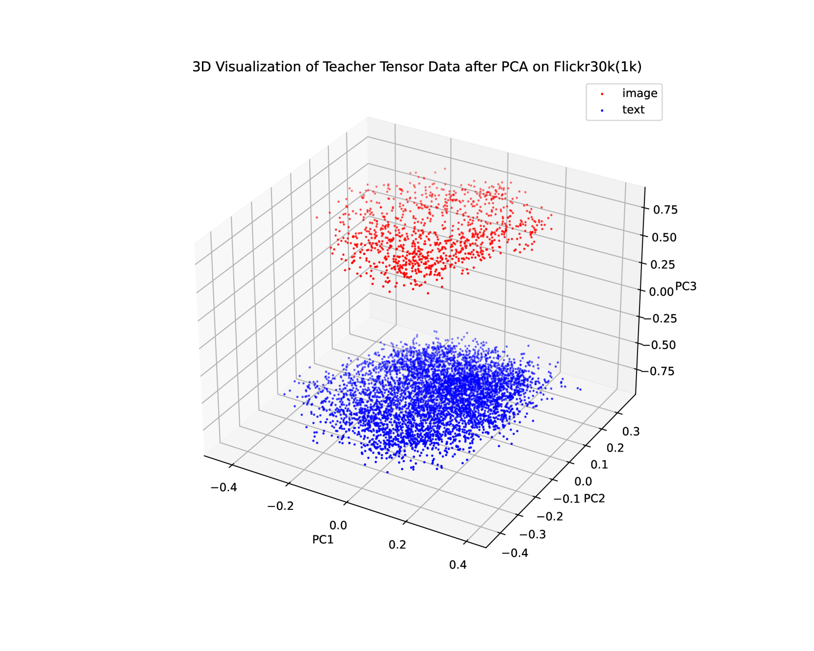
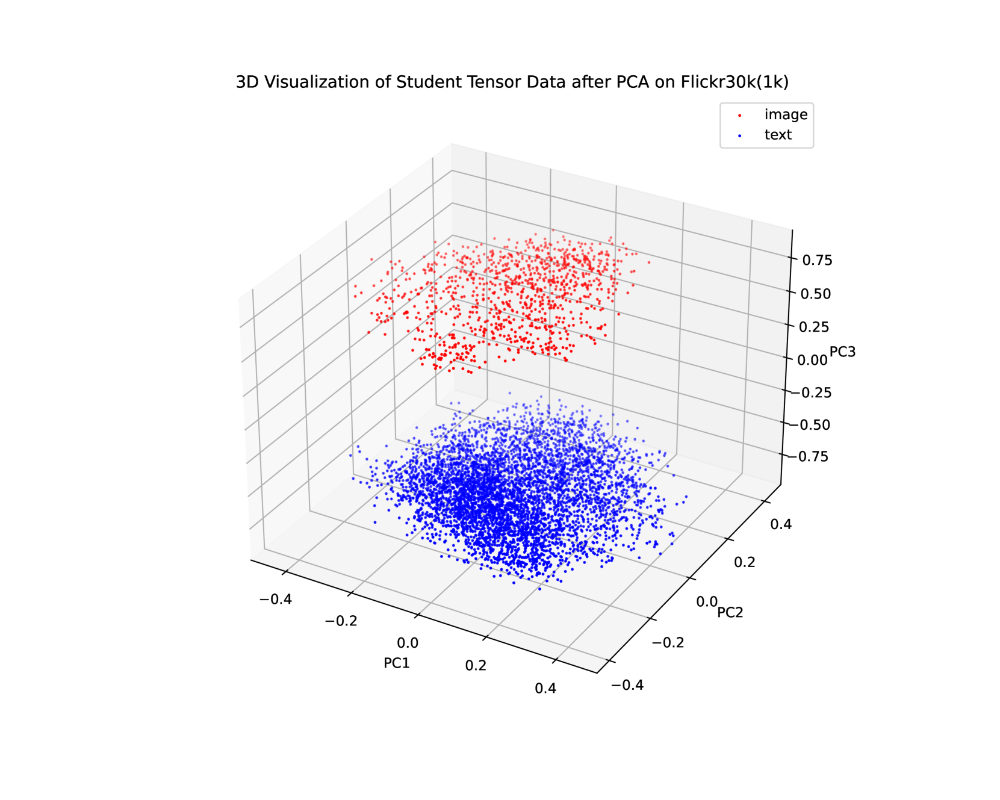

# 本研究提出了一种动态自适应的多尺度蒸馏方法，该方法源自预训练的多模态大型模型，旨在实现高效的跨模态表示学习。通过这种方法，我们能够从大规模多模态数据中提取深层次的特征，进而提升模型在不同模态任务上的表现。

发布时间：2024年04月16日

`RAG` `多模态学习` `资源优化`

> Dynamic Self-adaptive Multiscale Distillation from Pre-trained Multimodal Large Model for Efficient Cross-modal Representation Learning

# 摘要

> 近年来，预训练的多模态大型模型在多模态应用中表现出色，备受瞩目。但它们的训练需要庞大的计算资源和数据集，这在资源受限的环境中难以实现。为此，我们首次提出了一种创新的动态自适应多尺度蒸馏技术，旨在从预训练的多模态大型模型中高效学习跨模态表示。我们的策略采用多尺度分析，从大型模型中提炼结构化知识，确保学生模型能够深刻理解教师模型的知识。我们还引入了一种动态自适应蒸馏损失平衡器，这一新颖组件自动调整损失权重，简化了蒸馏过程。该方法仅依赖模型的输出特征和原始图像信息，极大地减少了计算资源的需求，适用于多种应用场景，即便是在资源受限的设置中也能部署高端的多模态技术。广泛的实验证明，我们的蒸馏方法在降低模型复杂性和训练成本的同时，保持了优异的性能。此外，我们的学生模型仅利用图像级信息，在跨模态检索任务上达到了业界领先水平，超越了依赖区域级信息的传统方法。

> In recent years, pre-trained multimodal large models have attracted widespread attention due to their outstanding performance in various multimodal applications. Nonetheless, the extensive computational resources and vast datasets required for their training present significant hurdles for deployment in environments with limited computational resources. To address this challenge, we propose a novel dynamic self-adaptive multiscale distillation from pre-trained multimodal large model for efficient cross-modal representation learning for the first time. Unlike existing distillation methods, our strategy employs a multiscale perspective, enabling the extraction structural knowledge across from the pre-trained multimodal large model. Ensuring that the student model inherits a comprehensive and nuanced understanding of the teacher knowledge. To optimize each distillation loss in a balanced and efficient manner, we propose a dynamic self-adaptive distillation loss balancer, a novel component eliminating the need for manual loss weight adjustments and dynamically balances each loss item during the distillation process. Our methodology streamlines pre-trained multimodal large models using only their output features and original image-level information, requiring minimal computational resources. This efficient approach is suited for various applications and allows the deployment of advanced multimodal technologies even in resource-limited settings. Extensive experiments has demonstrated that our method maintains high performance while significantly reducing model complexity and training costs. Moreover, our distilled student model utilizes only image-level information to achieve state-of-the-art performance on cross-modal retrieval tasks, surpassing previous methods that relied on region-level information.

[Arxiv](https://arxiv.org/abs/2404.10838)