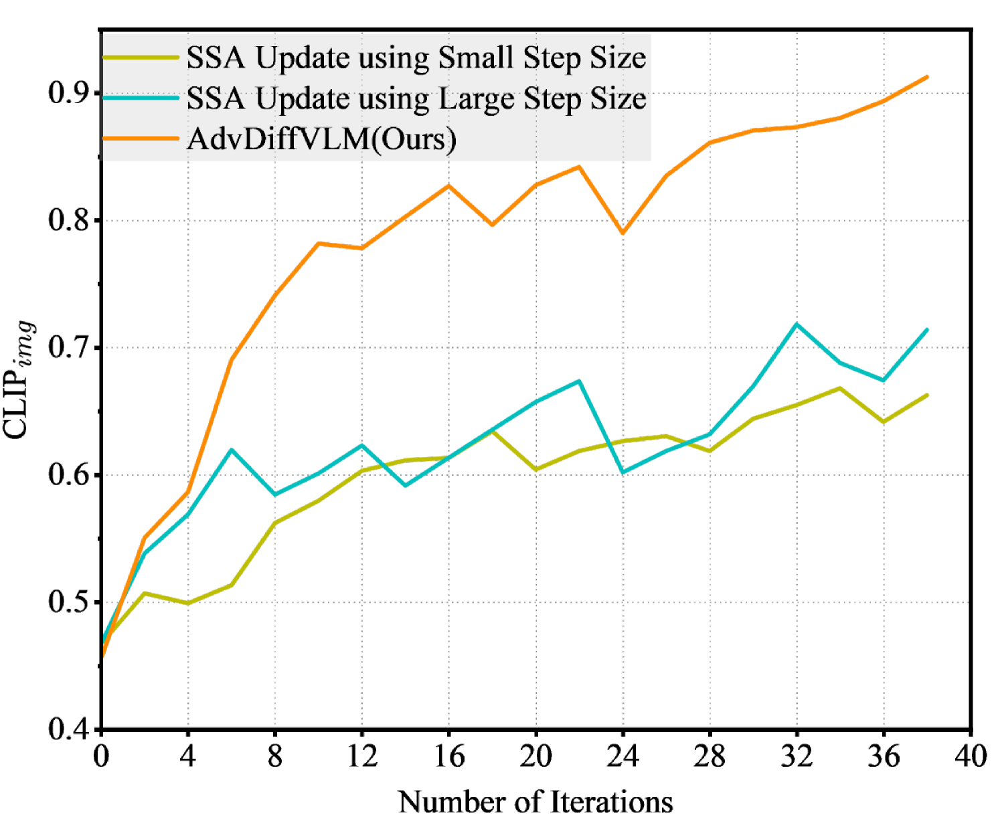
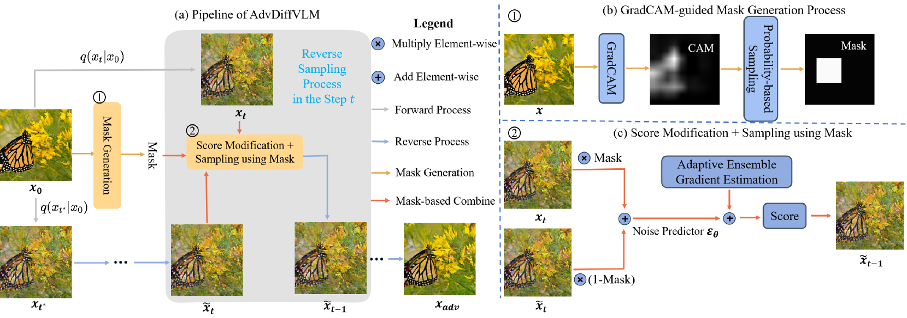
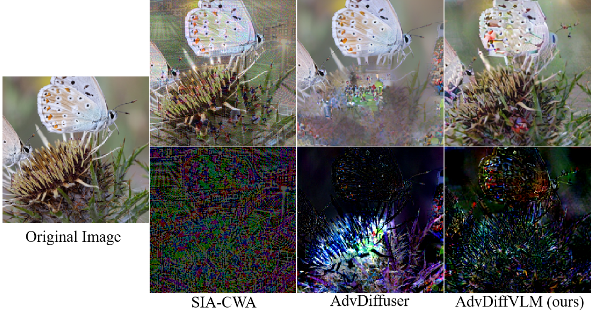
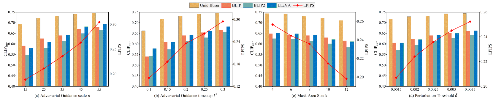
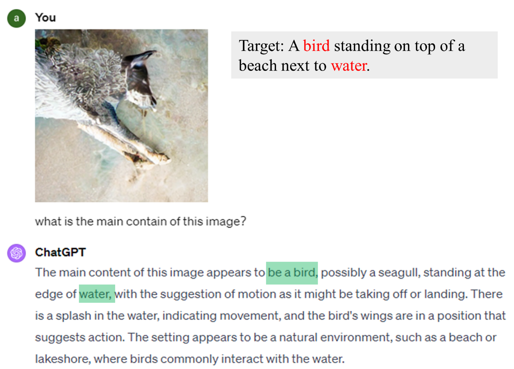

# 针对特定目标转移情境，本研究利用扩散模型，探索了一种高效的生成视觉-语言模型对抗样本的方法。

发布时间：2024年04月16日

`分类：LLM应用

这篇论文讨论了针对大型视觉-语言模型（VLMs）的转移式攻击，提出了一种新的攻击方法AdvDiffVLM，通过扩散模型生成自然、无拘束的对抗性示例。这篇论文主要关注于应用大型语言模型（LLM）进行攻击和防御，因此可以归类为LLM应用。` `计算机视觉` `对抗性攻击`

> Efficiently Adversarial Examples Generation for Visual-Language Models under Targeted Transfer Scenarios using Diffusion Models

# 摘要

> 针对大型视觉-语言模型（VLMs），针对性的转移式攻击通过对抗性示例构成了严峻挑战。然而，当前顶尖的转移式攻击因为迭代次数过多而代价昂贵，且生成的对抗性示例噪声明显，对防御手段如DiffPure的规避能力有限。为此，我们借鉴分数匹配的思路，提出了AdvDiffVLM，它通过扩散模型打造出自然、无拘束的对抗性示例。AdvDiffVLM使用自适应集成梯度估计技术，在扩散模型的逆生成过程中调整分数，确保生成的对抗性示例蕴含自然的对抗性含义，提升了其可转移性。同时，为了进一步优化对抗性示例，我们使用GradCAM引导的遮罩技术，将对抗性语义均匀分布在图像中，避免了过度集中。实验显示，我们的方法在速度上比现有技术快了10到30倍，对抗性示例的质量也更胜一筹。这些示例不仅转移性强，还能有效抵御对抗性防御。AdvDiffVLM甚至能成功突破包括GPT-4V在内的商业VLMs的防线，且操作方式如同黑盒攻击一般神秘高效。

> Targeted transfer-based attacks involving adversarial examples pose a significant threat to large visual-language models (VLMs). However, the state-of-the-art (SOTA) transfer-based attacks incur high costs due to excessive iteration counts. Furthermore, the generated adversarial examples exhibit pronounced adversarial noise and demonstrate limited efficacy in evading defense methods such as DiffPure. To address these issues, inspired by score matching, we introduce AdvDiffVLM, which utilizes diffusion models to generate natural, unrestricted adversarial examples. Specifically, AdvDiffVLM employs Adaptive Ensemble Gradient Estimation to modify the score during the diffusion model's reverse generation process, ensuring the adversarial examples produced contain natural adversarial semantics and thus possess enhanced transferability. Simultaneously, to enhance the quality of adversarial examples further, we employ the GradCAM-guided Mask method to disperse adversarial semantics throughout the image, rather than concentrating them in a specific area. Experimental results demonstrate that our method achieves a speedup ranging from 10X to 30X compared to existing transfer-based attack methods, while maintaining superior quality of adversarial examples. Additionally, the generated adversarial examples possess strong transferability and exhibit increased robustness against adversarial defense methods. Notably, AdvDiffVLM can successfully attack commercial VLMs, including GPT-4V, in a black-box manner.

[Arxiv](https://arxiv.org/abs/2404.10335)