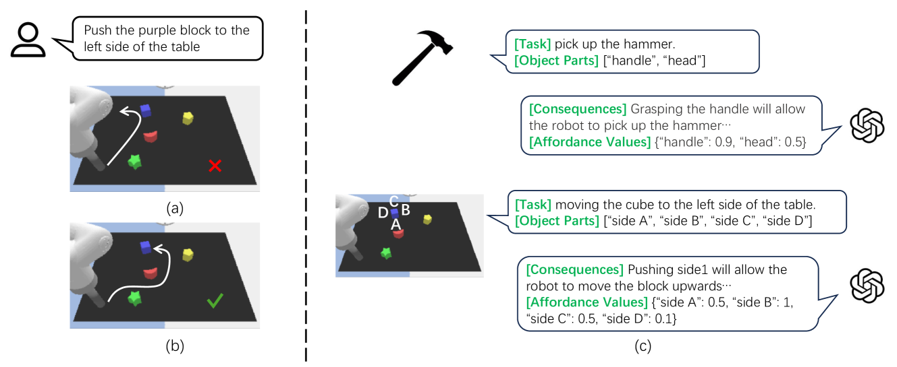
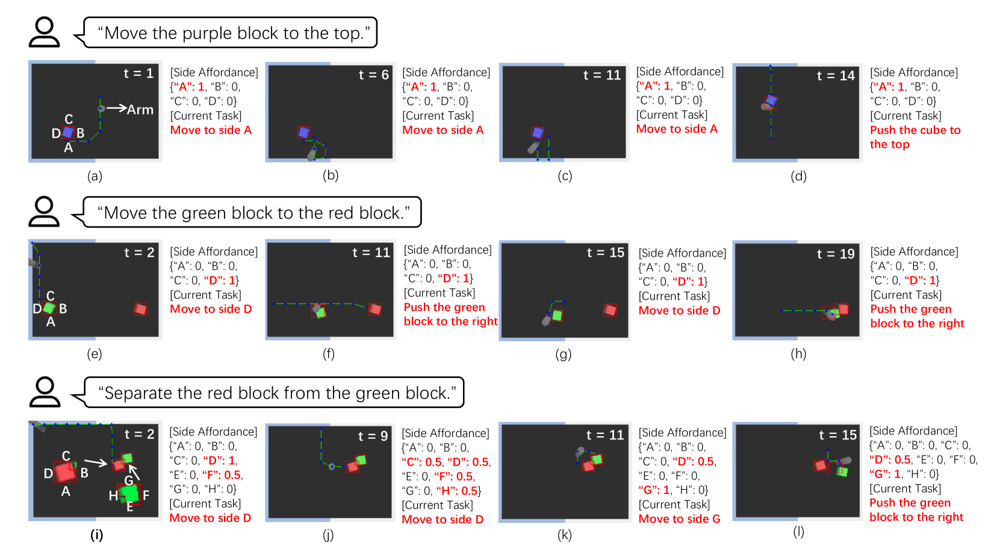

# 通过提供可负担性提示，我们增强了大型语言模型在机器人操控领域的应用能力。

发布时间：2024年04月16日

`LLM应用` `机器人技术` `人工智能`

> Empowering Large Language Models on Robotic Manipulation with Affordance Prompting

# 摘要

> 大型语言模型（LLMs）在处理多种语言任务上表现卓越，但在生成恰当的控制序列与物理世界互动时却常常碰壁。究其原因，主要是LLMs未能与物理世界形成有效连接。目前基于LLM的解决方案通常依赖于额外的预设技能或预先训练的子策略，这限制了它们应对新任务的灵活性。我们旨在突破这一局限，探索能否引导预训练的LLMs在无需训练的情况下执行一系列机器人操控任务。为此，我们设计了一个名为LLM+A（affordance）的框架，让LLM同时扮演子任务规划者和动作控制器的角色。通过我们开发的affordance提示技术，LLM能够预测计划的结果，并为相关物体生成affordance值，从而将计划和控制序列与物理世界相连接。我们在多种语言控制的机器人操控任务中验证了LLM+A的效能，实验结果表明，该方法通过提高计划的可行性和控制的适应性，显著提升了任务执行的性能，并且能够灵活适应不同的环境条件。

> While large language models (LLMs) are successful in completing various language processing tasks, they easily fail to interact with the physical world by generating control sequences properly. We find that the main reason is that LLMs are not grounded in the physical world. Existing LLM-based approaches circumvent this problem by relying on additional pre-defined skills or pre-trained sub-policies, making it hard to adapt to new tasks. In contrast, we aim to address this problem and explore the possibility to prompt pre-trained LLMs to accomplish a series of robotic manipulation tasks in a training-free paradigm. Accordingly, we propose a framework called LLM+A(ffordance) where the LLM serves as both the sub-task planner (that generates high-level plans) and the motion controller (that generates low-level control sequences). To ground these plans and control sequences on the physical world, we develop the affordance prompting technique that stimulates the LLM to 1) predict the consequences of generated plans and 2) generate affordance values for relevant objects. Empirically, we evaluate the effectiveness of LLM+A in various language-conditioned robotic manipulation tasks, which show that our approach substantially improves performance by enhancing the feasibility of generated plans and control and can easily generalize to different environments.

[Arxiv](https://arxiv.org/abs/2404.11027)