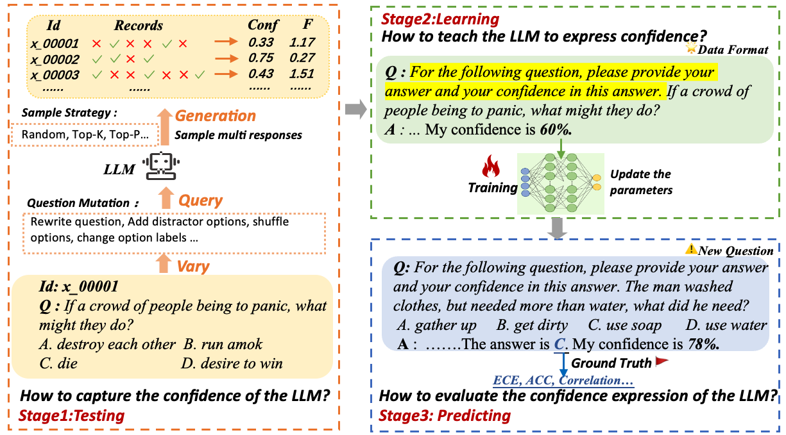
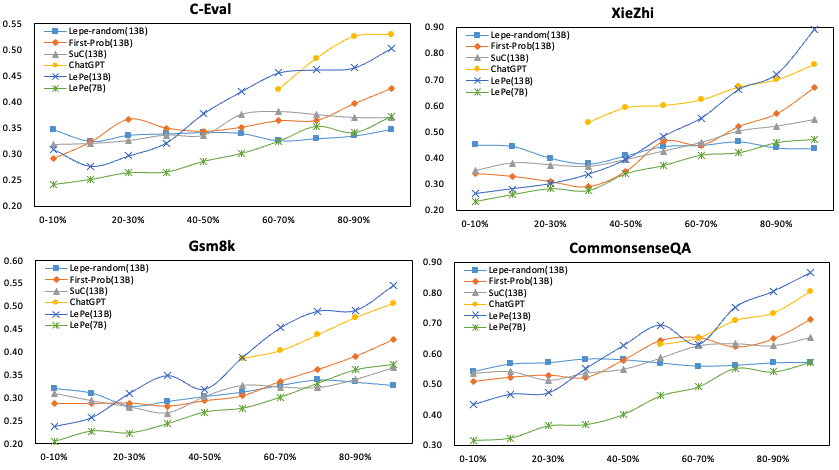

# 本研究探讨了如何通过借鉴历史经验，增强大型语言模型在表达信心方面的能力。

发布时间：2024年04月16日

`LLM理论` `认知诊断`

> Enhancing Confidence Expression in Large Language Models Through Learning from Past Experience

# 摘要

> 大型语言模型（LLMs）在众多任务中展现出卓越性能，但有时却可能以确信的口吻提供错误信息。提升LLM在置信度表达上的能力，使其能更准确地反映答案正确性的真正概率，是一种可行的解决策略。然而，要从LLM的内在特性或其输出的logits信号中准确捕捉这种不确定性，并非易事。受认知诊断领域的启发，我们提出了一种名为“从经验中学习”（LePe）的方法，旨在增强LLM在置信度表达上的能力。我们首先梳理出三个核心问题：（1）如何捕捉LLM的内在置信度？（2）如何引导LLM进行置信度表达？（3）如何评价LLM的置信度表达？针对这些问题，我们设计了LePe的三个阶段来应对。为了在训练数据构建过程中准确捕捉LLM的置信度，我们构建了一个包含问题准备和答案采样的完整流程。通过使用Llama系列LLM在四个数据集上进行的实验，我们验证了所提方法的有效性。

> Large Language Models (LLMs) have exhibited remarkable performance across various downstream tasks, but they may generate inaccurate or false information with a confident tone. One of the possible solutions is to empower the LLM confidence expression capability, in which the confidence expressed can be well-aligned with the true probability of the generated answer being correct. However, leveraging the intrinsic ability of LLMs or the signals from the output logits of answers proves challenging in accurately capturing the response uncertainty in LLMs. Therefore, drawing inspiration from cognitive diagnostics, we propose a method of Learning from Past experience (LePe) to enhance the capability for confidence expression. Specifically, we first identify three key problems: (1) How to capture the inherent confidence of the LLM? (2) How to teach the LLM to express confidence? (3) How to evaluate the confidence expression of the LLM? Then we devise three stages in LePe to deal with these problems. Besides, to accurately capture the confidence of an LLM when constructing the training data, we design a complete pipeline including question preparation and answer sampling. We also conduct experiments using the Llama family of LLMs to verify the effectiveness of our proposed method on four datasets.

[Arxiv](https://arxiv.org/abs/2404.10315)