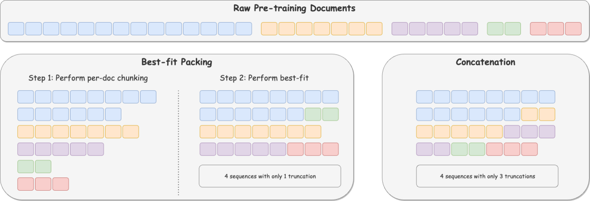
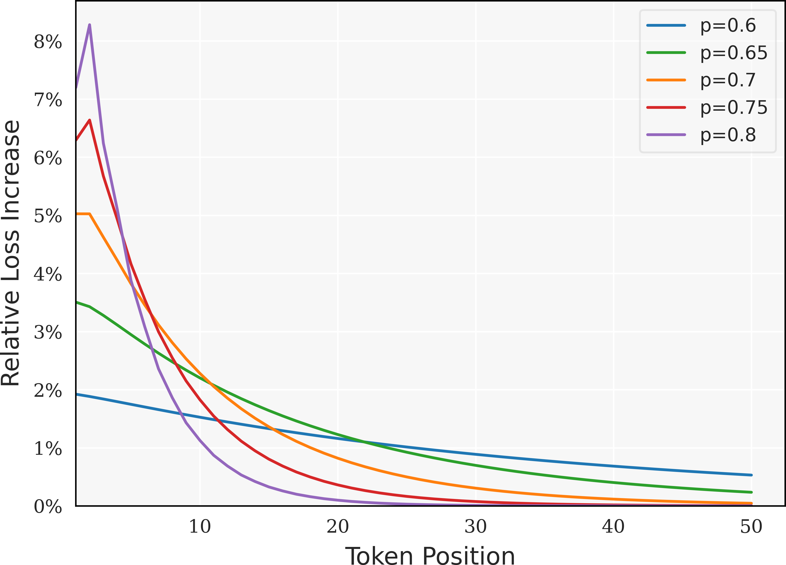
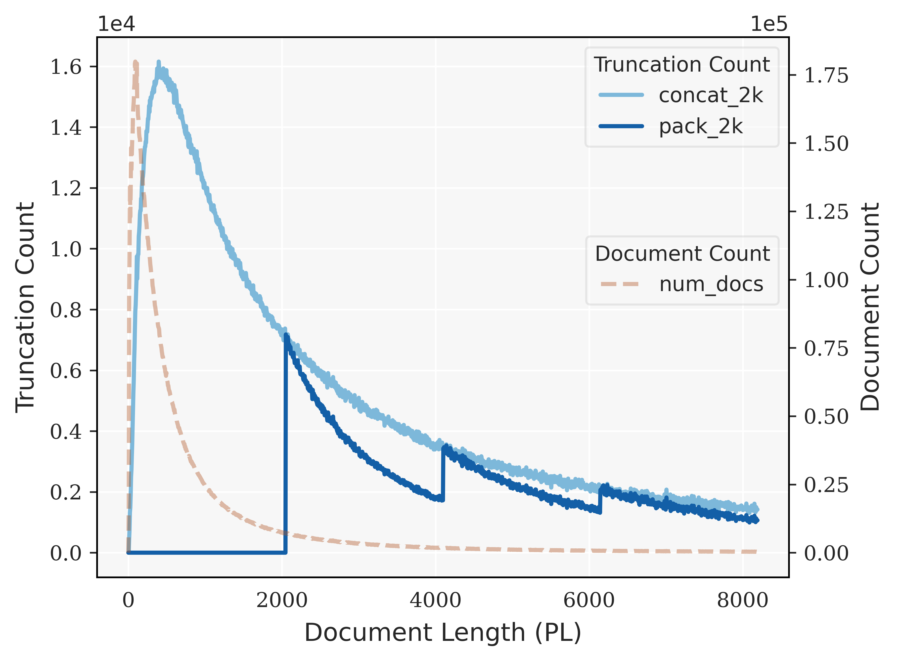
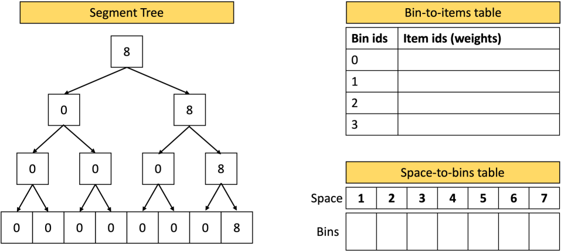
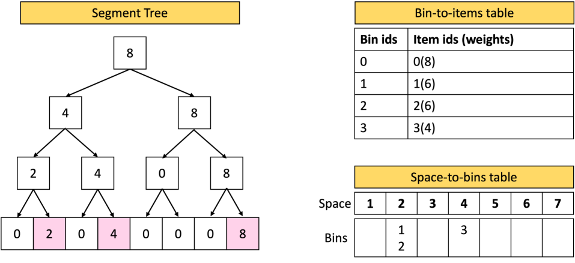
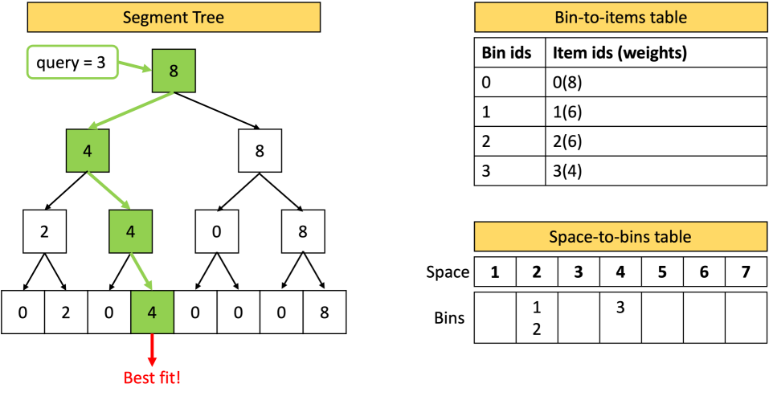
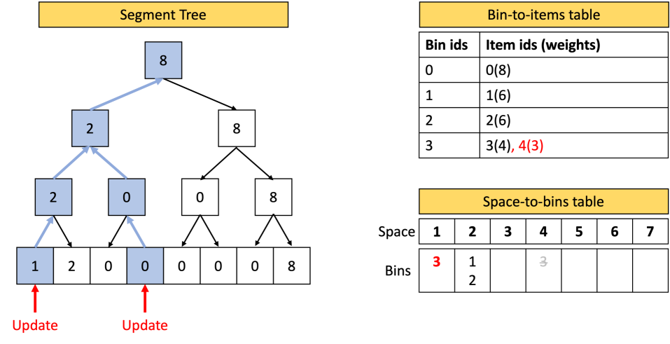

# 减少截断，优化语言模型性能

发布时间：2024年04月16日

`LLM理论` `机器学习`

> Fewer Truncations Improve Language Modeling

# 摘要

> 在大型语言模型的培训过程中，输入文档一般会被连结并等分，以减少填充符号的使用。然而，这种连结方式虽高效，却破坏了数据的完整性，常将文档切分成零散的片段，造成大量截断，影响模型学习构建逻辑连贯、事实一致的内容。为此，我们引入了“最佳拟合打包”方法，这是一种通过长度感知组合优化，将文档高效打包进训练序列的可扩展方法。此方法不仅完全避免了不必要的截断，还保持了与传统连结方法相当的训练效率。在文本和代码预训练的实验中，我们的方法在阅读理解上提升了4.7%，在上下文理解上提升了16.8%，在程序合成上提升了9.2%，同时将封闭领域的错误推断降低了高达58.3%。

> In large language model training, input documents are typically concatenated together and then split into sequences of equal length to avoid padding tokens. Despite its efficiency, the concatenation approach compromises data integrity -- it inevitably breaks many documents into incomplete pieces, leading to excessive truncations that hinder the model from learning to compose logically coherent and factually consistent content that is grounded on the complete context. To address the issue, we propose Best-fit Packing, a scalable and efficient method that packs documents into training sequences through length-aware combinatorial optimization. Our method completely eliminates unnecessary truncations while retaining the same training efficiency as concatenation. Empirical results from both text and code pre-training show that our method achieves superior performance (e.g., relatively +4.7% on reading comprehension; +16.8% in context following; and +9.2% on program synthesis), and reduces closed-domain hallucination effectively by up to 58.3%.

[Arxiv](https://arxiv.org/abs/2404.10830)