# 从语言模型中驱逐扩散分布

发布时间：2024年04月16日

`LLM应用` `数据科学` `人工智能`

> Forcing Diffuse Distributions out of Language Models

# 摘要

> 尽管现代语言模型经过专门训练以遵循用户指令，但在要求生成随机输出时却表现欠佳。举例来说，当要求在1到10之间随机选择一个数字时，Llama-2-13B-chat模型明显偏好数字5；而在随机选择名字的任务中，Mistral-7B-Instruct模型选择“Avery”这个名字的频率远高于我们根据美国人口统计数据所预期的。在需要输出多样性的实际应用场景，如语言模型辅助构建数据集时，模型无法生成广泛分布的有效选择成为一个重大挑战。本研究提出了一种微调技术，旨在促使语言模型产生更广泛分布的有效输出。我们的方法适用于多种任务和分布，使得大型语言模型在合成数据集生成方面更加实用，且减少了人为干预。

> Despite being trained specifically to follow user instructions, today's language models perform poorly when instructed to produce random outputs. For example, when prompted to pick a number uniformly between one and ten Llama-2-13B-chat disproportionately favors the number five, and when tasked with picking a first name at random, Mistral-7B-Instruct chooses Avery 40 times more often than we would expect based on the U.S. population. When these language models are used for real-world tasks where diversity of outputs is crucial, such as language model assisted dataset construction, their inability to produce diffuse distributions over valid choices is a major hurdle. In this work, we propose a fine-tuning method that encourages language models to output distributions that are diffuse over valid outcomes. The methods we introduce generalize across a variety of tasks and distributions and make large language models practical for synthetic dataset generation with little human intervention.

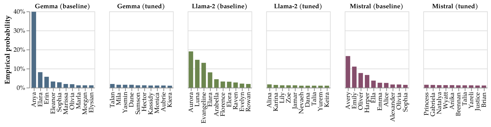

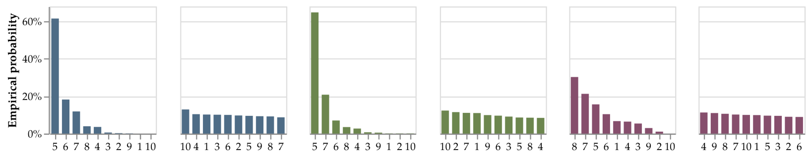

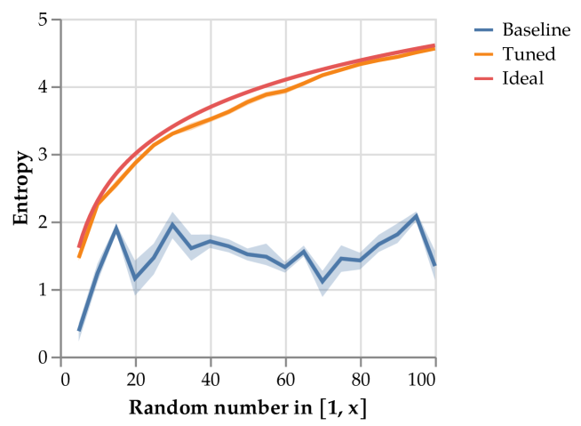

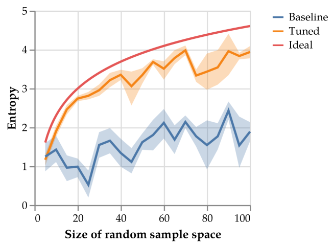

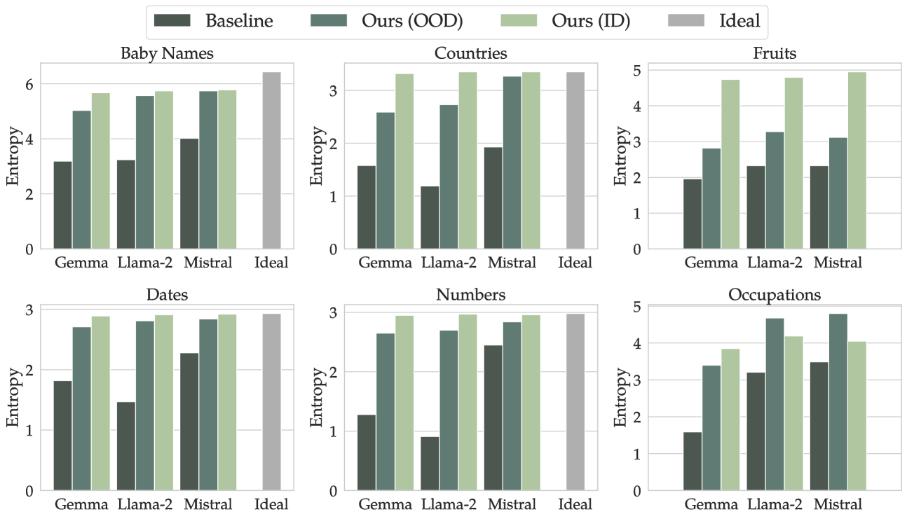

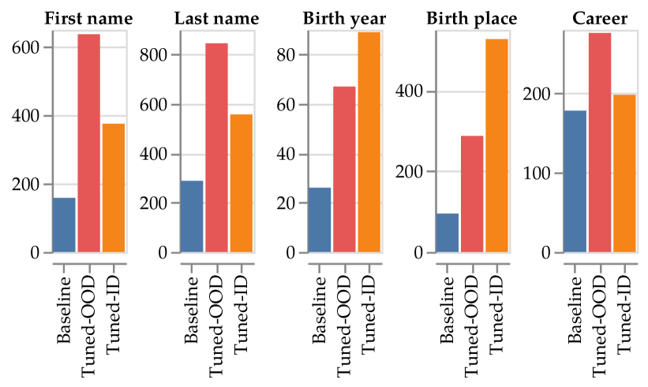

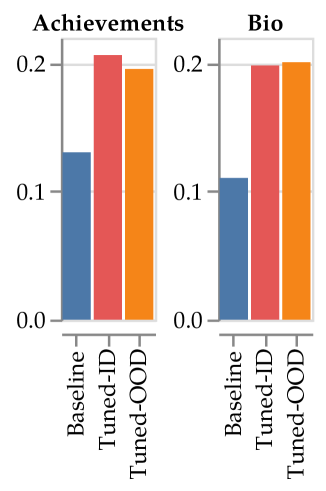

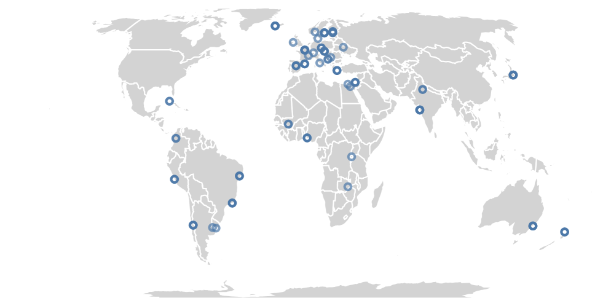

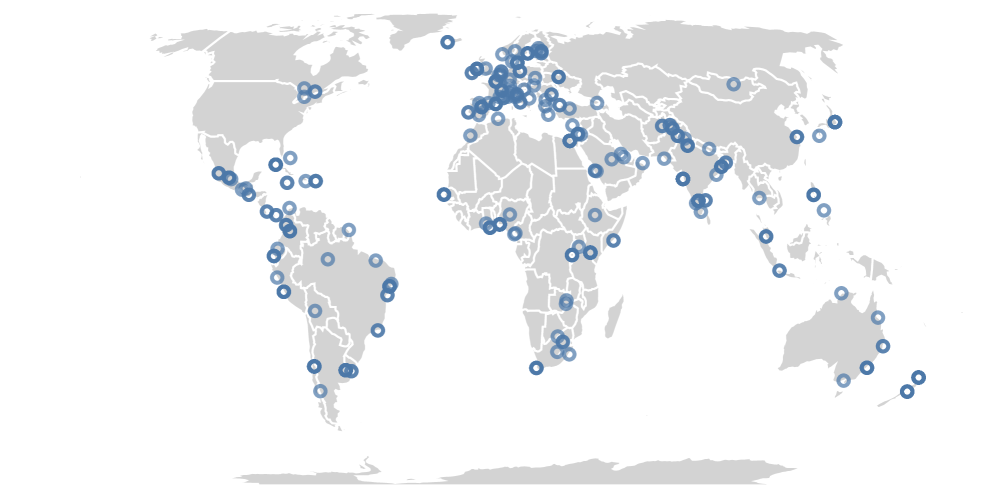

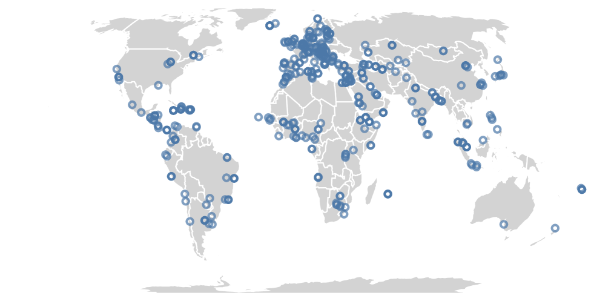

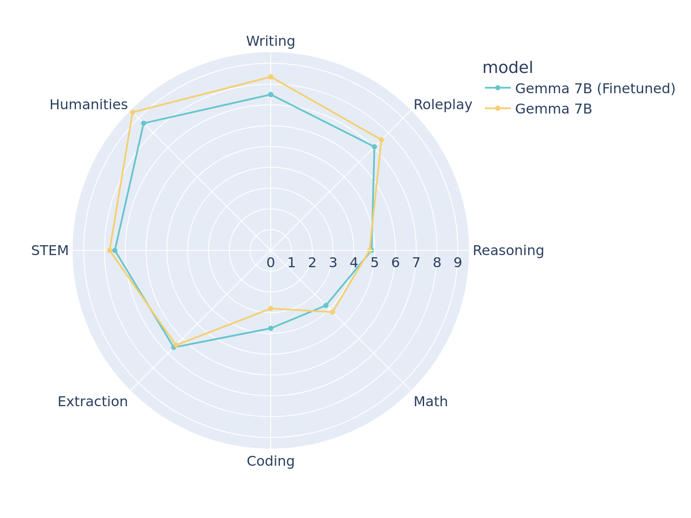

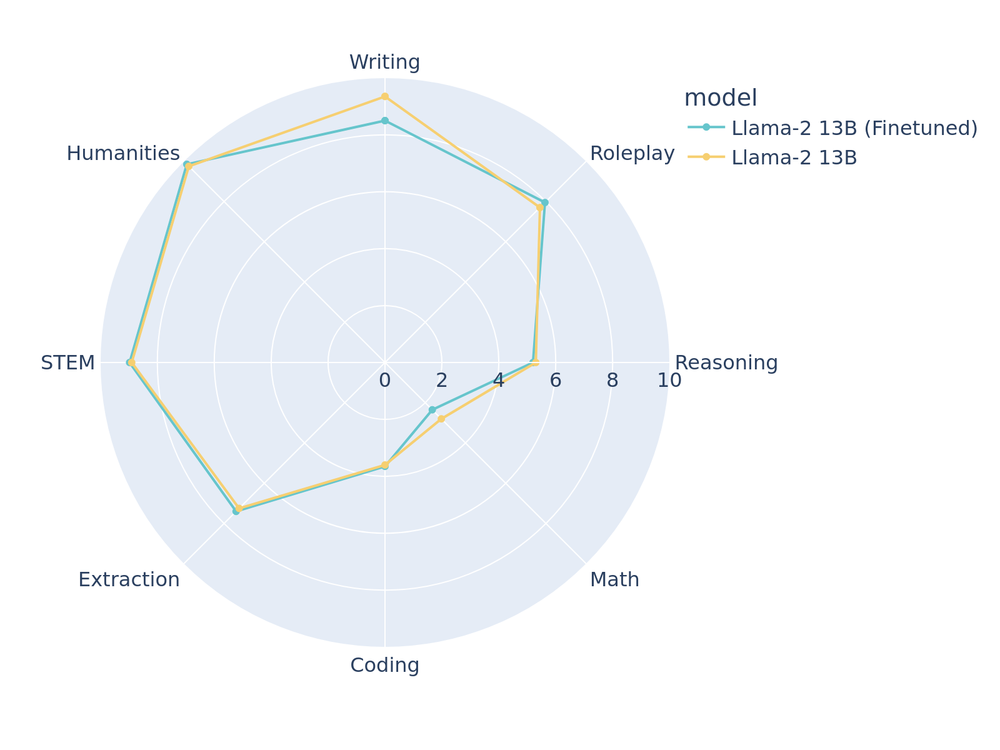

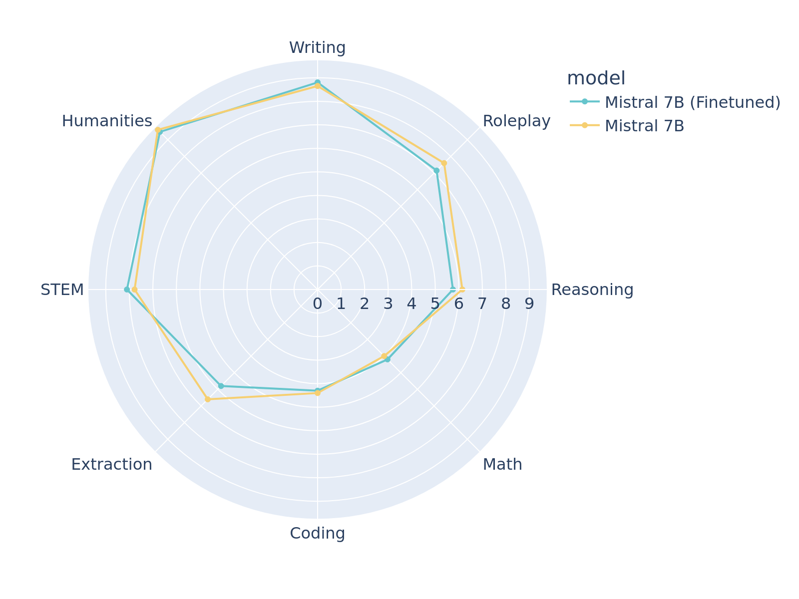

[Arxiv](https://arxiv.org/abs/2404.10859)