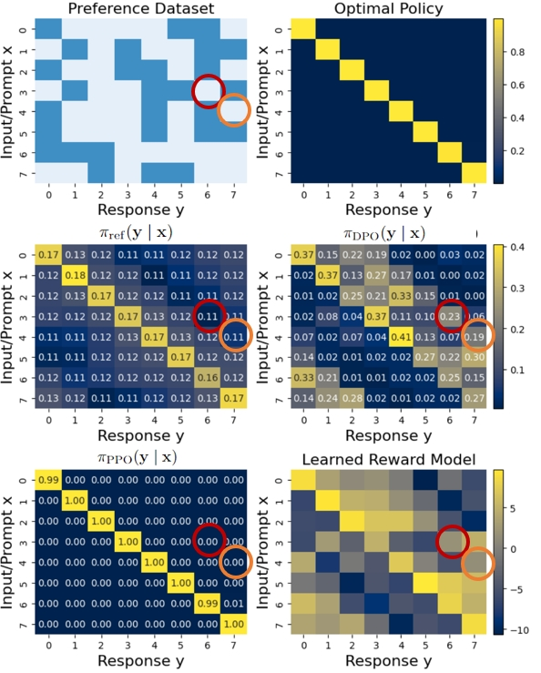
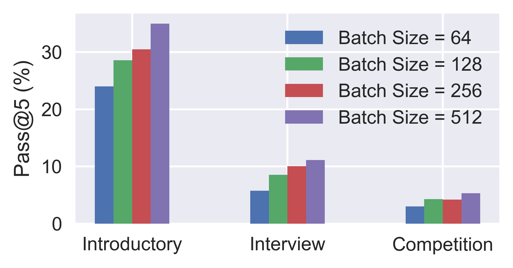

# 在大型语言模型 (LLM) 对齐方面，DPO 是否超越了 PPO？本研究进行了深入全面的比较分析。

发布时间：2024年04月16日

`LLM理论` `人工智能`

> Is DPO Superior to PPO for LLM Alignment? A Comprehensive Study

# 摘要

> 目前，通过人类反馈进行强化学习（RLHF）是将大型语言模型（LLMs）与人类偏好相匹配的主流方法。RLHF的方法主要分为基于奖励和无奖励两大类。例如ChatGPT和Claude这样的创新应用，采用基于奖励的方法，先学习奖励模型，再运用近端策略优化（PPO）等演员-评论家算法。但在学术界，最先进的成果往往通过无奖励的方法，如直接偏好优化（DPO）来实现。DPO真的优于PPO吗？PPO为何在这些测试中不尽人意？本文首先对DPO的算法特性进行了深入的理论探讨和实证分析，发现DPO可能存在根本性局限。同时，我们也对PPO进行了全面审视，揭示了其在微调LLMs时取得最佳表现的关键要素。最终，我们在一系列RLHF测试场景中，从对话到代码生成，对DPO和PPO进行了基准测试。实验结果显示，PPO在所有场景中都能超越其他对齐技术，并在复杂的代码竞赛中达到了最先进的水平。

> Reinforcement Learning from Human Feedback (RLHF) is currently the most widely used method to align large language models (LLMs) with human preferences. Existing RLHF methods can be roughly categorized as either reward-based or reward-free. Novel applications such as ChatGPT and Claude leverage reward-based methods that first learn a reward model and apply actor-critic algorithms, such as Proximal Policy Optimization (PPO). However, in academic benchmarks, state-of-the-art results are often achieved via reward-free methods, such as Direct Preference Optimization (DPO). Is DPO truly superior to PPO? Why does PPO perform poorly on these benchmarks? In this paper, we first conduct both theoretical and empirical studies on the algorithmic properties of DPO and show that DPO may have fundamental limitations. Moreover, we also comprehensively examine PPO and reveal the key factors for the best performances of PPO in fine-tuning LLMs. Finally, we benchmark DPO and PPO across various a collection of RLHF testbeds, ranging from dialogue to code generation. Experiment results demonstrate that PPO is able to surpass other alignment methods in all cases and achieve state-of-the-art results in challenging code competitions.

[Arxiv](https://arxiv.org/abs/2404.10719)