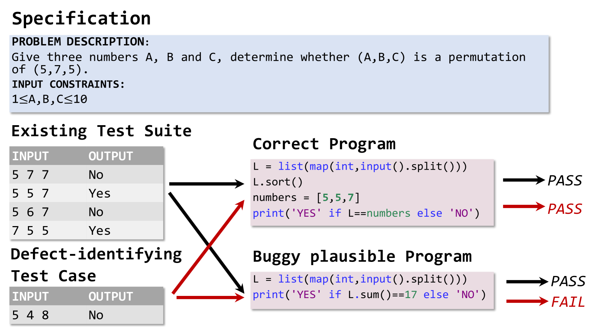
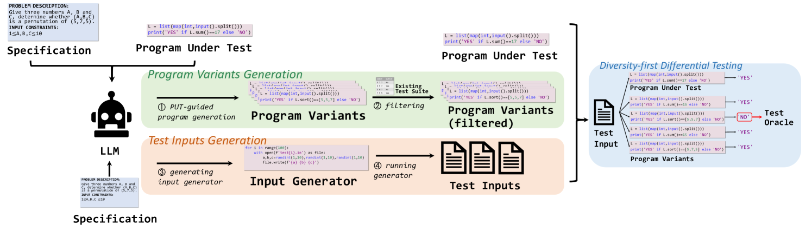
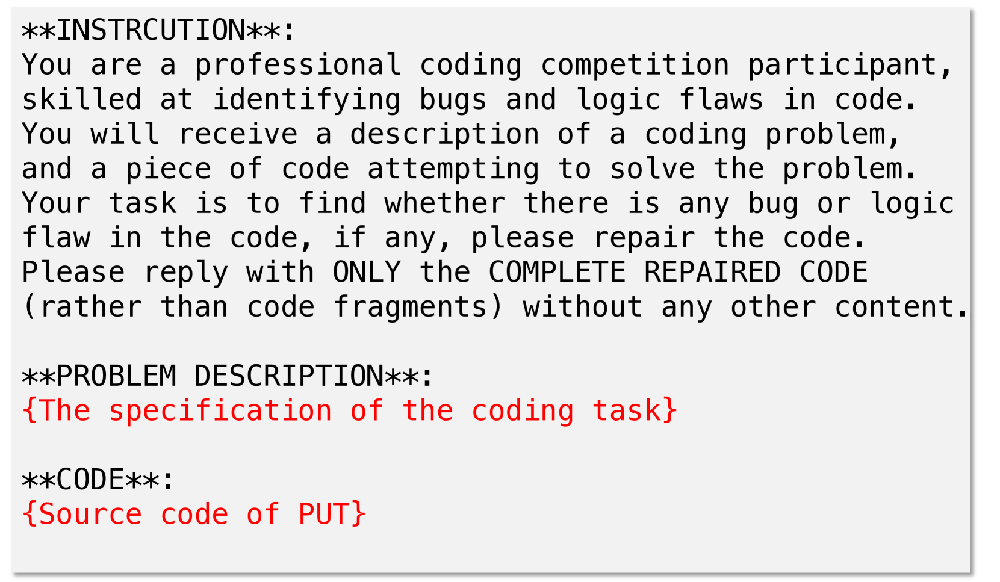
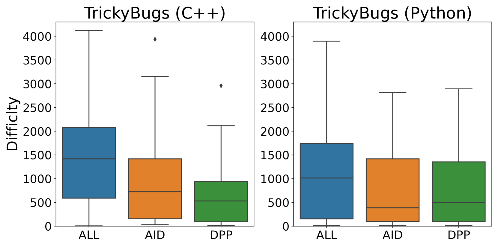
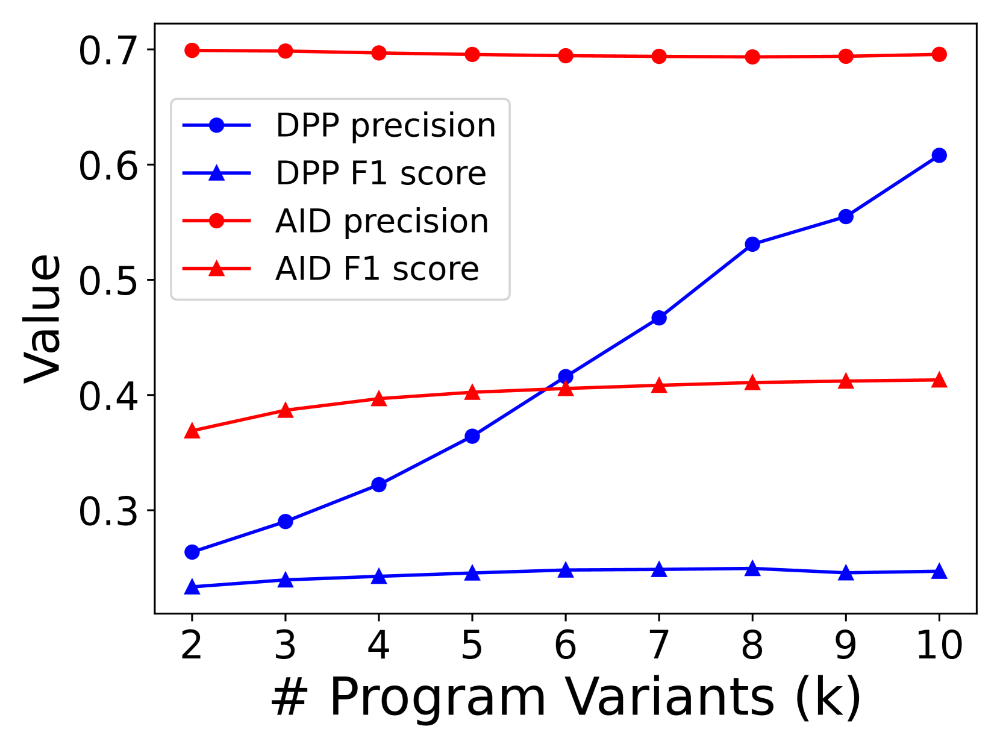

# 借助大型语言模型（LLM）的力量，我们能够生成测试用例来捕捉那些难以发现的软件缺陷。

发布时间：2024年04月16日

`LLM应用` `软件测试` `自动化`

> LLM-Powered Test Case Generation for Detecting Tricky Bugs

# 摘要

> 传统自动化测试工具在创建能够揭示难题般错误的测试输入和预言方面表现不佳。而大型语言模型（LLMs）虽然能够直接生成测试输入和预言，但在处理复杂情况时准确性却不尽人意（我们的实验显示仅为6.3%）。为解决这一问题，本研究提出了AID，它通过结合LLMs和差异测试技术，旨在生成能够揭示潜在正确程序错误的测试输入和预言。AID通过选择在LLMs生成的程序变体集上产生多样输出的测试输入，并据此构建测试预言。在TrickyBugs和EvalPlus这两个充满棘手错误的大型数据集上的评估显示，与三个业界领先的基线相比，AID在召回率、精确度和F1得分上分别实现了高达1.80倍、2.65倍和1.66倍的提升。

> Conventional automated test generation tools struggle to generate test oracles and tricky bug-revealing test inputs. Large Language Models (LLMs) can be prompted to produce test inputs and oracles for a program directly, but the precision of the tests can be very low for complex scenarios (only 6.3% based on our experiments). To fill this gap, this paper proposes AID, which combines LLMs with differential testing to generate fault-revealing test inputs and oracles targeting plausibly correct programs (i.e., programs that have passed all the existing tests). In particular, AID selects test inputs that yield diverse outputs on a set of program variants generated by LLMs, then constructs the test oracle based on the outputs. We evaluate AID on two large-scale datasets with tricky bugs: TrickyBugs and EvalPlus, and compare it with three state-of-the-art baselines. The evaluation results show that the recall, precision, and F1 score of AID outperform the state-of-the-art by up to 1.80x, 2.65x, and 1.66x, respectively.

[Arxiv](https://arxiv.org/abs/2404.10304)