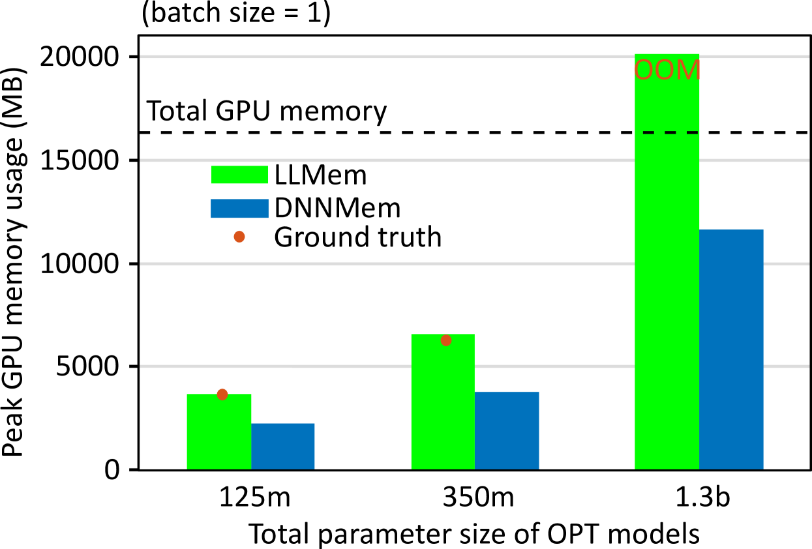
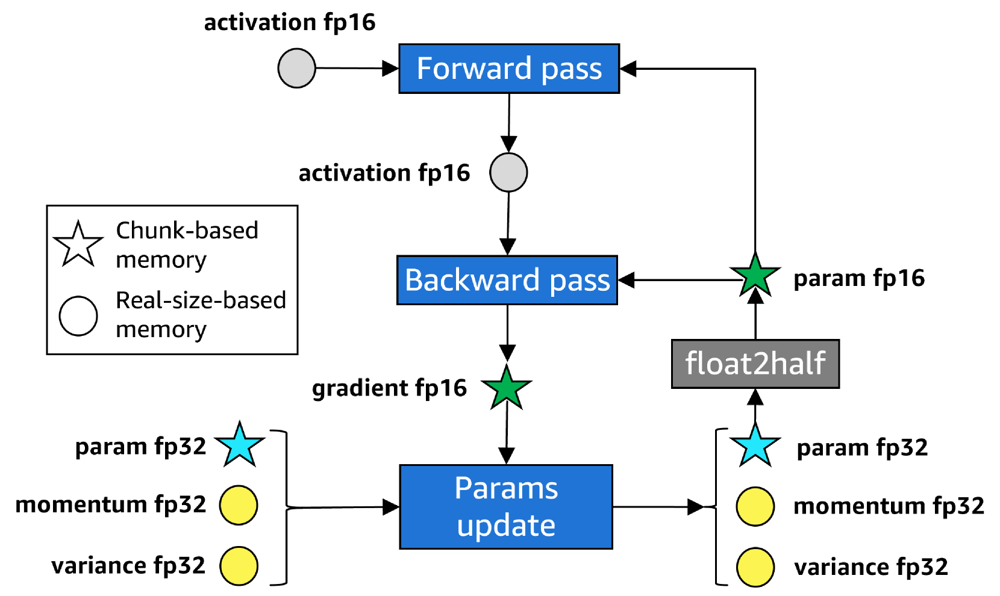
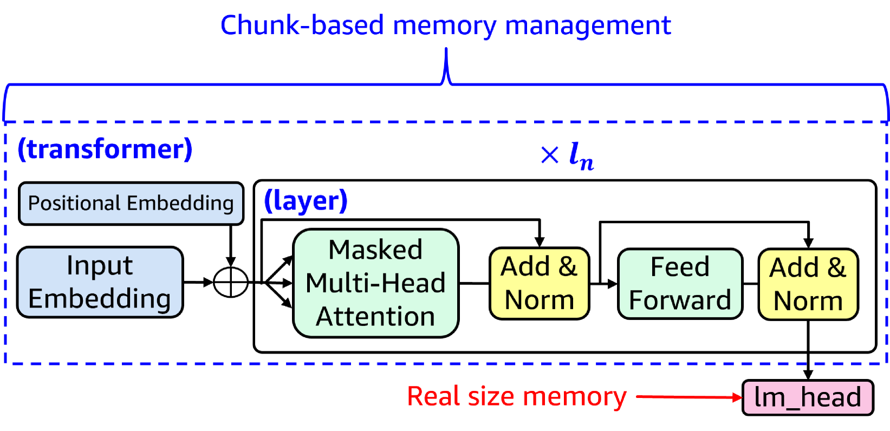
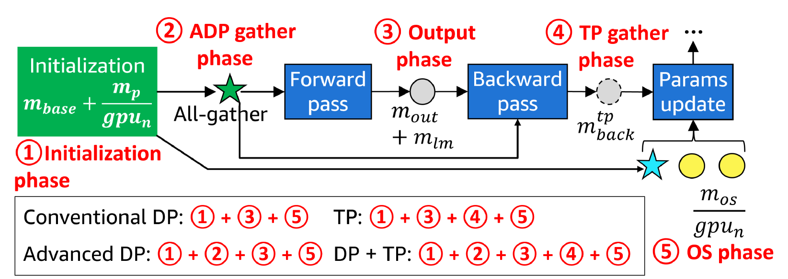
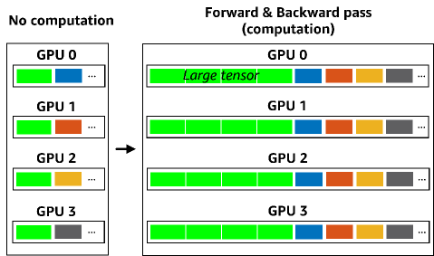
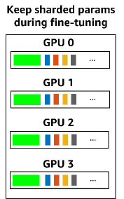
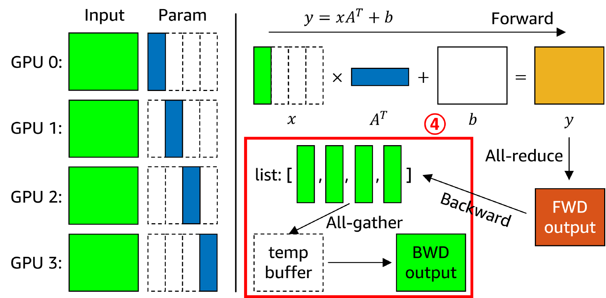
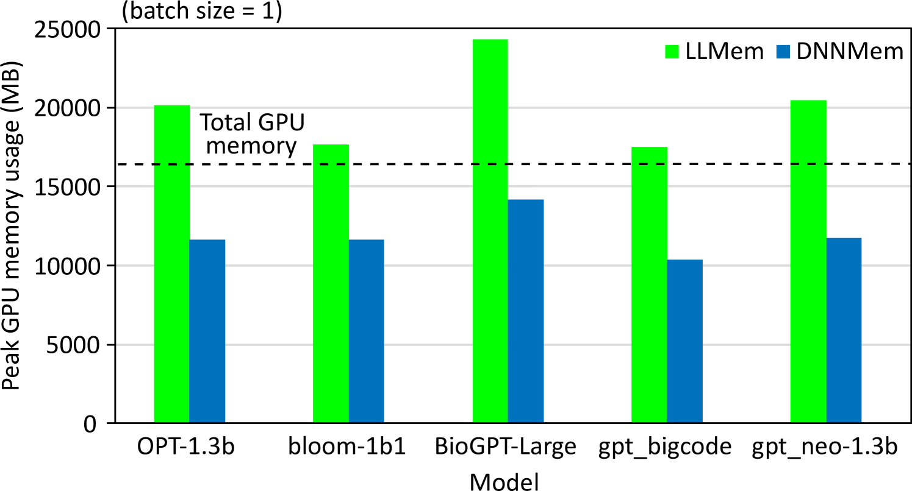
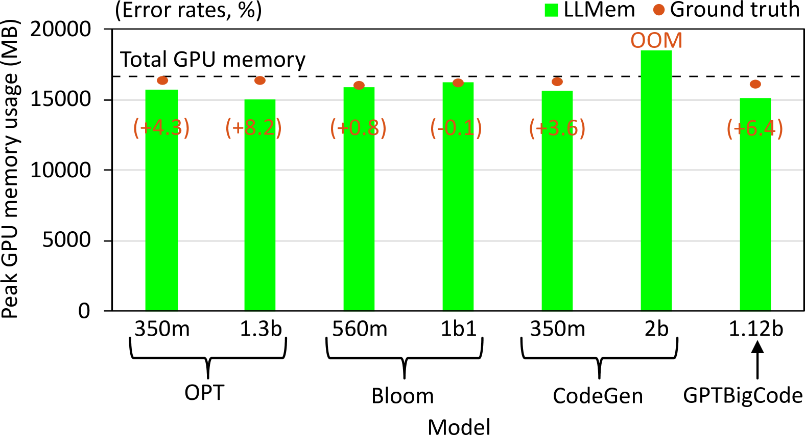
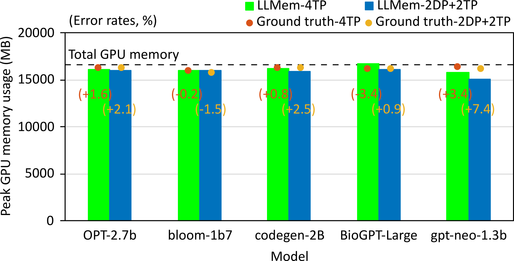

# LLMem：为预训练的大型语言模型（LLM）的微调过程估算 GPU 内存需求。

发布时间：2024年04月16日

`LLM应用` `硬件资源管理`

> LLMem: Estimating GPU Memory Usage for Fine-Tuning Pre-Trained LLMs

# 摘要

> 在硬件资源受限的情况下对预训练的大型语言模型（LLM）进行微调，往往会因为GPU内存的限制而遇到困难。为了解决这一问题，提出了多种分布式微调技术，但如何在保持GPU内存不溢出的同时快速完成微调，目前尚无定论。为此，我们推出了LLMem，这一方案能够预估在多GPU环境下应用分布式微调技术时的GPU内存消耗，并找出最佳方法。通过在微调前对GPU内存使用情况进行预估，我们利用了基于变换器的解码器模型的基本架构和各种方法的内存使用分布特性。实验结果显示，LLMem在估算单个GPU上的峰值内存使用时非常准确，误差率不超过1.6%；在多GPU配置下对超大型参数规模的LLM进行分布式微调时，平均误差率也仅为3.0%。

> Fine-tuning pre-trained large language models (LLMs) with limited hardware presents challenges due to GPU memory constraints. Various distributed fine-tuning methods have been proposed to alleviate memory constraints on GPU. However, determining the most effective method for achieving rapid fine-tuning while preventing GPU out-of-memory issues in a given environment remains unclear. To address this challenge, we introduce LLMem, a solution that estimates the GPU memory consumption when applying distributed fine-tuning methods across multiple GPUs and identifies the optimal method. We conduct GPU memory usage estimation prior to fine-tuning, leveraging the fundamental structure of transformer-based decoder models and the memory usage distribution of each method. Experimental results show that LLMem accurately estimates peak GPU memory usage on a single GPU, with error rates of up to 1.6%. Additionally, it shows an average error rate of 3.0% when applying distributed fine-tuning methods to LLMs with more than a billion parameters on multi-GPU setups.

[Arxiv](https://arxiv.org/abs/2404.10933)