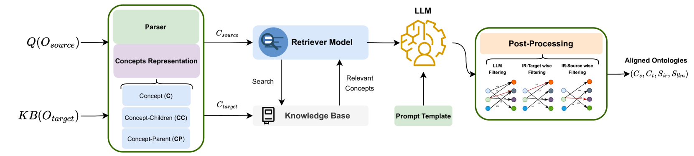

# LLMs4OM：借助大型语言模型实现本体匹配

发布时间：2024年04月16日

`LLM应用` `知识图谱` `本体匹配`

> LLMs4OM: Matching Ontologies with Large Language Models

# 摘要

> 本体匹配作为知识整合的核心环节，关键在于实现不同本体间的有效对接，以促进数据互通与知识共享。传统方法依赖专家见解或预测模型，却未能充分发挥大型语言模型（LLMs）的潜力。本文介绍了LLMs4OM框架，它是一种创新的评估LLMs在本体匹配任务中表现的方法。该框架结合检索与匹配两大模块，并通过零-shot提示技术，针对概念、概念层级关系进行优化。经过跨领域的20个数据集综合评测，我们发现在LLMs4OM框架指导下，LLMs不仅能与传统本体匹配系统匹敌，更能在复杂匹配情境中脱颖而出。这一发现充分展示了LLMs在本体匹配领域的巨大潜力。

> Ontology Matching (OM), is a critical task in knowledge integration, where aligning heterogeneous ontologies facilitates data interoperability and knowledge sharing. Traditional OM systems often rely on expert knowledge or predictive models, with limited exploration of the potential of Large Language Models (LLMs). We present the LLMs4OM framework, a novel approach to evaluate the effectiveness of LLMs in OM tasks. This framework utilizes two modules for retrieval and matching, respectively, enhanced by zero-shot prompting across three ontology representations: concept, concept-parent, and concept-children. Through comprehensive evaluations using 20 OM datasets from various domains, we demonstrate that LLMs, under the LLMs4OM framework, can match and even surpass the performance of traditional OM systems, particularly in complex matching scenarios. Our results highlight the potential of LLMs to significantly contribute to the field of OM.

[Arxiv](https://arxiv.org/abs/2404.10317)