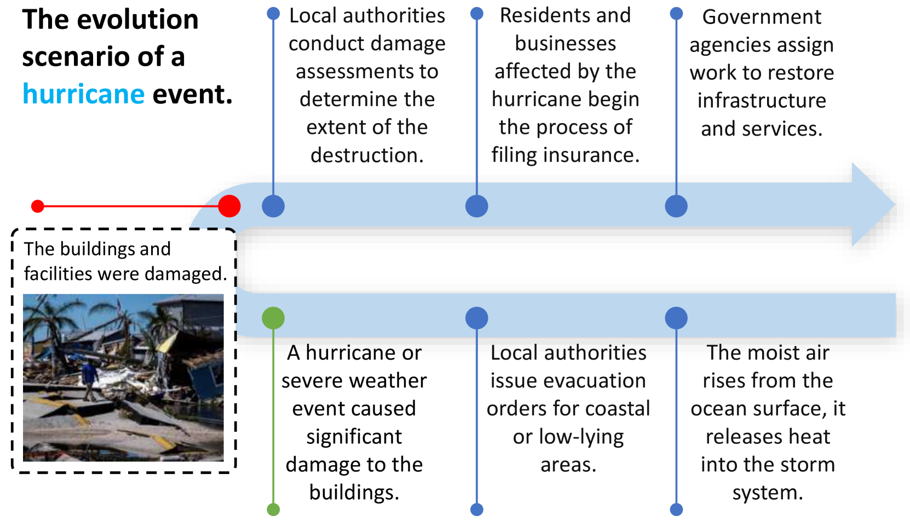
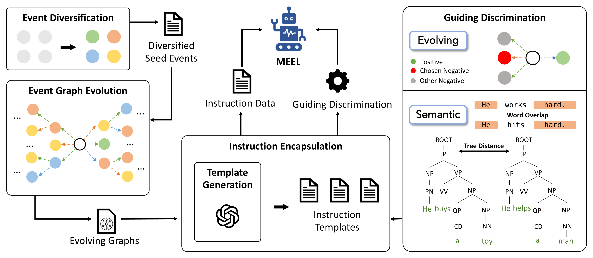
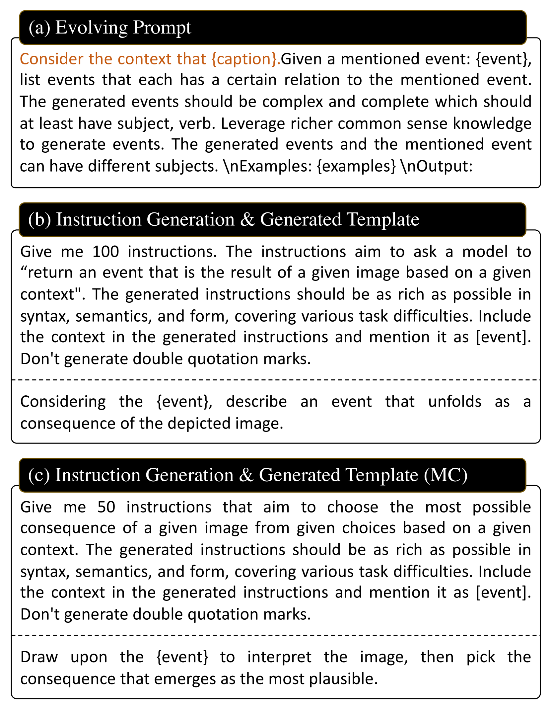
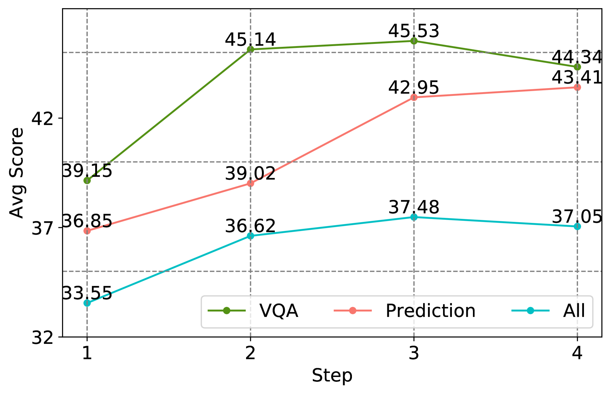
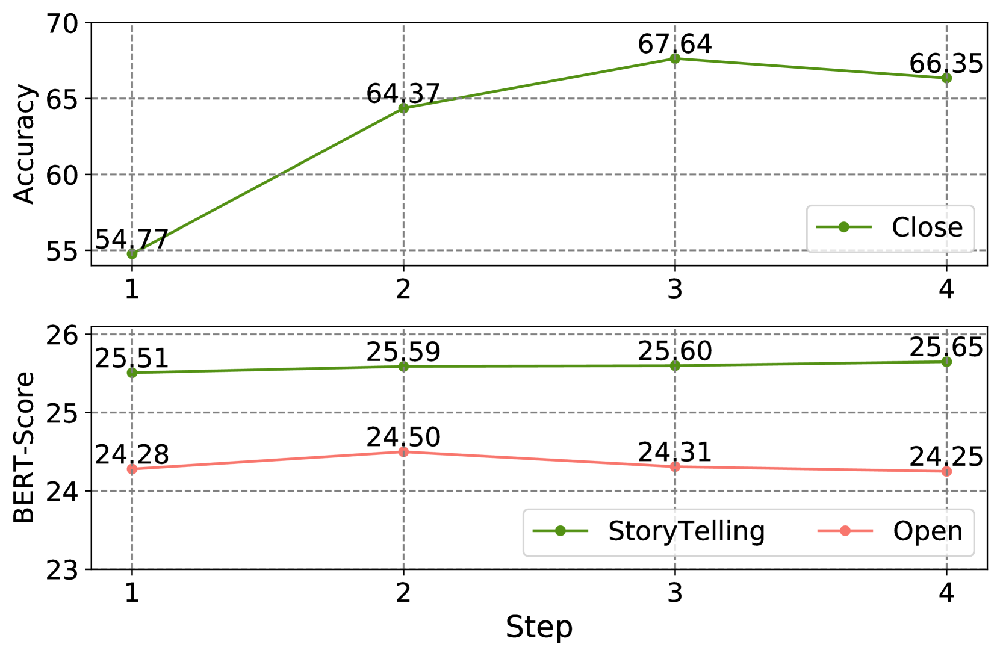
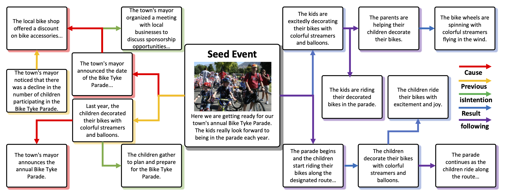
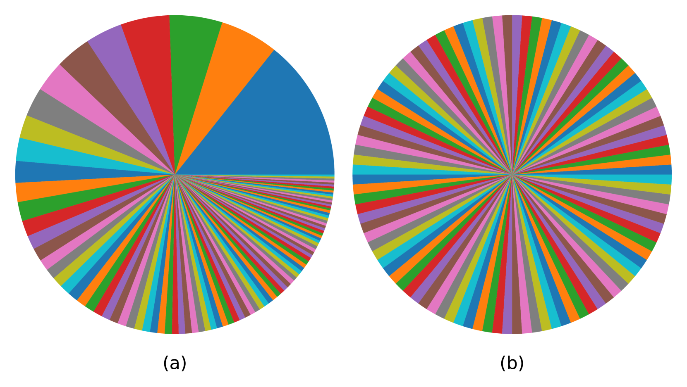
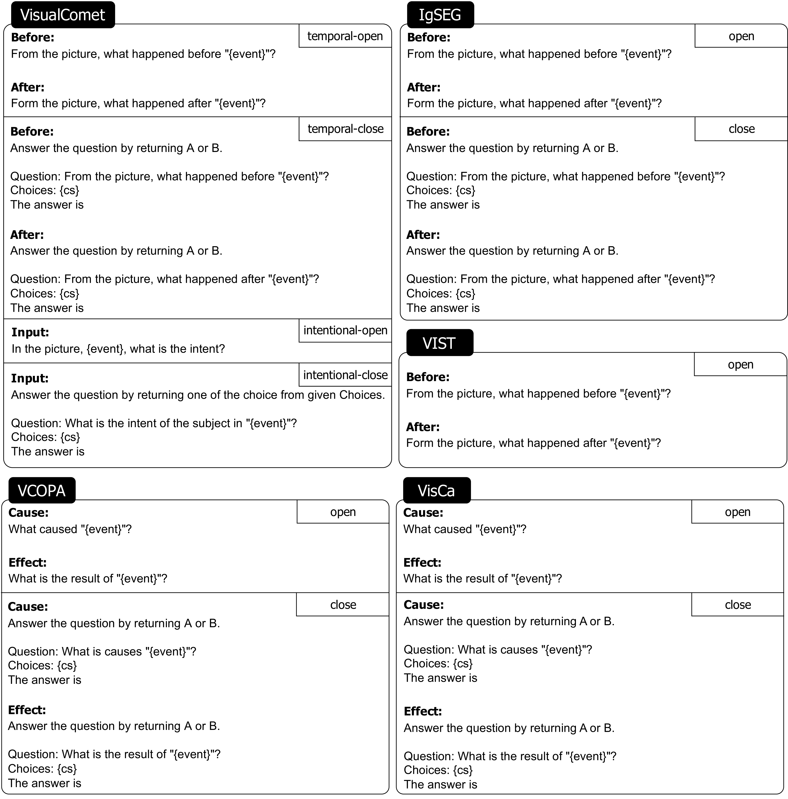

# MEEL 代表多模态事件演化学习，这是一种结合多种数据形式以更好地理解和学习事件发展过程的方法。

发布时间：2024年04月16日

`Agent` `多模态` `事件推理`

> MEEL: Multi-Modal Event Evolution Learning

# 摘要

> 多模态事件推理（MMER）旨在让机器能够洞悉不同数据形式中的复杂事件联系。这一技术是应用广泛的关键基础。尽管对多模态大型语言模型进行了深度的指令优化，它们在理解事件关系的演变上仍有欠缺。问题在于现有模型未能充分捕获不同情境下事件发展的基本原则。本文提出了一种新的多模态事件演变学习方法（MEEL），让模型能够理解事件随时间的演进，提升MMER的效能。我们首先设计了事件多样化策略，从众多场景中搜集初始事件。接着，利用ChatGPT生成这些事件的演变图谱。我们设计了一种指令封装流程，将演变图谱转化为指令调整数据，使模型对事件推理的理解更接近人类。然而，我们发现这样训练的模型在完全理解事件演变上仍有挑战。为此，我们引入了引导性辨别策略，训练模型识别不正确的演变路径。我们还创建并整理了一个M-EV2基准数据集，专门用于评估MMER。通过在M-EV2上的广泛实验，我们的方法证明了其有效性，并在开源的多模态大型语言模型中展现出了卓越的性能。

> Multi-modal Event Reasoning (MMER) endeavors to endow machines with the ability to comprehend intricate event relations across diverse data modalities. MMER is fundamental and underlies a wide broad of applications. Despite extensive instruction fine-tuning, current multi-modal large language models still fall short in such ability. The disparity stems from that existing models are insufficient to capture underlying principles governing event evolution in various scenarios. In this paper, we introduce Multi-Modal Event Evolution Learning (MEEL) to enable the model to grasp the event evolution mechanism, yielding advanced MMER ability. Specifically, we commence with the design of event diversification to gather seed events from a rich spectrum of scenarios. Subsequently, we employ ChatGPT to generate evolving graphs for these seed events. We propose an instruction encapsulation process that formulates the evolving graphs into instruction-tuning data, aligning the comprehension of event reasoning to humans. Finally, we observe that models trained in this way are still struggling to fully comprehend event evolution. In such a case, we propose the guiding discrimination strategy, in which models are trained to discriminate the improper evolution direction. We collect and curate a benchmark M-EV2 for MMER. Extensive experiments on M-EV2 validate the effectiveness of our approach, showcasing competitive performance in open-source multi-modal LLMs.

[Arxiv](https://arxiv.org/abs/2404.10429)