# 多次射击上下文学习

发布时间：2024年04月16日

`LLM应用` `人工智能`

> Many-Shot In-Context Learning

# 摘要

> 大型语言模型（LLMs）在少量样本上下文学习（ICL）上表现优异，即在推理阶段通过上下文中的少量示例进行学习，无需更新权重。通过扩大上下文窗口，我们得以探索涉及成百上千示例的ICL——进入多样本学习阶段。从少量样本过渡到多样本，我们在广泛的生成和判别任务中观察到了显著的性能提升。尽管这一进展充满希望，但多样本ICL可能受限于可用的人类生成示例数量。为了克服这一局限，我们提出了两种新的方法：强化ICL和无监督ICL。强化ICL用模型生成的思维推理过程来替代人类示例。无监督ICL则完全不使用推理过程，仅通过特定领域的提问来引导模型。我们发现，这两种方法在多样本学习中都非常有效，尤其是在处理复杂推理任务时。此外，与少量样本学习相比，多样本学习能够更有效地消除预训练偏见，并学习包含数值输入的高维函数。我们的分析还指出，将下一个词预测损失作为衡量下游ICL性能的指标存在局限。

> Large language models (LLMs) excel at few-shot in-context learning (ICL) -- learning from a few examples provided in context at inference, without any weight updates. Newly expanded context windows allow us to investigate ICL with hundreds or thousands of examples -- the many-shot regime. Going from few-shot to many-shot, we observe significant performance gains across a wide variety of generative and discriminative tasks. While promising, many-shot ICL can be bottlenecked by the available amount of human-generated examples. To mitigate this limitation, we explore two new settings: Reinforced and Unsupervised ICL. Reinforced ICL uses model-generated chain-of-thought rationales in place of human examples. Unsupervised ICL removes rationales from the prompt altogether, and prompts the model only with domain-specific questions. We find that both Reinforced and Unsupervised ICL can be quite effective in the many-shot regime, particularly on complex reasoning tasks. Finally, we demonstrate that, unlike few-shot learning, many-shot learning is effective at overriding pretraining biases and can learn high-dimensional functions with numerical inputs. Our analysis also reveals the limitations of next-token prediction loss as an indicator of downstream ICL performance.

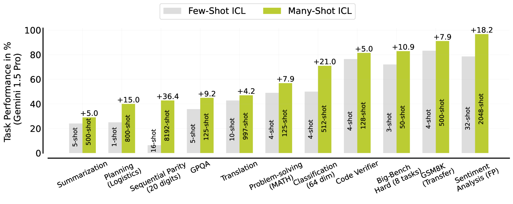

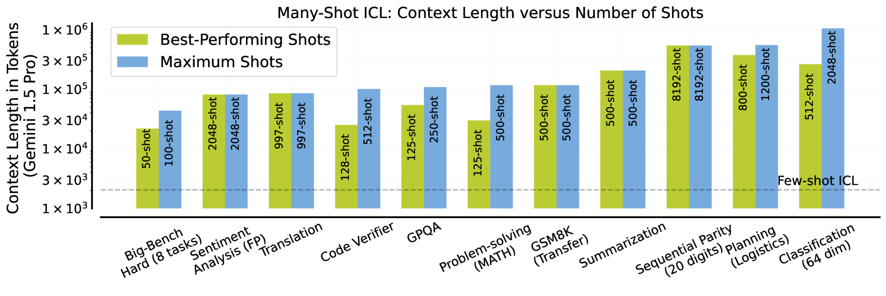

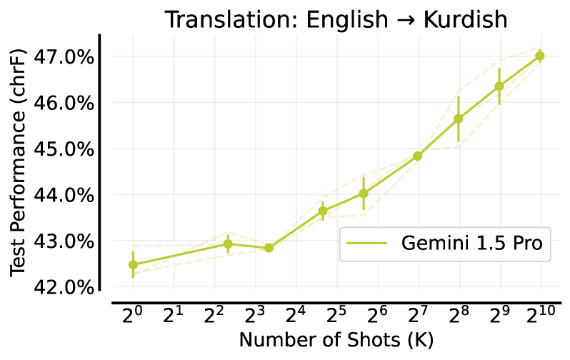

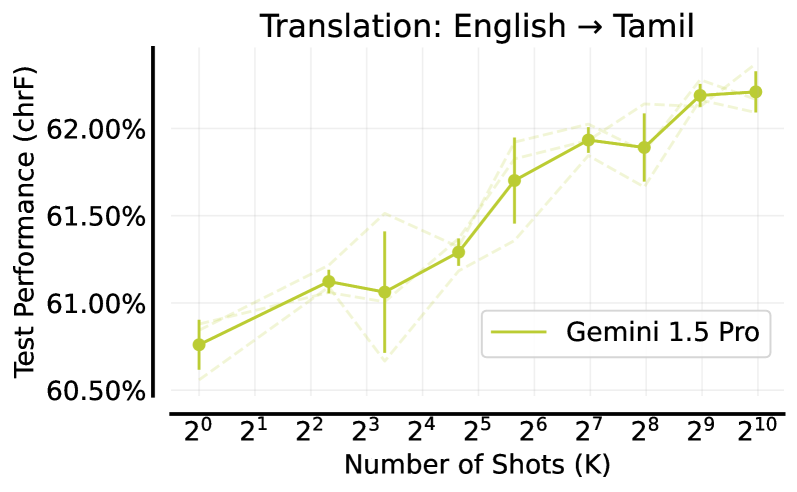

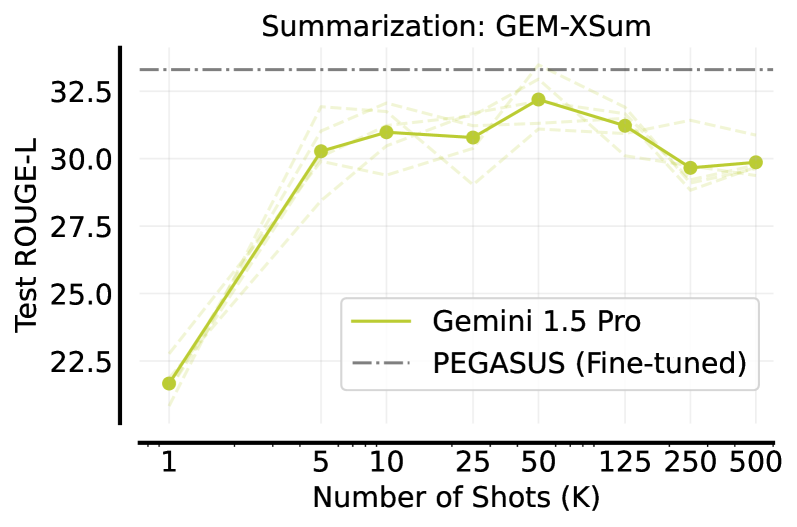

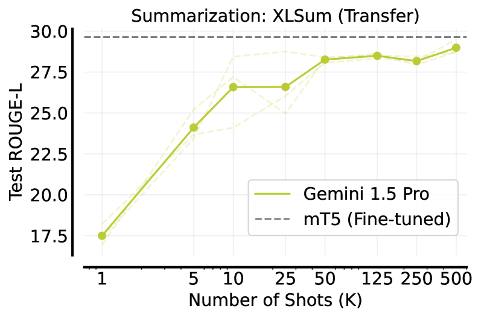

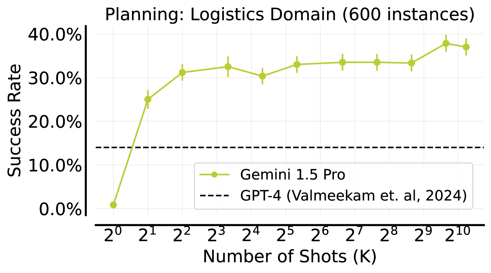

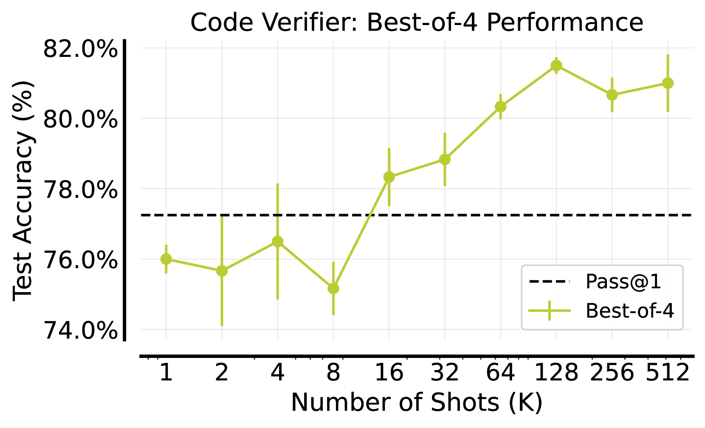

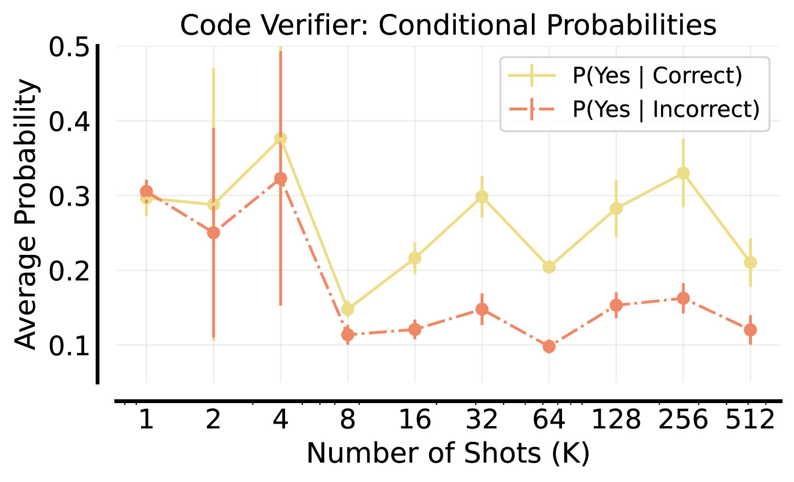

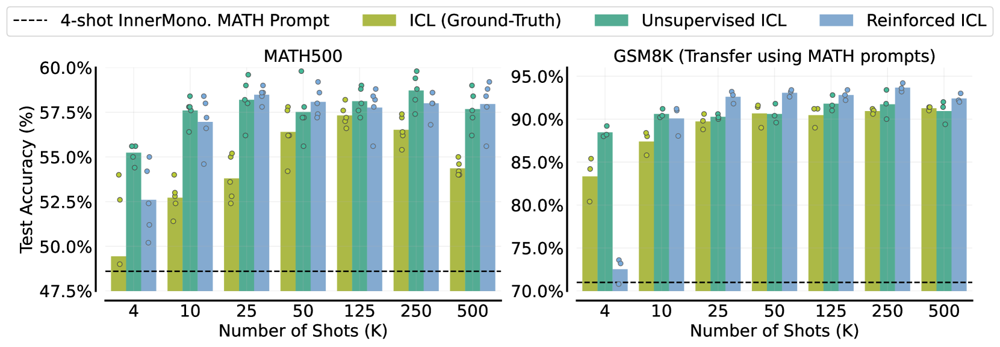

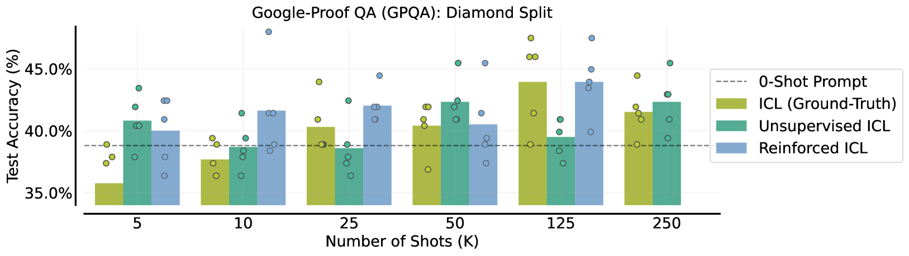

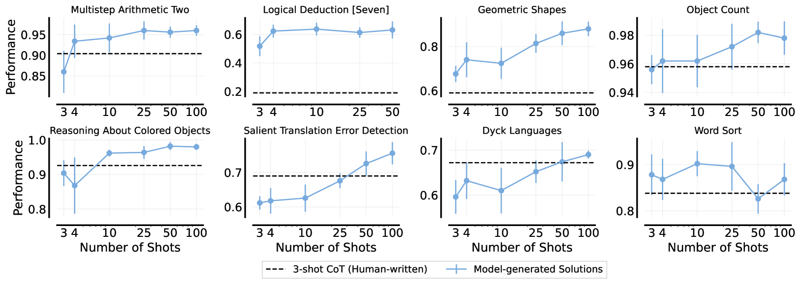

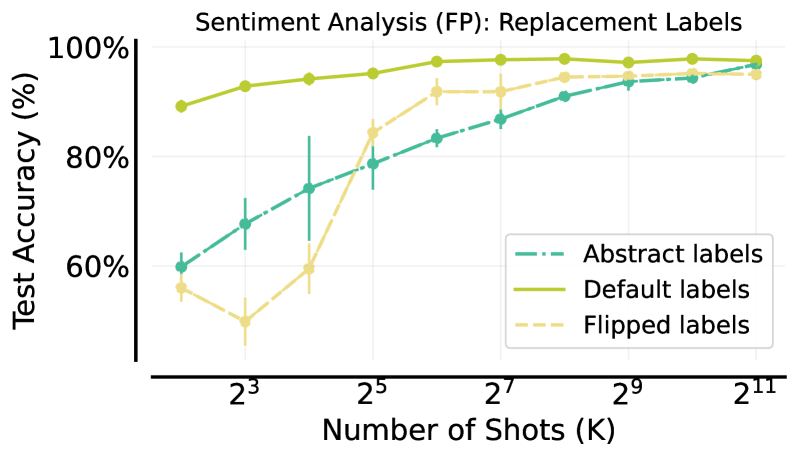

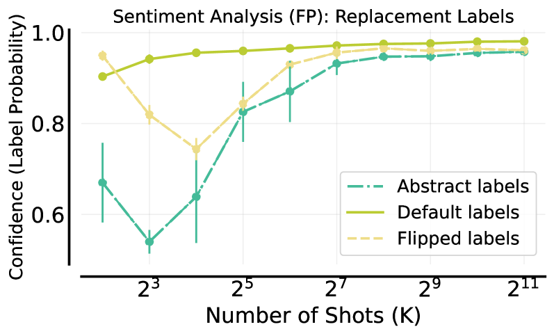

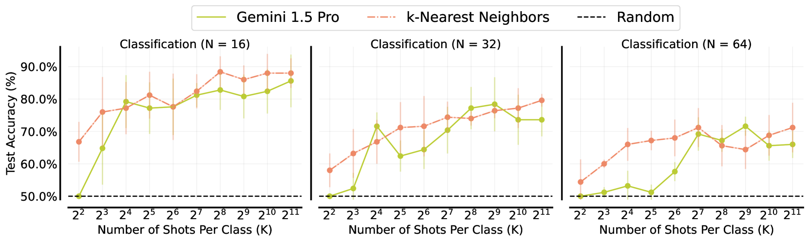

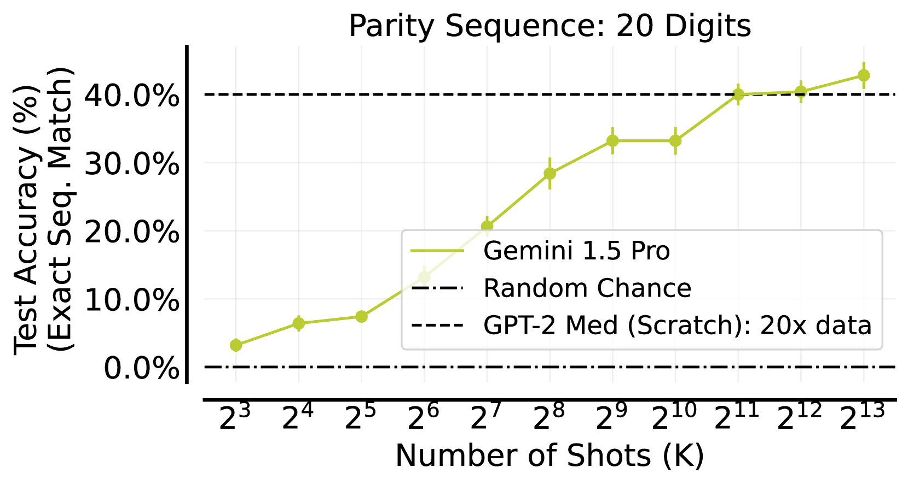

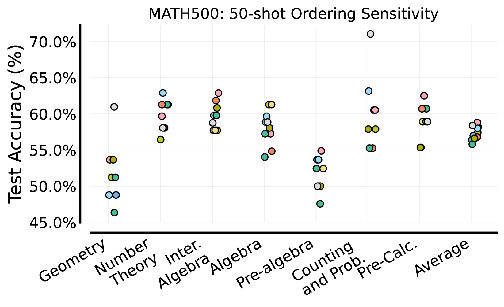

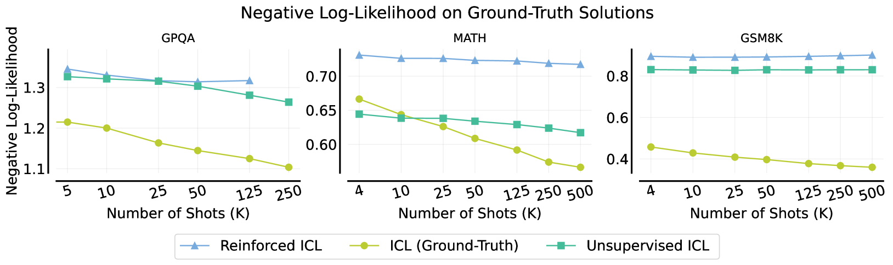

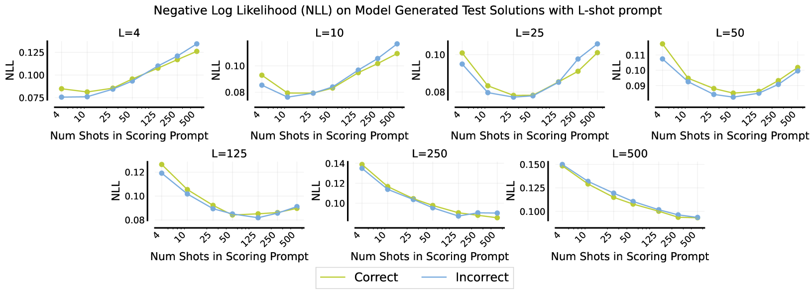

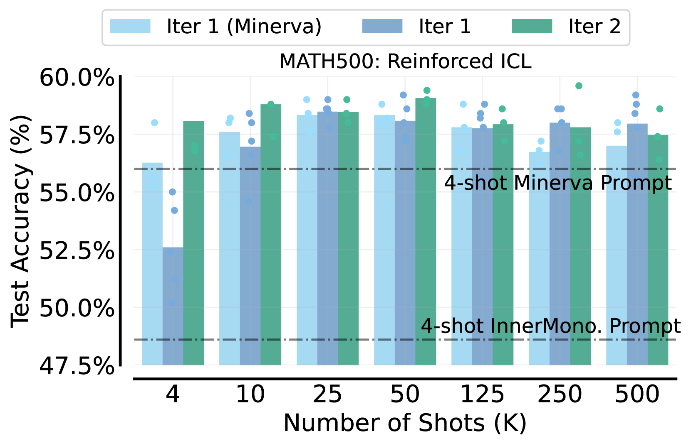

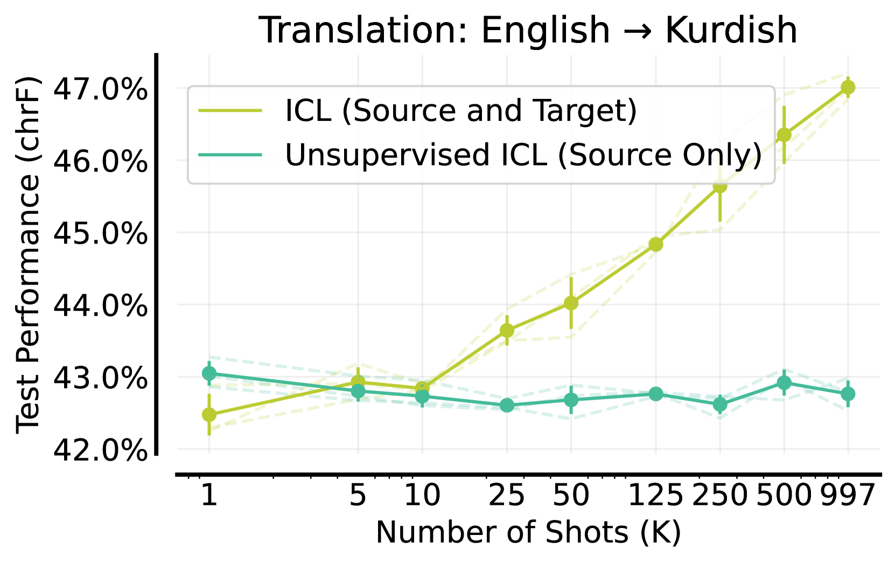

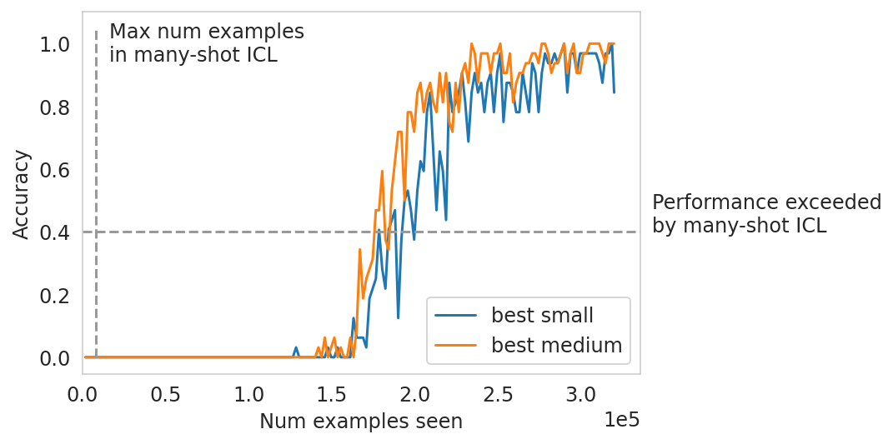

[Arxiv](https://arxiv.org/abs/2404.11018)