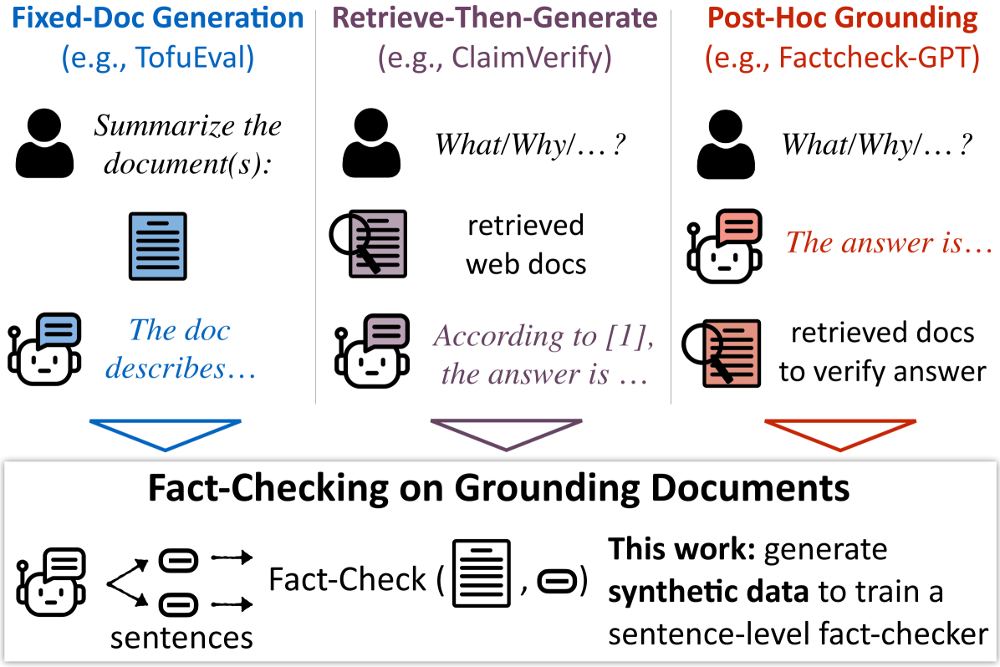
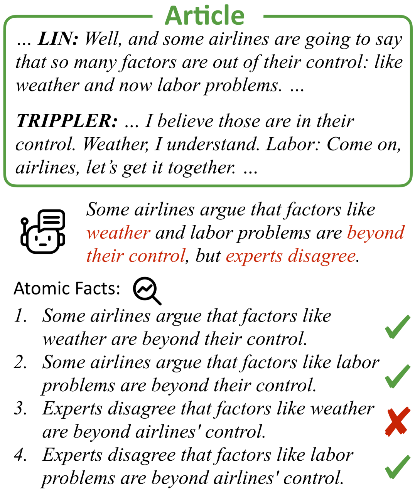
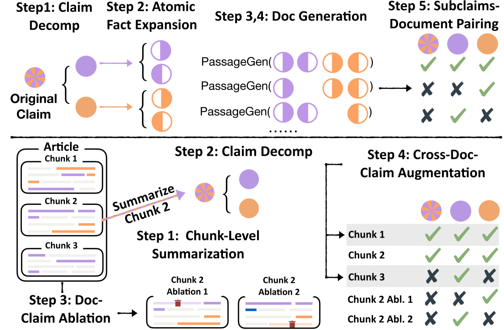
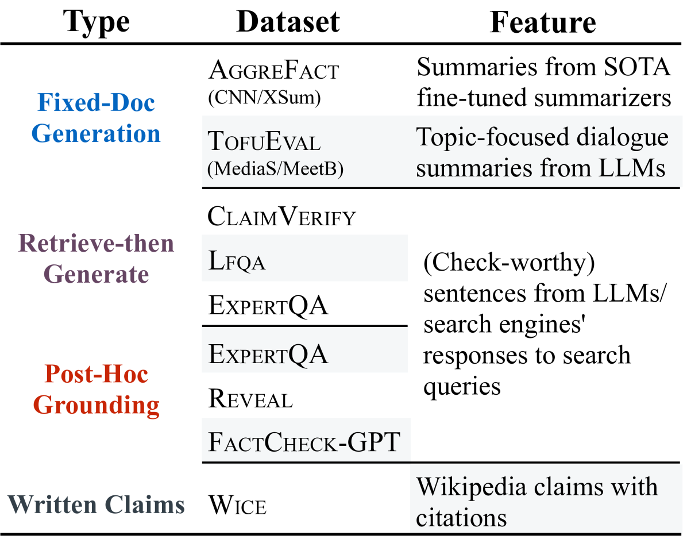
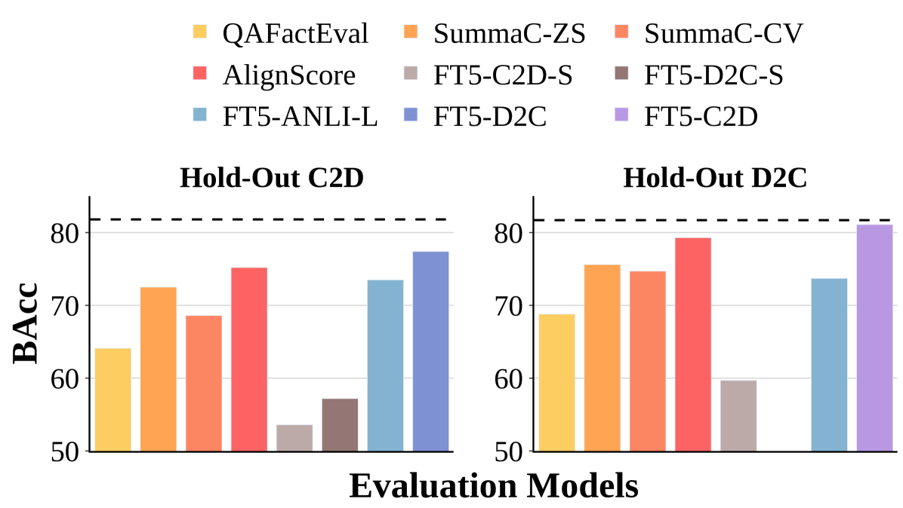

# MiniCheck：一种高效的事实核查工具，专为在基础文档上验证大型语言模型（LLMs）的准确性而设计。

发布时间：2024年04月16日

`LLM应用` `事实核查`

> MiniCheck: Efficient Fact-Checking of LLMs on Grounding Documents

# 摘要

> 在自然语言处理领域，判断大型语言模型输出是否有确凿证据支持，对于检索增强生成、内容摘要、基于文档的对话等任务极为关键。目前流行的“事实核查”方法，依赖于利用LLM对生成内容的每个部分与潜在证据进行核对。然而，这种方法计算成本高昂，验证一条响应需要多次调用LLM。本研究提出了一种新方法，通过GPT-4生成合成训练数据，创建既真实又具有挑战性的错误事实案例，从而构建出性能匹敌GPT-4但成本仅为其四百分之一的小型模型。训练过程中，模型学习如何核实每个事实陈述，并识别跨句信息的综合。我们整合了现有的相关数据集，创建了一个新的基准LLM-AggreFact，用于评估。我们的最佳系统MiniCheck-FT5（参数规模770M）不仅超越了同等规模的系统，更达到了GPT-4的精确度。目前，LLM-AggreFact、数据合成代码和模型已公开发布。

> Recognizing if LLM output can be grounded in evidence is central to many tasks in NLP: retrieval-augmented generation, summarization, document-grounded dialogue, and more. Current approaches to this kind of "fact-checking" are based on verifying each piece of a model generation against potential evidence using an LLM. However, this process can be very computationally expensive, requiring many calls to LLMs to check a single response. In this work, we show how to build small models that have GPT-4-level performance but for 400x lower cost. We do this by constructing synthetic training data with GPT-4, which involves creating realistic yet challenging instances of factual errors via a structured generation procedure. Training on this data teaches models to check each fact in the claim and recognize synthesis of information across sentences. For evaluation, we unify pre-existing datasets into a benchmark LLM-AggreFact, collected from recent work on fact-checking and grounding LLM generations. Our best system MiniCheck-FT5 (770M parameters) outperforms all systems of comparable size and reaches GPT-4 accuracy. We release LLM-AggreFact, code for data synthesis, and models.

[Arxiv](https://arxiv.org/abs/2404.10774)