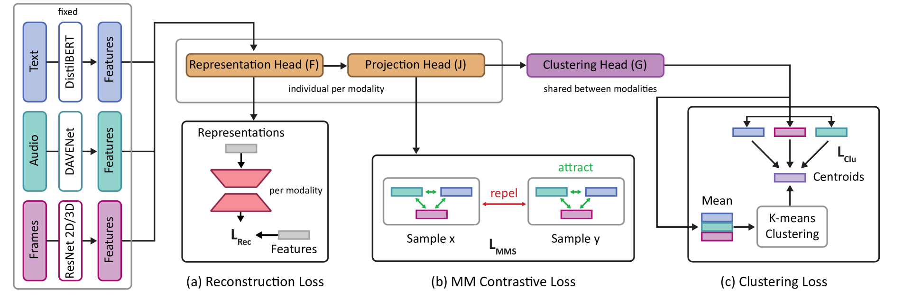
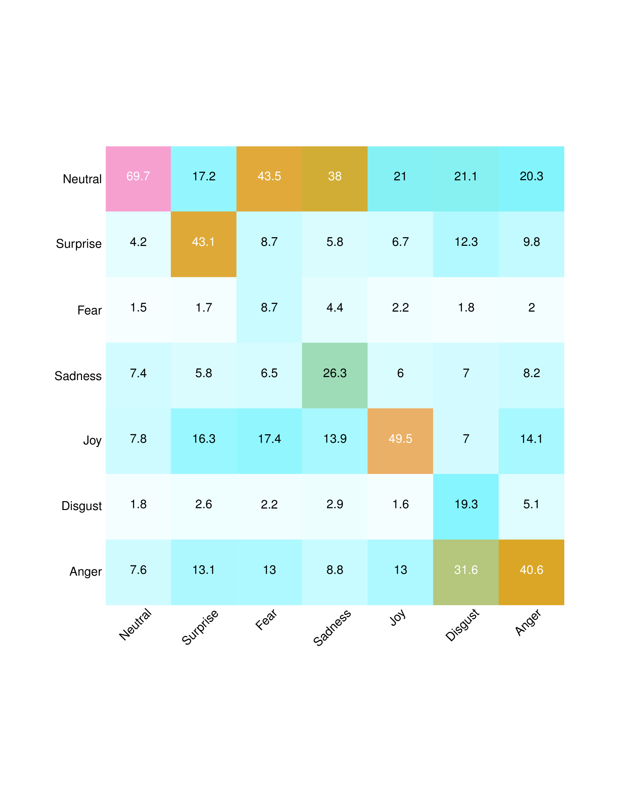
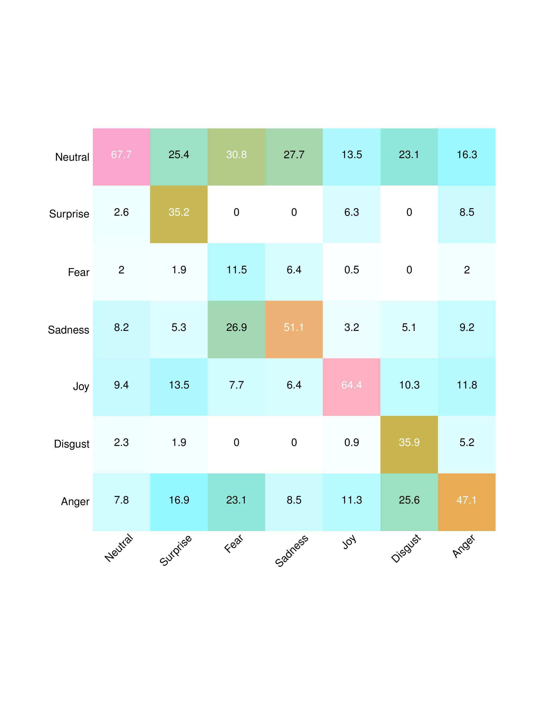
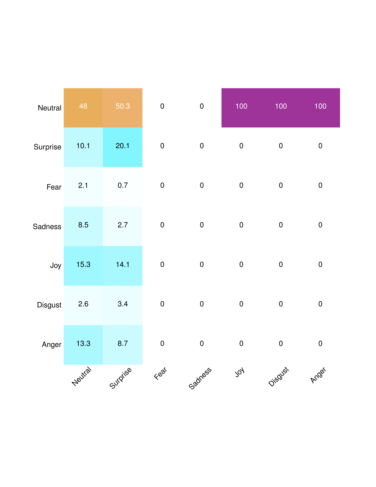
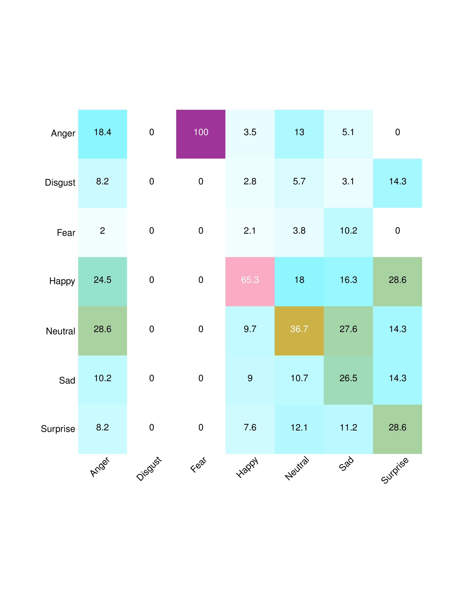
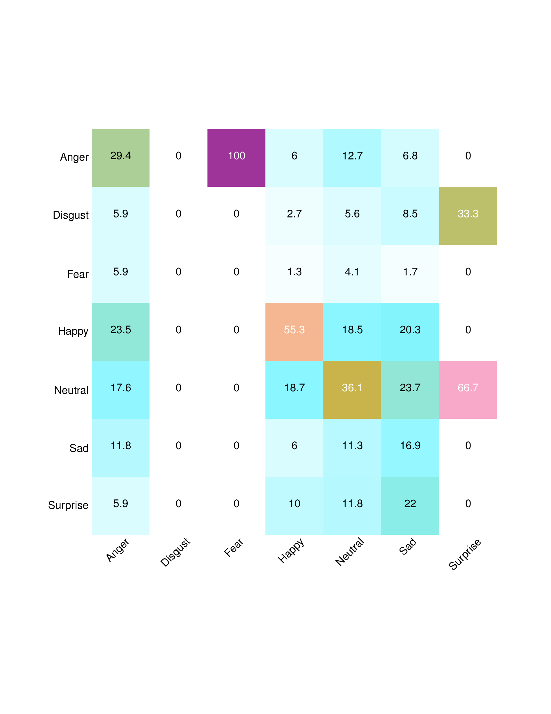

# 多模态自监督学习在面部表情识别任务中实现了多任务处理能力。

发布时间：2024年04月16日

`Agent` `面部表情识别` `自监督学习`

> Multi-Task Multi-Modal Self-Supervised Learning for Facial Expression Recognition

# 摘要

> 人类沟通包含多种方式，如面对面交流就包括了听觉（如说话声）和视觉（如面部表情和手势）信号。因此，开发基于机器学习的面部表情识别系统时，整合多种感官模态显得尤为重要。面对日益增长的未标记视频数据，这些系统应能直接利用这些原始资料，避免昂贵的标注过程。在本研究中，我们采用了一种多任务多模态自监督学习方法，专门针对野外视频数据中的人脸表情识别。我们的模型融合了三种自监督目标：首先是多模态对比损失，它使得同一视频的不同模态数据在表示空间中更接近；其次是多模态聚类损失，它在表示空间中保持了输入数据的语义结构；最后是多模态数据重构损失。我们在三个面部表情识别基准测试中对该方法进行了深入研究，并比较了不同自监督任务组合在面部表情识别任务上的表现。我们的模型ConCluGen在CMU-MOSEI数据集上超越了多个多模态自监督和全监督基线模型。研究结果普遍表明，多模态自监督任务在面部表情识别等复杂任务中能够显著提升性能，同时减少了对手动标注的依赖。我们已经将预训练模型和源代码公开发布。

> Human communication is multi-modal; e.g., face-to-face interaction involves auditory signals (speech) and visual signals (face movements and hand gestures). Hence, it is essential to exploit multiple modalities when designing machine learning-based facial expression recognition systems. In addition, given the ever-growing quantities of video data that capture human facial expressions, such systems should utilize raw unlabeled videos without requiring expensive annotations. Therefore, in this work, we employ a multitask multi-modal self-supervised learning method for facial expression recognition from in-the-wild video data. Our model combines three self-supervised objective functions: First, a multi-modal contrastive loss, that pulls diverse data modalities of the same video together in the representation space. Second, a multi-modal clustering loss that preserves the semantic structure of input data in the representation space. Finally, a multi-modal data reconstruction loss. We conduct a comprehensive study on this multimodal multi-task self-supervised learning method on three facial expression recognition benchmarks. To that end, we examine the performance of learning through different combinations of self-supervised tasks on the facial expression recognition downstream task. Our model ConCluGen outperforms several multi-modal self-supervised and fully supervised baselines on the CMU-MOSEI dataset. Our results generally show that multi-modal self-supervision tasks offer large performance gains for challenging tasks such as facial expression recognition, while also reducing the amount of manual annotations required. We release our pre-trained models as well as source code publicly

[Arxiv](https://arxiv.org/abs/2404.10904)