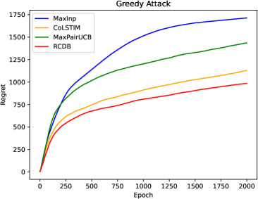
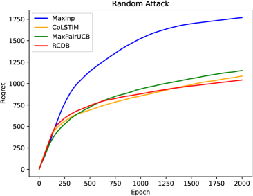
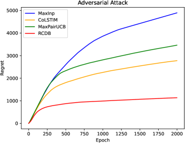
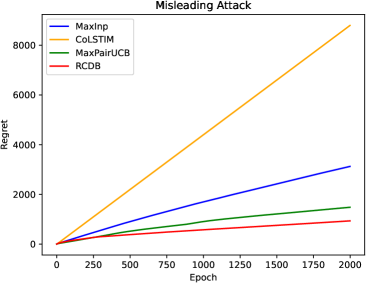
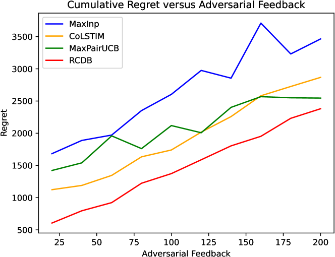

# 通过对抗性反馈优化的情境对决强盗算法接近最优解

发布时间：2024年04月16日

`RAG` `算法设计与分析` `机器学习`

> Nearly Optimal Algorithms for Contextual Dueling Bandits from Adversarial Feedback

# 摘要

> 在大型语言模型（LLM）的生成模型对齐过程中，汲取人类反馈至关重要。然而，这种策略可能受到恶意干预者的干扰，他们通过故意给出错误偏好来操纵结果，导致不良后果。为解决这一问题，我们深入研究了一个特定模型——在对抗性反馈下，上下文对决盗贼的真实偏好可能被篡改。我们设计了一种新颖算法，名为鲁棒上下文对决盗贼（\algo），该算法采用不确定性加权的最大似然估计法。此算法在对抗性反馈的回合数$T$、上下文维度$d$以及对抗性反馈总数$0 \le C \le T$的条件下，实现了近乎最优的$\tilde O(d\sqrt{T}+dC)$遗憾界限。通过实验验证，我们的算法在面对各种对抗性反馈时，均展现出超越现有技术的卓越性能。

> Learning from human feedback plays an important role in aligning generative models, such as large language models (LLM). However, the effectiveness of this approach can be influenced by adversaries, who may intentionally provide misleading preferences to manipulate the output in an undesirable or harmful direction. To tackle this challenge, we study a specific model within this problem domain--contextual dueling bandits with adversarial feedback, where the true preference label can be flipped by an adversary. We propose an algorithm namely robust contextual dueling bandit (\algo), which is based on uncertainty-weighted maximum likelihood estimation. Our algorithm achieves an $\tilde O(d\sqrt{T}+dC)$ regret bound, where $T$ is the number of rounds, $d$ is the dimension of the context, and $ 0 \le C \le T$ is the total number of adversarial feedback. We also prove a lower bound to show that our regret bound is nearly optimal, both in scenarios with and without ($C=0$) adversarial feedback. Additionally, we conduct experiments to evaluate our proposed algorithm against various types of adversarial feedback. Experimental results demonstrate its superiority over the state-of-the-art dueling bandit algorithms in the presence of adversarial feedback.

[Arxiv](https://arxiv.org/abs/2404.10776)