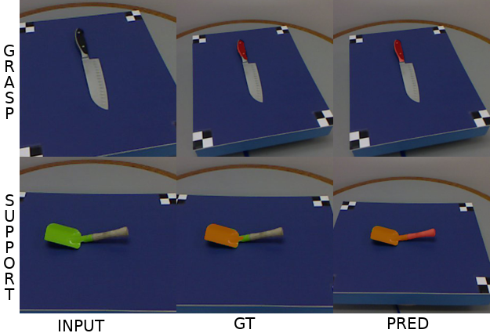
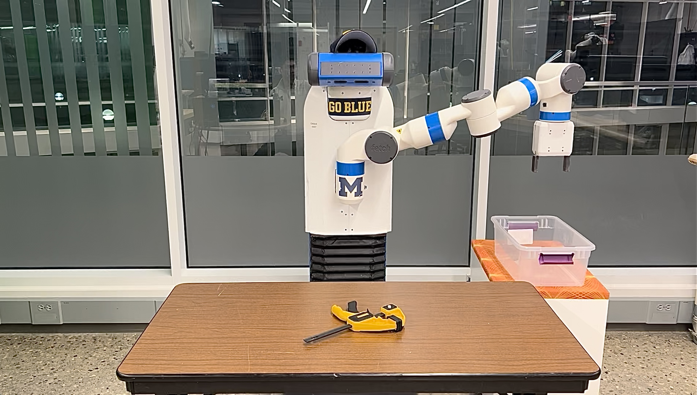

# OVAL-Prompt：一种开放式词汇的可操作性定位方法，利用大型语言模型（LLM）为机器人操控提供支持。

发布时间：2024年04月16日

`分类：Agent` `机器人技术` `人工智能`

> OVAL-Prompt: Open-Vocabulary Affordance Localization for Robot Manipulation through LLM Affordance-Grounding

# 摘要

> 为了让机器人与物体有效互动，它们必须识别出所遇物体的形状与功能。核心在于，机器人需明白每个物体能提供哪些操作，以及这些操作应在物体的哪个部位执行。我们期望机器人能在杂乱无章的人类环境中自如运作，这意味着机器人在部署前无法预知将遇到的物体类型和相应的操作可能性（即开放式词汇场景）。本研究提出了 OVAL-Prompt，这是一种基于提示的方法，用于在 RGB-D 图像中进行开放式词汇的行动可能性定位。该方法结合了视觉语言模型（VLM）进行开放式词汇的物体部分分割，以及大型语言模型（LLM）来识别每个部分-分割-行动可能性，展现了对新物体实例、类别和行动可能性的广泛适用性，无需特定领域的精细调整。量化实验显示，OVAL-Prompt 在无需调整的情况下，其定位精度可与监督式基线模型相媲美。此外，定性实验证实了 OVAL-Prompt 能够支持基于行动可能性的机器人对开放式词汇物体实例和类别的操作。

> In order for robots to interact with objects effectively, they must understand the form and function of each object they encounter. Essentially, robots need to understand which actions each object affords, and where those affordances can be acted on. Robots are ultimately expected to operate in unstructured human environments, where the set of objects and affordances is not known to the robot before deployment (i.e. the open-vocabulary setting). In this work, we introduce OVAL-Prompt, a prompt-based approach for open-vocabulary affordance localization in RGB-D images. By leveraging a Vision Language Model (VLM) for open-vocabulary object part segmentation and a Large Language Model (LLM) to ground each part-segment-affordance, OVAL-Prompt demonstrates generalizability to novel object instances, categories, and affordances without domain-specific finetuning. Quantitative experiments demonstrate that without any finetuning, OVAL-Prompt achieves localization accuracy that is competitive with supervised baseline models. Moreover, qualitative experiments show that OVAL-Prompt enables affordance-based robot manipulation of open-vocabulary object instances and categories.

[Arxiv](https://arxiv.org/abs/2404.11000)