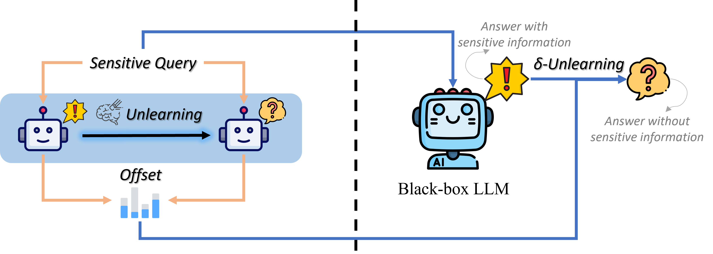
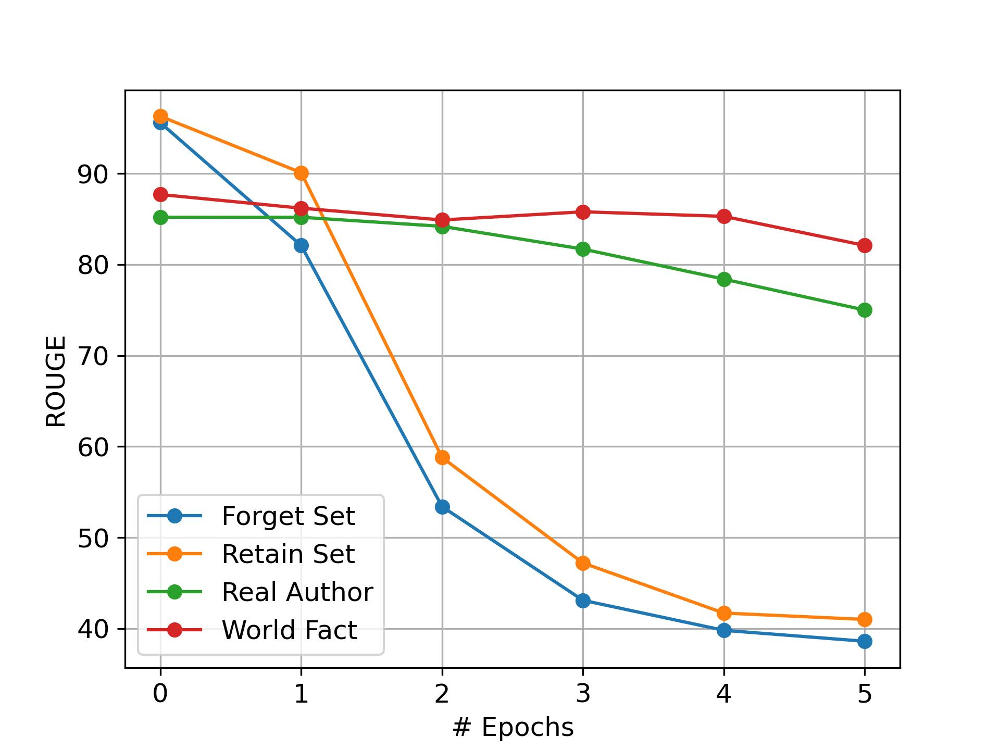
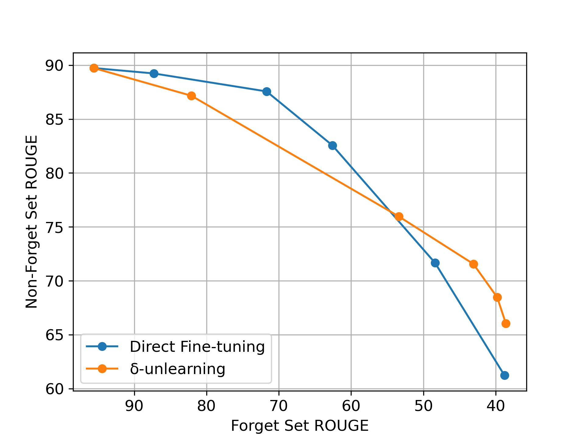
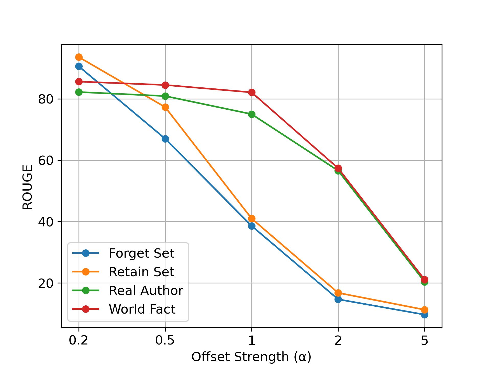

# 为大型语言模型消除偏差学习

发布时间：2024年04月16日

`LLM应用` `伦理和法律` `人工智能`

> Offset Unlearning for Large Language Models

# 摘要

> 大型语言模型（LLMs）虽能从训练数据中学习知识，但其中包含的敏感信息如版权、有害和私人内容，引发了伦理和法律问题。为应对这些问题，遗忘技术成为了一种可能的解决方案。然而，现有遗忘技术要么因需访问模型内部权重而不适用于黑盒LLMs，要么在推理时保留敏感信息以进行校正，违反了数据保护原则。我们提出了$δ$-遗忘，一种为黑盒LLMs设计的偏移遗忘框架。该框架不直接调整LLM，而是通过比较两组较小模型的logits来学习必要的logit偏移量。实验结果证明，$δ$-遗忘能够在不牺牲或甚至提升模型在非遗忘任务上性能的前提下，有效实现目标数据的遗忘。此外，$δ$-遗忘还能灵活地整合多种遗忘算法，为适配现有遗忘算法到黑盒LLMs提供了一种通用的解决方案。

> Despite the strong capabilities of Large Language Models (LLMs) to acquire knowledge from their training corpora, the memorization of sensitive information in the corpora such as copyrighted, harmful, and private content has led to ethical and legal concerns. In response to these challenges, unlearning has emerged as a potential remedy for LLMs affected by problematic training data. However, previous unlearning techniques are either not applicable to black-box LLMs due to required access to model internal weights, or violate data protection principles by retaining sensitive data for inference-time correction. We propose $δ$-unlearning, an offset unlearning framework for black-box LLMs. Instead of tuning the black-box LLM itself, $δ$-unlearning learns the logit offset needed for unlearning by contrasting the logits from a pair of smaller models. Experiments demonstrate that $δ$-unlearning can effectively unlearn target data while maintaining similar or even stronger performance on general out-of-forget-scope tasks. $δ$-unlearning also effectively incorporates different unlearning algorithms, making our approach a versatile solution to adapting various existing unlearning algorithms to black-box LLMs.

[Arxiv](https://arxiv.org/abs/2404.11045)