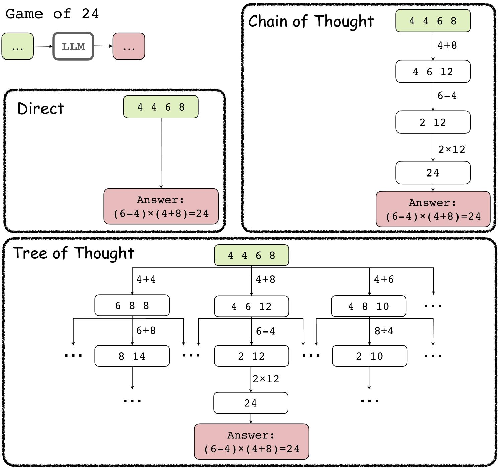
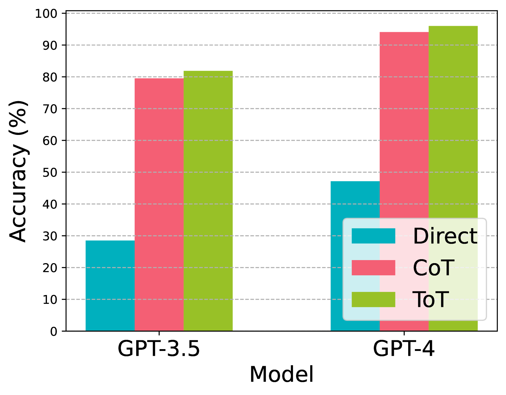
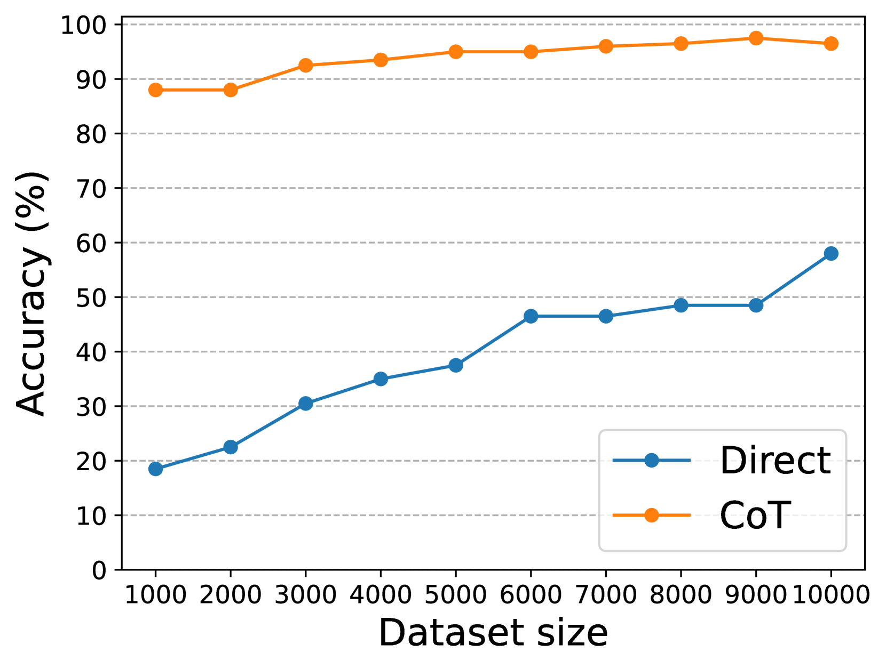
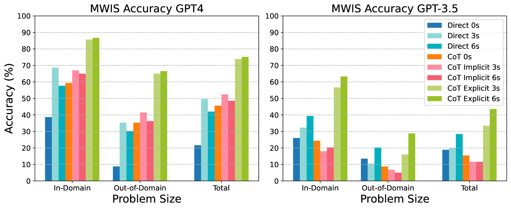
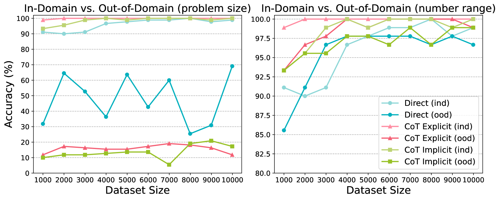
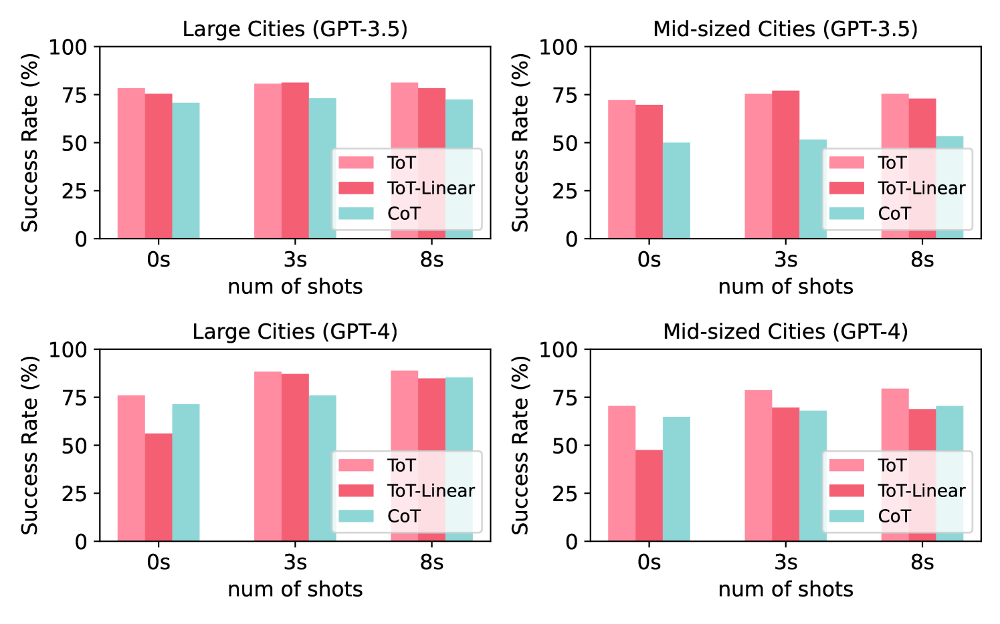
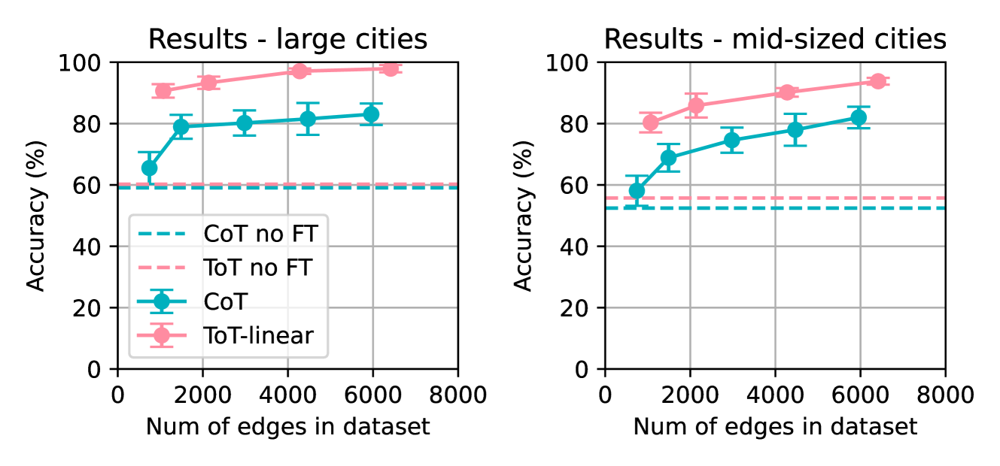
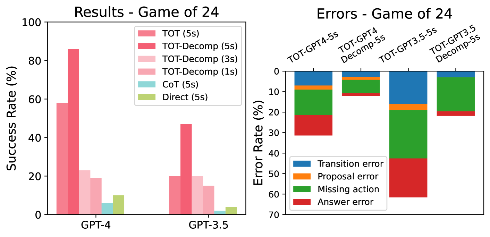
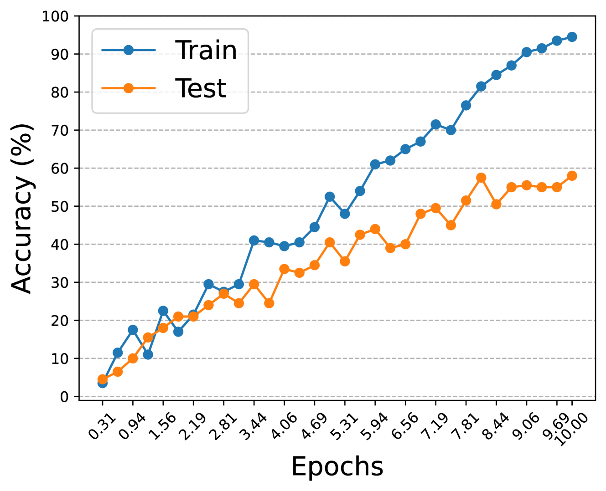

# 探究大型语言模型在推理与规划方面的经验复杂性

发布时间：2024年04月16日

`分类：LLM理论` `人工智能` `机器学习`

> On the Empirical Complexity of Reasoning and Planning in LLMs

# 摘要

> 大型语言模型（LLMs）在处理某些复杂推理问题时，借助思维链（CoT）或思维树（ToT）的方法表现出了惊人的效果，但其背后的原理尚不明确。本研究通过实验案例分析，并将其结果与机器学习中的样本和计算复杂性相联系，以探究这些方法的效果。研究发现，当问题能够被分解为一系列推理步骤，并且预测下一步的样本和计算复杂性较低时，清晰地展示包含所有必要信息的推理链条，有助于提升解题表现。反之，对于那些预测下一步计算难度较高的问题，采用思维树（ToT）的方法可能会比构建简短的推理链条带来更佳的推理效果。

> Large Language Models (LLMs) work surprisingly well for some complex reasoning problems via chain-of-thought (CoT) or tree-of-thought (ToT), but the underlying reasons remain unclear. We seek to understand the performance of these methods by conducting experimental case studies and linking the outcomes to sample and computational complexity in machine learning. We found that if problems can be decomposed into a sequence of reasoning steps and learning to predict the next step has a low sample and computational complexity, explicitly outlining the reasoning chain with all necessary information for predicting the next step may improve performance. Conversely, for problems where predicting the next step is computationally hard, adopting ToT may yield better reasoning outcomes than attempting to formulate a short reasoning chain.

[Arxiv](https://arxiv.org/abs/2404.11041)