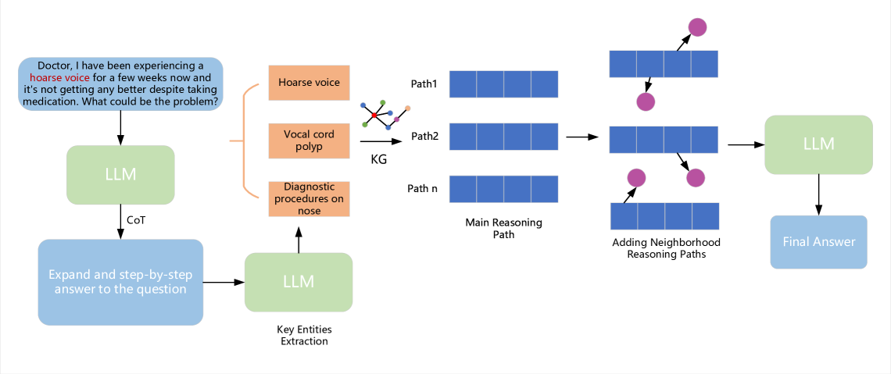
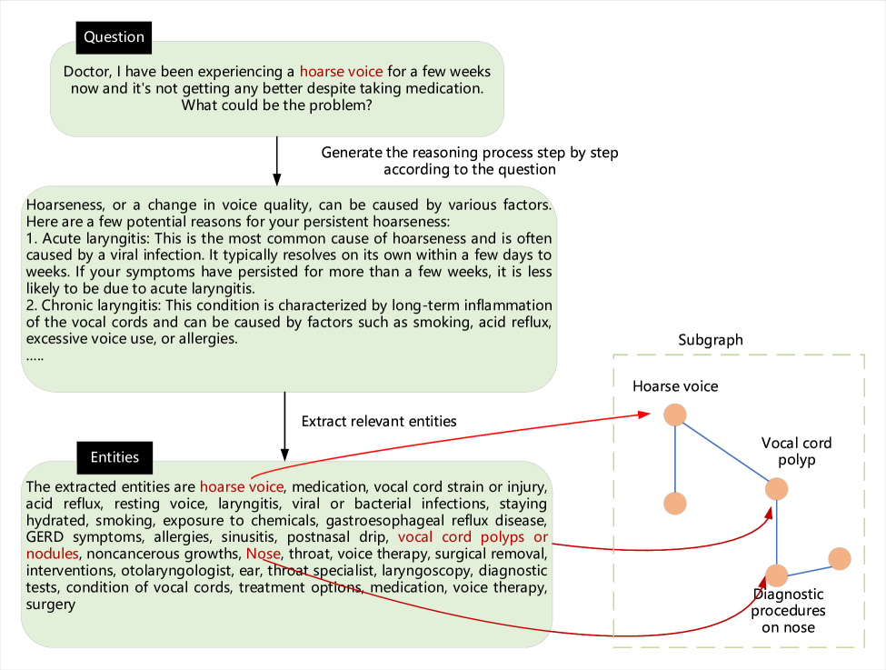
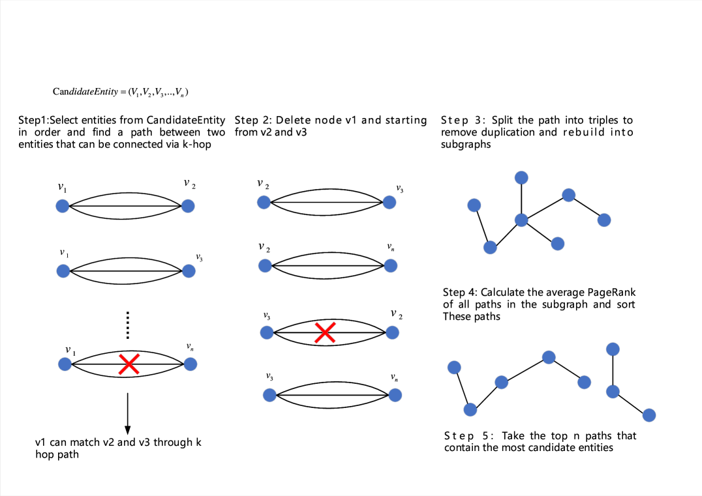
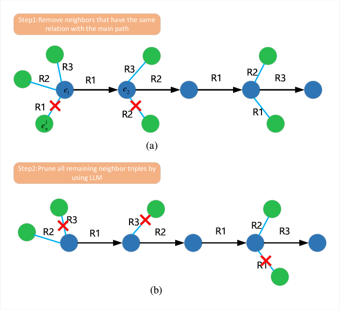
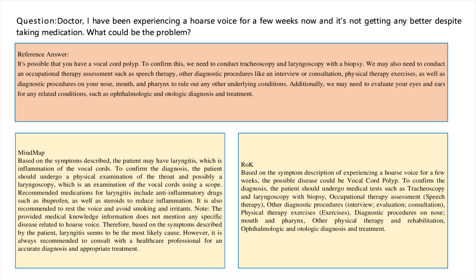
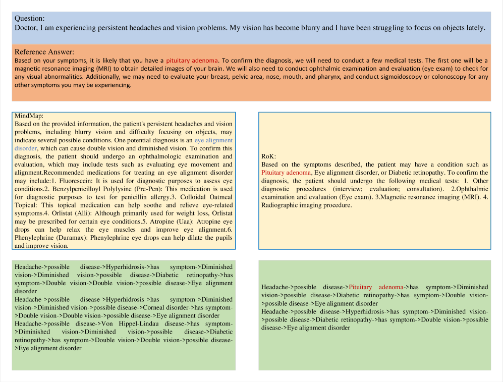
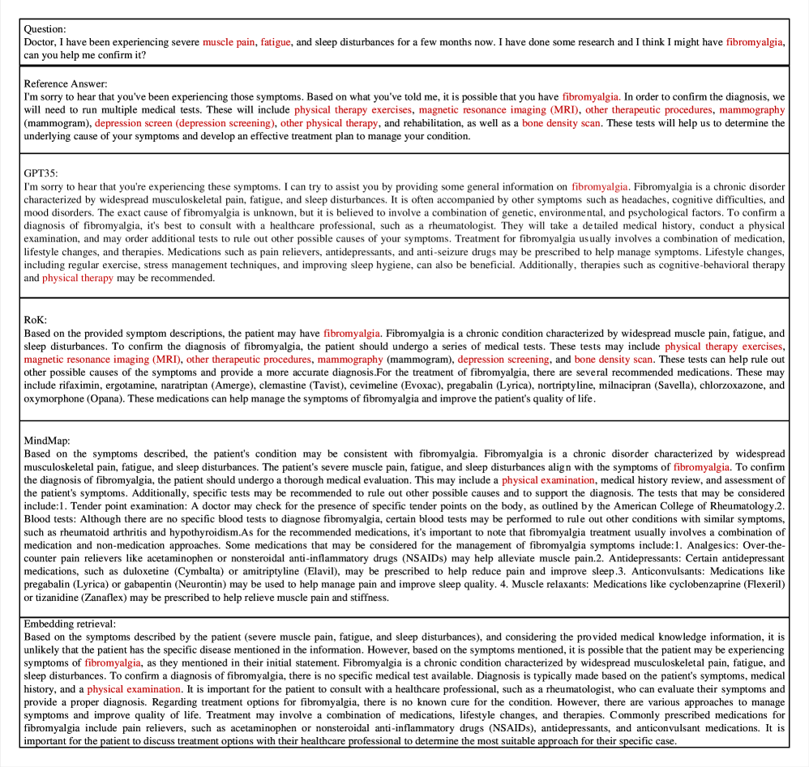

# 高效知识路径推理：知识图谱助力大型语言模型解答领域问题

发布时间：2024年04月16日

`LLM应用` `知识图谱` `推理路径优化`

> Reasoning on Efficient Knowledge Paths:Knowledge Graph Guides Large Language Model for Domain Question Answering

# 摘要

> 像 GPT3.5、GPT4 和 LLAMA2 这样的大型语言模型在众多任务上展现出超越人类专家的能力。但在特定领域的测试中，它们往往因为缺乏充分的专业训练而产生幻觉现象。微调这些模型也面临挑战，例如模型不开源或难以构建高质量的指导信息。因此，知识图谱等结构化知识库能更有效地为 LLMs 提供领域知识支持，发挥其推理分析的潜力。在以往的研究中，通过问题检索子图时，会反复调用 LLM 来判断三元组是否适宜。对于需要复杂推理的问题，频繁的模型调用会导致巨大的计算消耗。而且，每选择一个推理步骤就会调用一次 LLM，一旦选错，便会累积错误。本文提出了一个优化的流程，通过基于 LLM 的知识图谱推理路径选择，降低了对 LLM 的依赖。同时，我们引入了一种结合思维链和页面排名的高效子图检索方法，能够锁定最可能的答案路径。我们在 GenMedGPT-5k、WebQuestions 和 CMCQA 三个数据集上进行了验证。RoK 实验结果表明，减少 LLM 调用次数仍可达到先进模型的性能水平。

> Large language models (LLMs), such as GPT3.5, GPT4 and LLAMA2 perform surprisingly well and outperform human experts on many tasks. However, in many domain-specific evaluations, these LLMs often suffer from hallucination problems due to insufficient training of relevant corpus. Furthermore, fine-tuning large models may face problems such as the LLMs are not open source or the construction of high-quality domain instruction is difficult. Therefore, structured knowledge databases such as knowledge graph can better provide domain back- ground knowledge for LLMs and make full use of the reasoning and analysis capabilities of LLMs. In some previous works, LLM was called multiple times to determine whether the current triplet was suitable for inclusion in the subgraph when retrieving subgraphs through a question. Especially for the question that require a multi-hop reasoning path, frequent calls to LLM will consume a lot of computing power. Moreover, when choosing the reasoning path, LLM will be called once for each step, and if one of the steps is selected incorrectly, it will lead to the accumulation of errors in the following steps. In this paper, we integrated and optimized a pipeline for selecting reasoning paths from KG based on LLM, which can reduce the dependency on LLM. In addition, we propose a simple and effective subgraph retrieval method based on chain of thought (CoT) and page rank which can returns the paths most likely to contain the answer. We conduct experiments on three datasets: GenMedGPT-5k [14], WebQuestions [2], and CMCQA [21]. Finally, RoK can demonstrate that using fewer LLM calls can achieve the same results as previous SOTAs models.

[Arxiv](https://arxiv.org/abs/2404.10384)