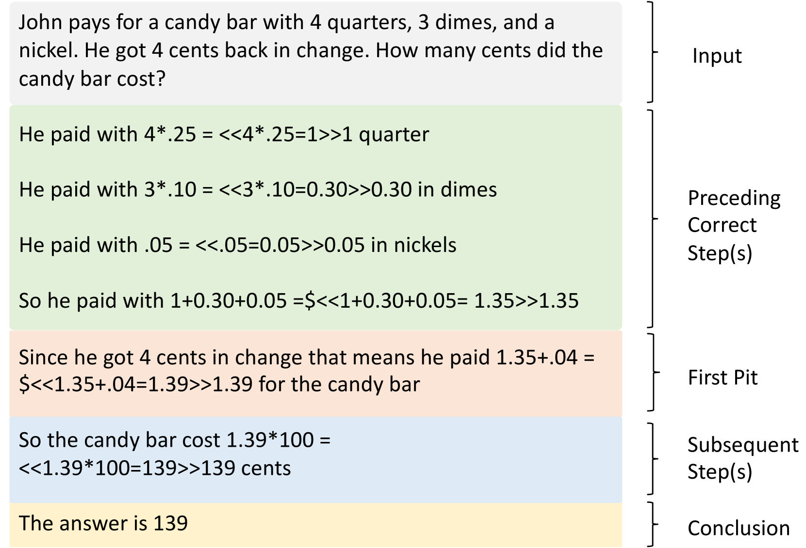
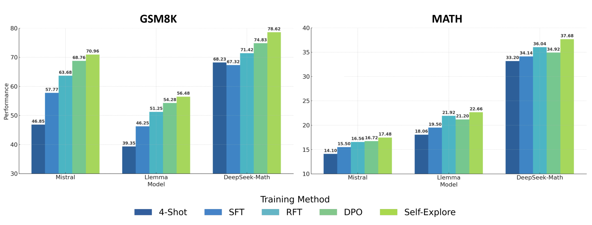
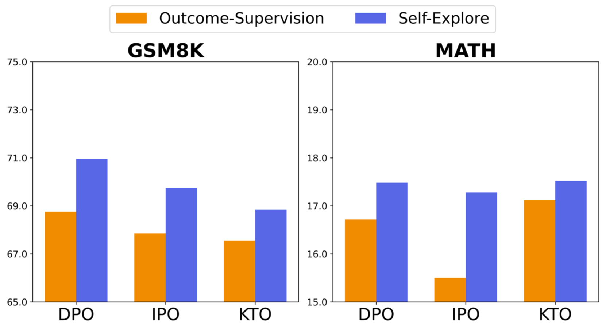
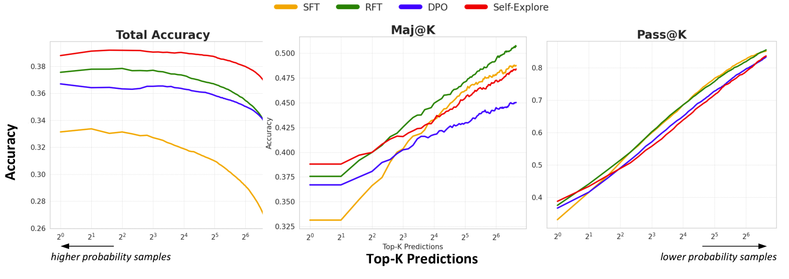
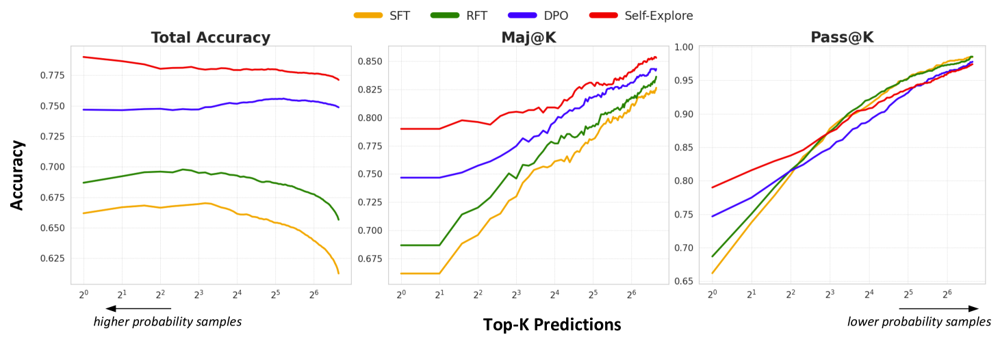
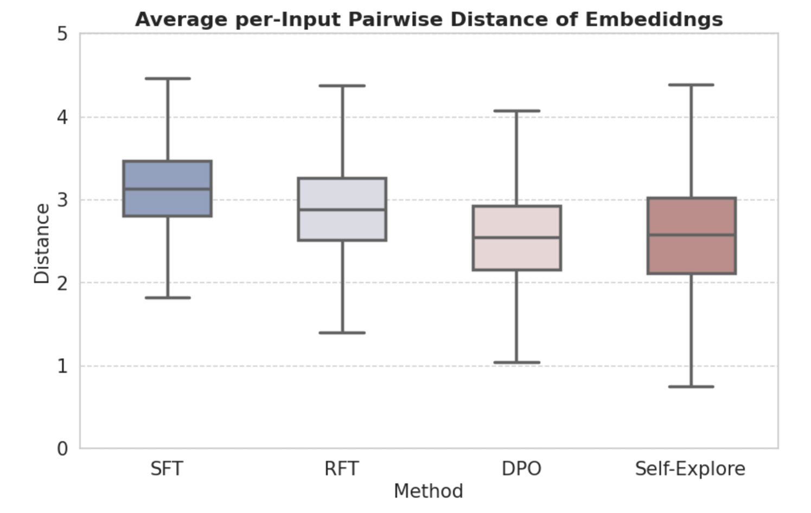
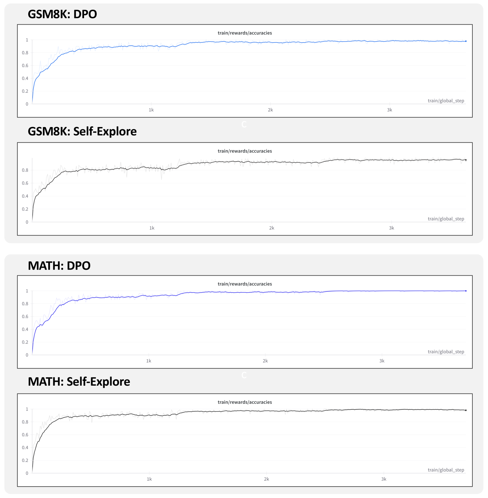
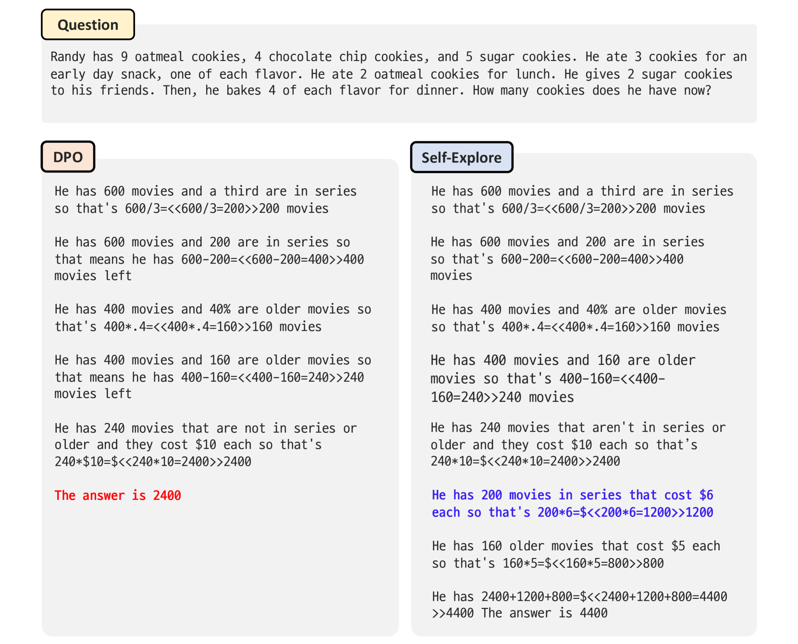
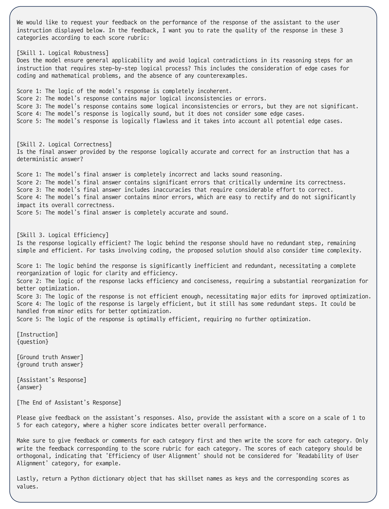
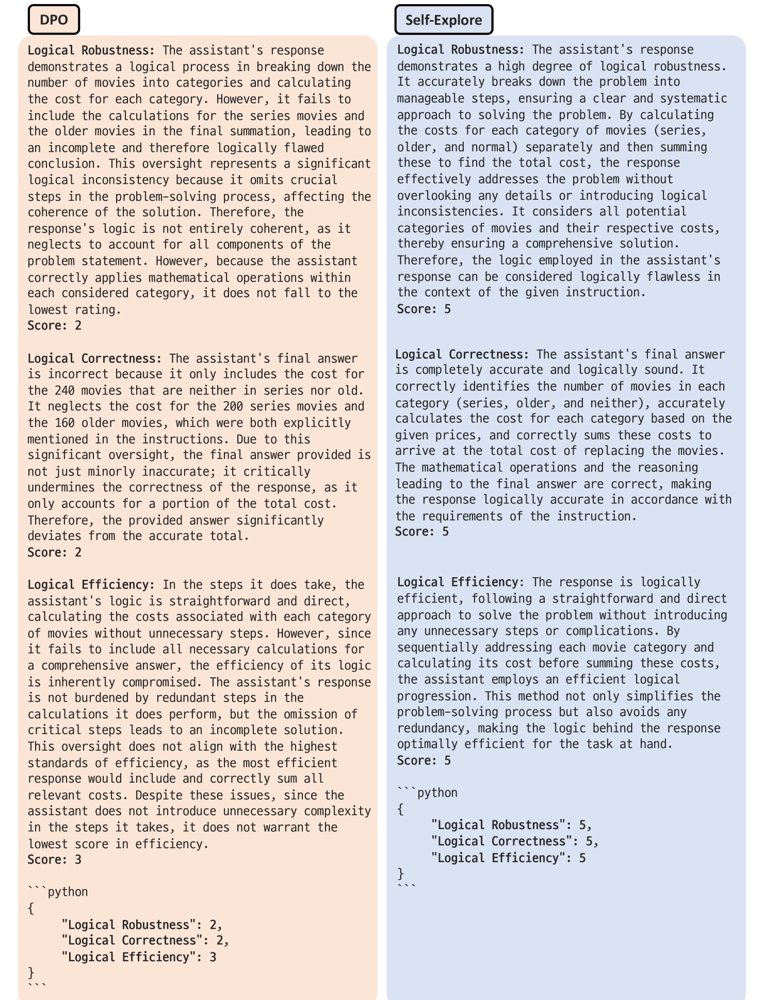

# 探索自救，远离陷阱：利用精细奖励机制增强语言模型的推理能力

发布时间：2024年04月16日

`LLM理论` `人工智能` `自我提升`

> Self-Explore to Avoid the Pit: Improving the Reasoning Capabilities of Language Models with Fine-grained Rewards

# 摘要

> 通过大量理由训练（例如CoT微调）能有效提升大型语言模型（LLM）的推理能力。但获取人工编写的理由或从专有模型中扩充理由成本高昂且难以扩展。本文探讨了LLM是否能够自我提升其推理技能的问题，并提出了一种名为“自我探索”的方法，该方法要求LLM在理由中寻找首个错误步骤（即首个陷阱），并以此作为细粒度的奖励信号以促进进一步的改进。在GSM8K和MATH测试集中，与监督微调（SFT）相比，自我探索在三个不同的LLM上平均提升了11.57%和2.89%。相关代码已在GitHub上公开，地址为 https://github.com/hbin0701/Self-Explore。

> Training on large amounts of rationales (i.e., CoT Fine-tuning) is effective at improving the reasoning capabilities of large language models (LLMs). However, acquiring human-authored rationales or augmenting rationales from proprietary models is costly and not scalable. In this paper, we study the problem of whether LLMs could self-improve their reasoning capabilities. To this end, we propose Self-Explore, where the LLM is tasked to explore the first wrong step (i.e., the first pit) within the rationale and use such signals as fine-grained rewards for further improvement. On the GSM8K and MATH test set, Self-Explore achieves 11.57% and 2.89% improvement on average across three LLMs compared to supervised fine-tuning (SFT). Our code is available at https://github.com/hbin0701/Self-Explore.

[Arxiv](https://arxiv.org/abs/2404.10346)