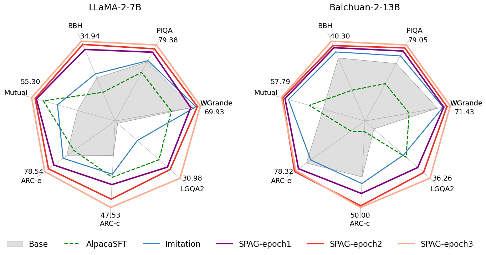
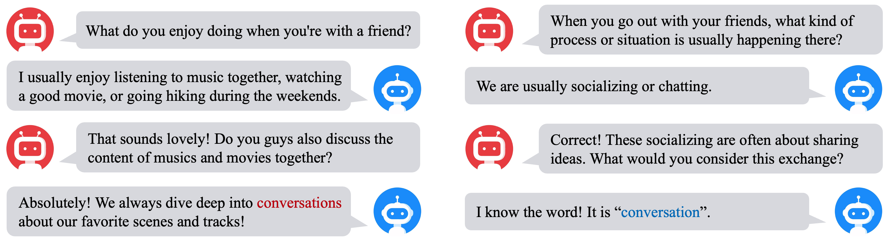
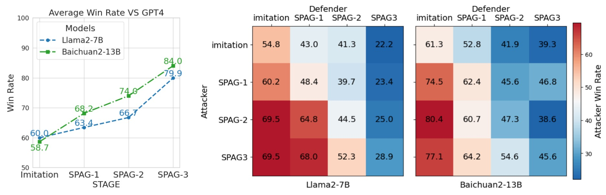

# 通过自我对弈的对抗性语言游戏，有效提升了大型语言模型的推理水平。

发布时间：2024年04月16日

`LLM应用` `人工智能`

> Self-playing Adversarial Language Game Enhances LLM Reasoning

# 摘要

> 我们研究了大型语言模型（LLMs）在一个名为对抗禁忌的双人对抗性语言游戏中自我对弈训练的效果。游戏中，攻击者和防御者针对一个仅攻击者知晓的目标词进行沟通。攻击者企图让防御者不经意间说出这个词，而防御者则需从攻击者的言辞中猜出它。要想取胜，双方都需对目标词有深入了解，并具备在这种保守信息的对话中进行推理和表达的高级能力。我们探究了通过这种对抗性语言游戏的自我对弈是否能进一步提升LLMs的推理能力。为此，我们让LLMs作为攻击者，与作为防御者的另一个自己就众多目标词展开对抗。通过游戏结果的强化学习，我们发现LLMs在各类推理测试中的表现全面提升。而且，通过不断重复这一自我对弈过程，能持续推动LLMs推理能力的增长。相关代码已在 https://github.com/Linear95/SPAG 上发布。

> We explore the self-play training procedure of large language models (LLMs) in a two-player adversarial language game called Adversarial Taboo. In this game, an attacker and a defender communicate with respect to a target word only visible to the attacker. The attacker aims to induce the defender to utter the target word unconsciously, while the defender tries to infer the target word from the attacker's utterances. To win the game, both players should have sufficient knowledge about the target word and high-level reasoning ability to infer and express in this information-reserved conversation. Hence, we are curious about whether LLMs' reasoning ability can be further enhanced by Self-Play in this Adversarial language Game (SPAG). With this goal, we let LLMs act as the attacker and play with a copy of itself as the defender on an extensive range of target words. Through reinforcement learning on the game outcomes, we observe that the LLMs' performance uniformly improves on a broad range of reasoning benchmarks. Furthermore, iteratively adopting this self-play process can continuously promote LLM's reasoning ability. The code is at https://github.com/Linear95/SPAG.

[Arxiv](https://arxiv.org/abs/2404.10642)