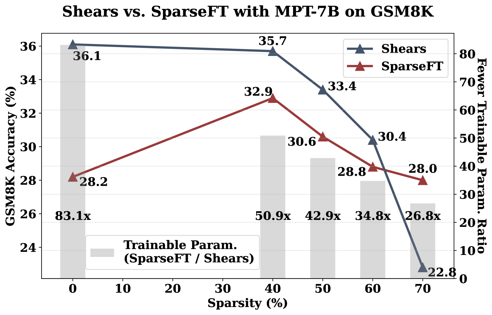

# Shears：利用神经网络低秩适配器搜索技术，实现模型的非结构化稀疏化。

发布时间：2024年04月16日

`LLM理论` `神经网络` `模型优化`

> Shears: Unstructured Sparsity with Neural Low-rank Adapter Search

# 摘要

> 近期，多项研究成功展示了权重共享的神经架构搜索（NAS）能够高效地探索具有弹性的低秩适配器（LoRA）的搜索空间，实现大型语言模型的参数高效微调（PEFT）与压缩。本文提出了一种创新方法——Shears，阐释了如何结合经济的稀疏性与新提出的神经低秩适配器搜索（NLS）算法，进一步提升PEFT方法的效率。实验结果显示，Shears相较于其他方法具有显著优势，能够在保持或仅小幅降低准确度的同时，实现高稀疏度，且仅需单GPU数小时即可完成。

> Recently, several approaches successfully demonstrated that weight-sharing Neural Architecture Search (NAS) can effectively explore a search space of elastic low-rank adapters (LoRA), allowing the parameter-efficient fine-tuning (PEFT) and compression of large language models. In this paper, we introduce a novel approach called Shears, demonstrating how the integration of cost-effective sparsity and a proposed Neural Low-rank adapter Search (NLS) algorithm can further improve the efficiency of PEFT approaches. Results demonstrate the benefits of Shears compared to other methods, reaching high sparsity levels while improving or with little drop in accuracy, utilizing a single GPU for a pair of hours.

[Arxiv](https://arxiv.org/abs/2404.10934)