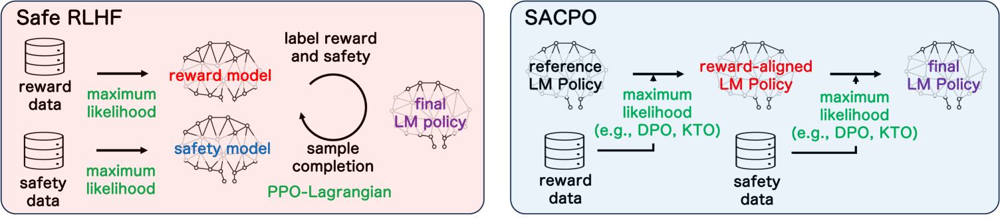
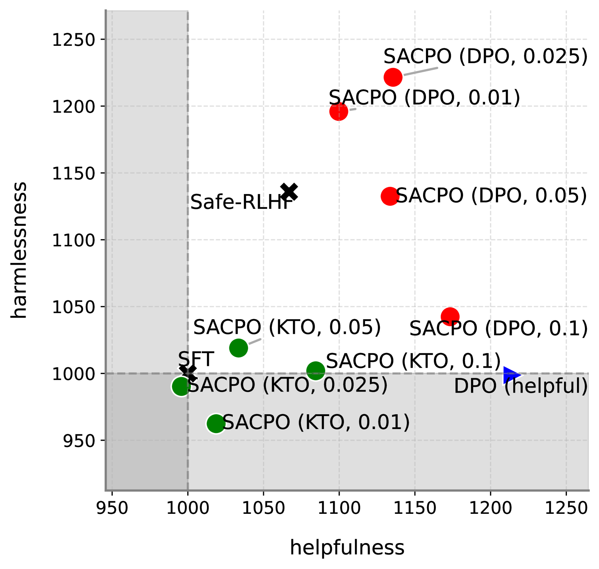
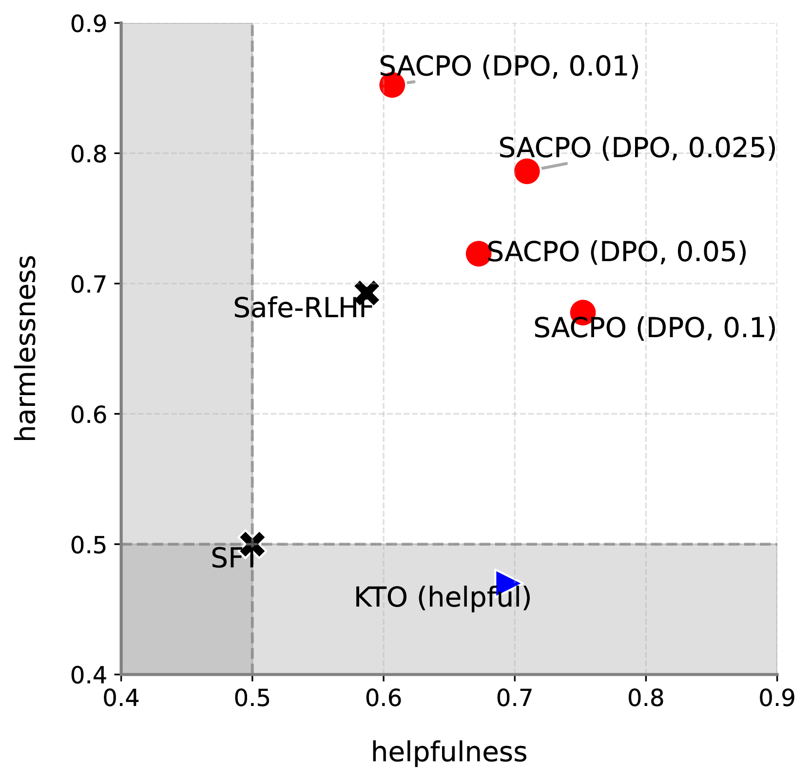
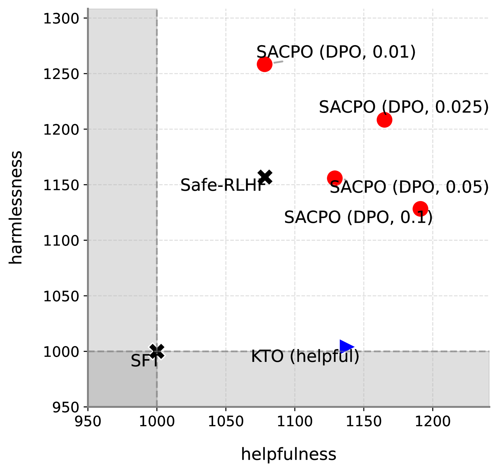
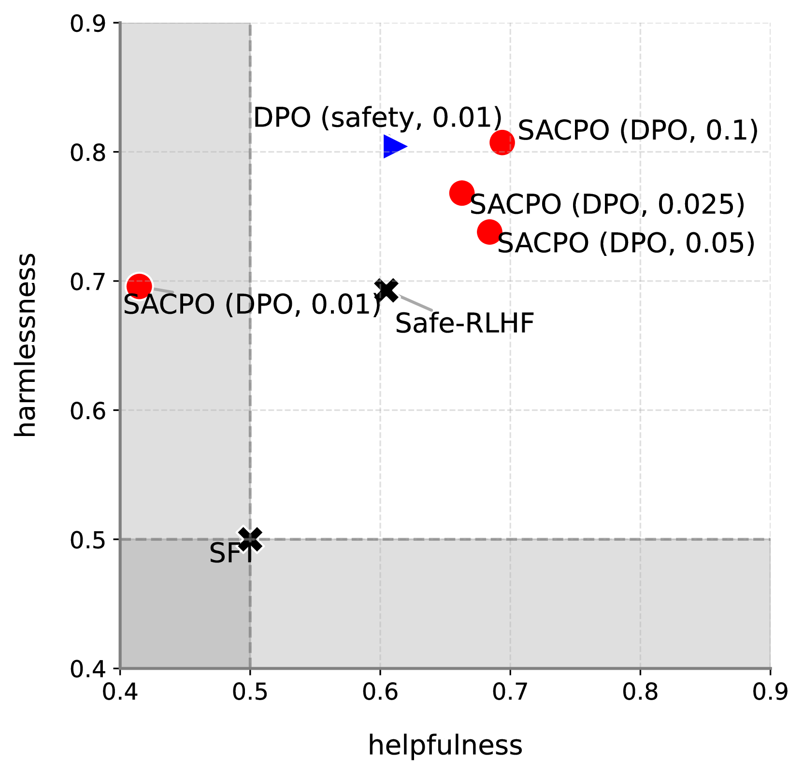
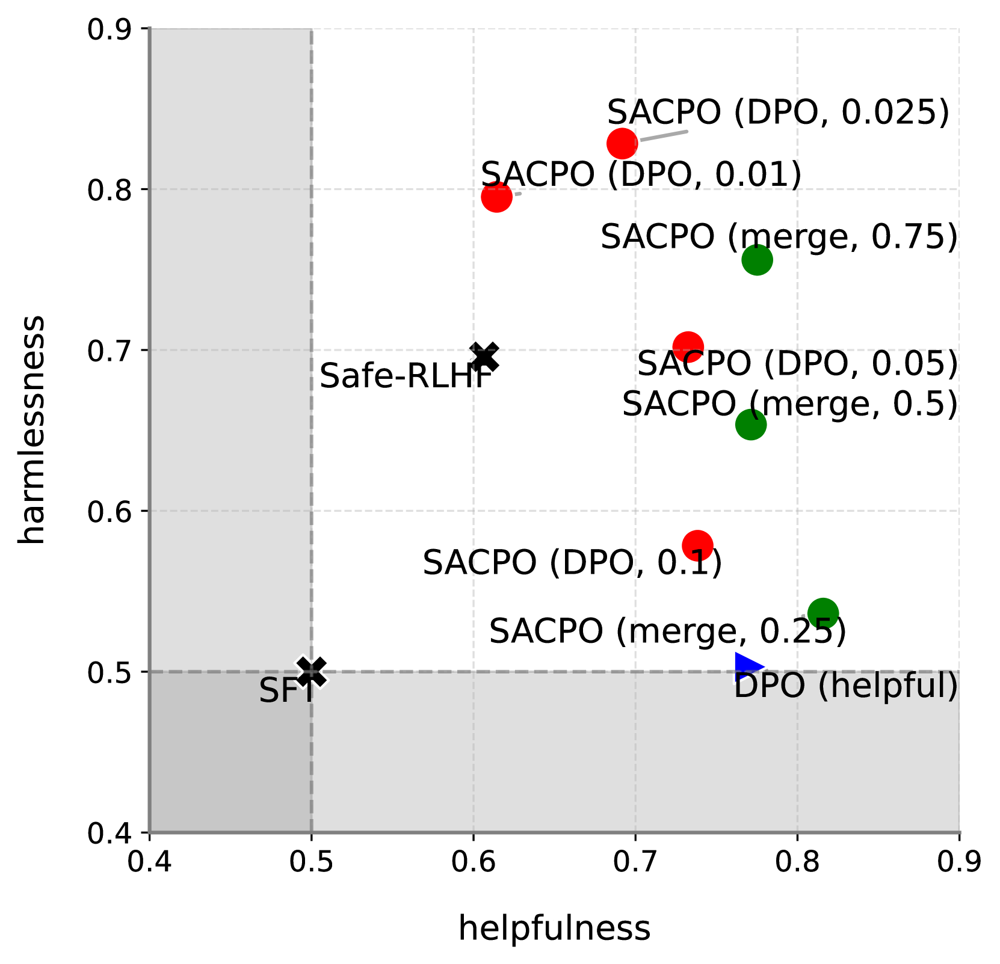
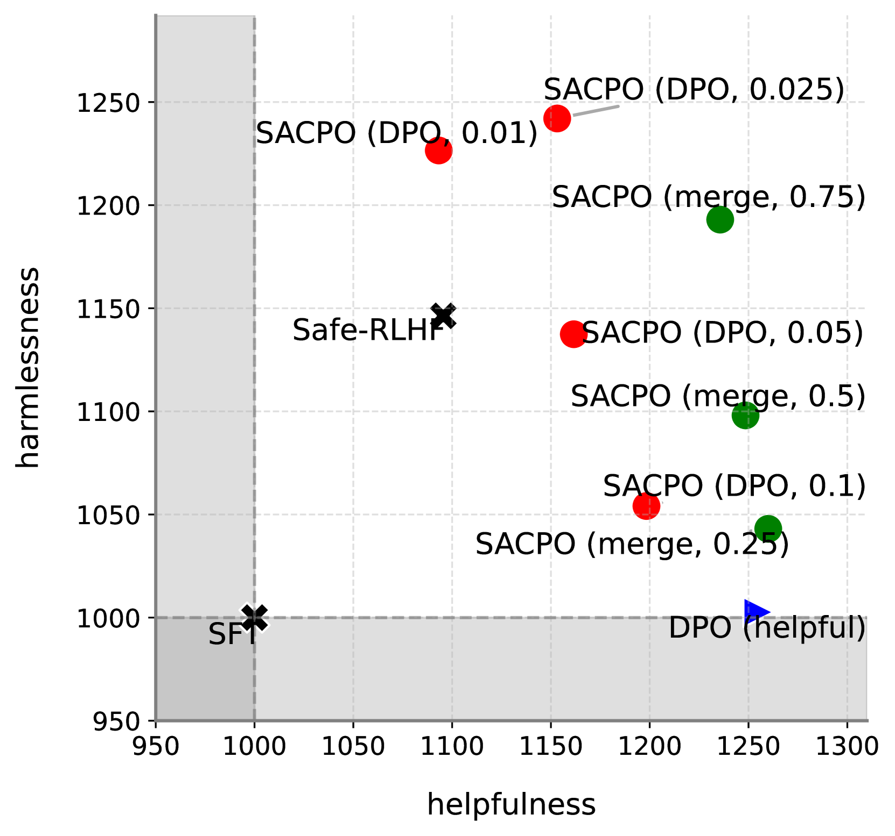

# 渐进式对齐：优化受限语言模型策略的新途径

发布时间：2024年04月16日

`LLM应用` `人工智能`

> Stepwise Alignment for Constrained Language Model Policy Optimization

# 摘要

> 在现实世界应用中，安全性与可信度是部署基于大型语言模型（LLMs）的人工智能系统的基本要求。本文提出了一种新算法——逐步对齐约束策略优化（SACPO），旨在通过语言模型策略优化实现人类价值的最大化，同时确保安全。SACPO的核心理念是，一个既考虑奖励又兼顾安全的最优策略可以直接从奖励对齐策略中推导出来。该算法利用直接偏好优化（DPO）等简洁而高效的对齐技术，逐步对LLMs的各项指标进行优化。SACPO以其简洁、稳定、计算高效和在算法及数据集选择上的灵活性而备受推崇。在合理的假设条件下，我们的理论分析为接近最优解和安全约束违规提供了上限。实验结果显示，SACPO在提升Alpaca-7B模型的有用性和安全性方面，超越了现有的最先进方法。

> Safety and trustworthiness are indispensable requirements for applying AI systems based on large language models (LLMs) in real-world applications. This paper formulates a human value alignment as a language model policy optimization problem to maximize reward under a safety constraint and then proposes an algorithm called Stepwise Alignment for Constrained Policy Optimization (SACPO). A key idea behind SACPO, supported by theory, is that the optimal policy incorporating both reward and safety can be directly obtained from a reward-aligned policy. Based on this key idea, SACPO aligns the LLMs with each metric step-wise while leveraging simple yet powerful alignment algorithms such as direct preference optimization (DPO). SACPO provides many benefits such as simplicity, stability, computational efficiency, and flexibility regarding algorithms and dataset selection. Under mild assumption, our theoretical analysis provides the upper bounds regarding near-optimality and safety constraint violation. Our experimental results show that SACPO can fine-tune Alpaca-7B better than the state-of-the-art method in terms of both helpfulness and harmlessness

[Arxiv](https://arxiv.org/abs/2404.11049)