# SuRe：为大型语言模型（LLMs）的开放域问答任务，通过候选答案对检索结果进行智能总结。

发布时间：2024年04月16日

`LLM应用` `问答系统`

> SuRe: Summarizing Retrievals using Answer Candidates for Open-domain QA of LLMs

# 摘要

> 大型语言模型（LLMs）在自然语言处理的多个任务上取得了突破性进展，尤其是在问答（QA）领域。尽管结合新信息检索相关文段是提升LLMs QA性能的有效途径，但现有技术往往需要额外的微调步骤，这在最新LLMs上变得不太现实。我们提出了一种新颖的方法，通过提示来增强检索到的文段，以克服这一难题，但这一研究方向尚未得到充分探索。我们设计了一个简洁高效的框架——总结检索（SuRe），用于提升LLMs在开放域问答（ODQA）任务中的表现。SuRe通过为每个可能的答案构建检索文段的摘要，并评估这些摘要的有效性来确定最可信的答案，从而辅助LLMs给出更加准确的回答。在多个ODQA基准测试中，SuRe展现了其卓越性能，相较于传统提示方法，精确匹配（EM）准确度提升了4.6%，F1分数提升了4.0%。此外，SuRe能够与多种检索技术和LLMs无缝集成。SuRe生成的摘要不仅有助于评估检索文段的相关性，也为模型和人类提供了更优的理由。

> Large language models (LLMs) have made significant advancements in various natural language processing tasks, including question answering (QA) tasks. While incorporating new information with the retrieval of relevant passages is a promising way to improve QA with LLMs, the existing methods often require additional fine-tuning which becomes infeasible with recent LLMs. Augmenting retrieved passages via prompting has the potential to address this limitation, but this direction has been limitedly explored. To this end, we design a simple yet effective framework to enhance open-domain QA (ODQA) with LLMs, based on the summarized retrieval (SuRe). SuRe helps LLMs predict more accurate answers for a given question, which are well-supported by the summarized retrieval that could be viewed as an explicit rationale extracted from the retrieved passages. Specifically, SuRe first constructs summaries of the retrieved passages for each of the multiple answer candidates. Then, SuRe confirms the most plausible answer from the candidate set by evaluating the validity and ranking of the generated summaries. Experimental results on diverse ODQA benchmarks demonstrate the superiority of SuRe, with improvements of up to 4.6% in exact match (EM) and 4.0% in F1 score over standard prompting approaches. SuRe also can be integrated with a broad range of retrieval methods and LLMs. Finally, the generated summaries from SuRe show additional advantages to measure the importance of retrieved passages and serve as more preferred rationales by models and humans.

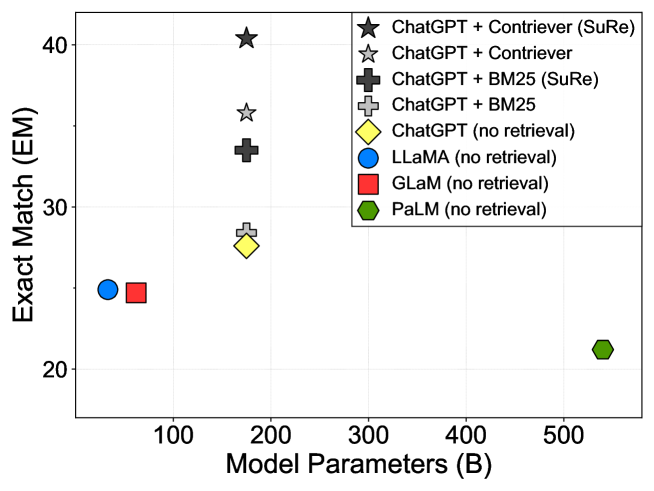

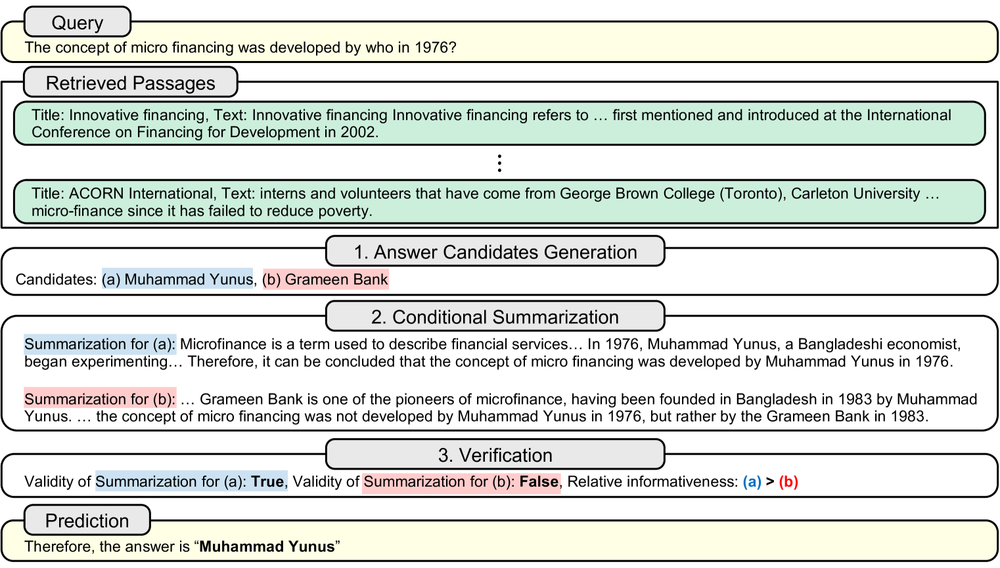

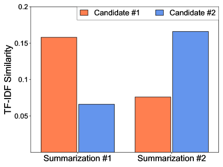

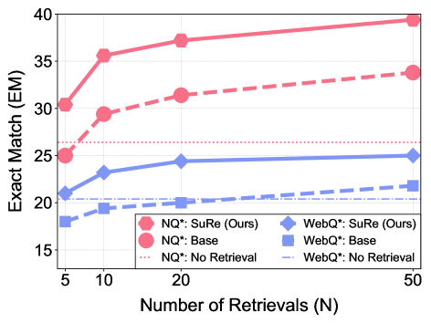

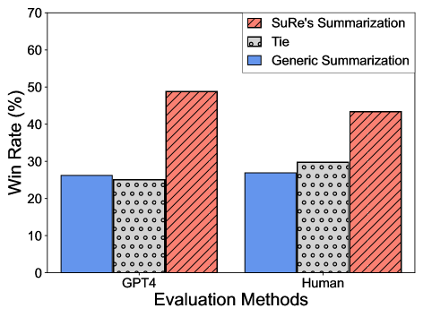

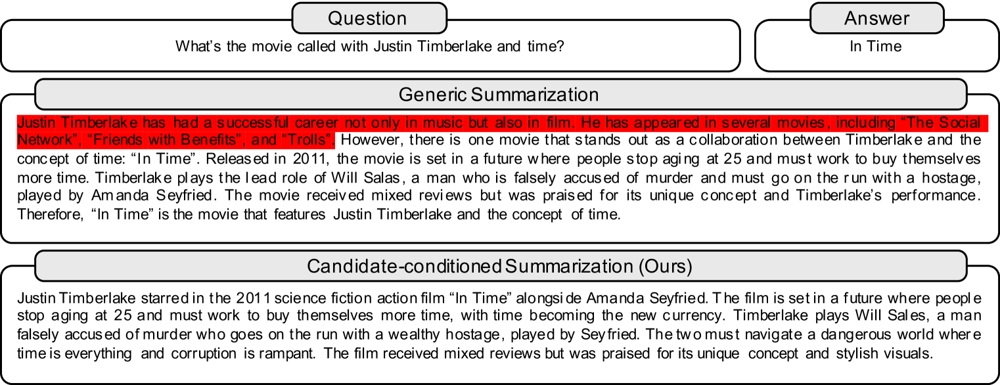

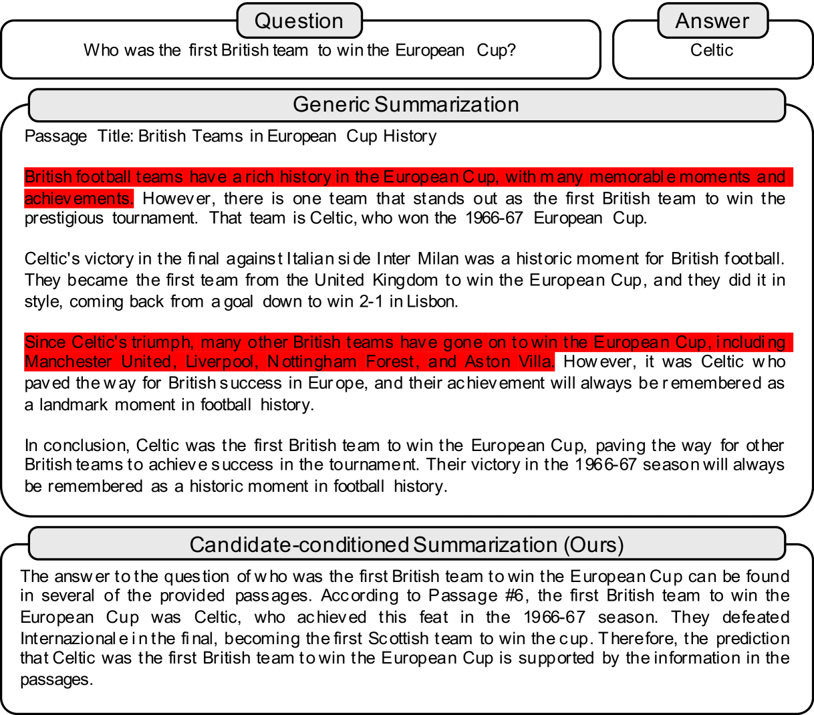

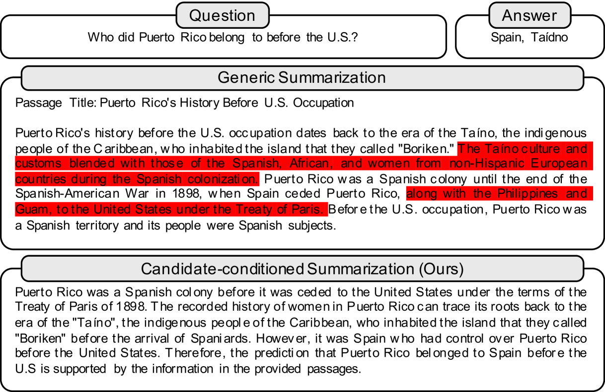

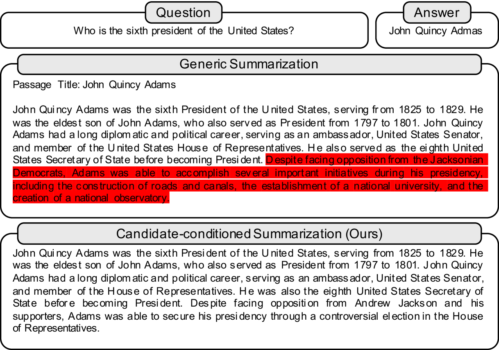

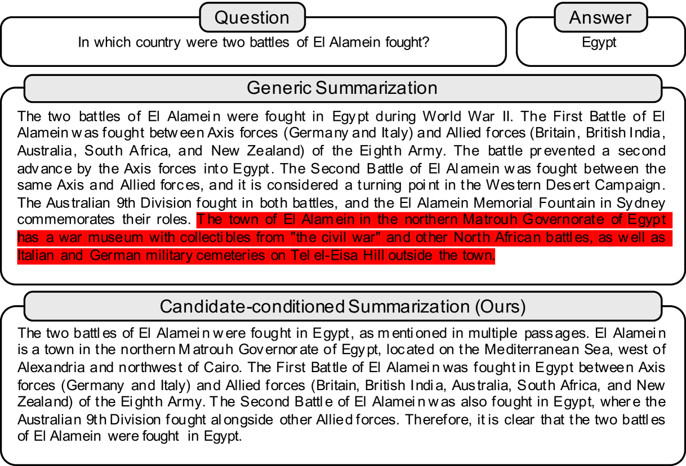

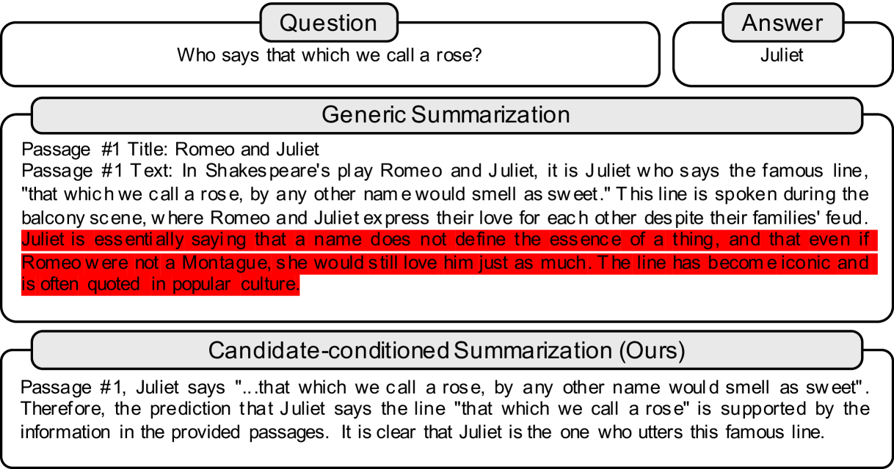

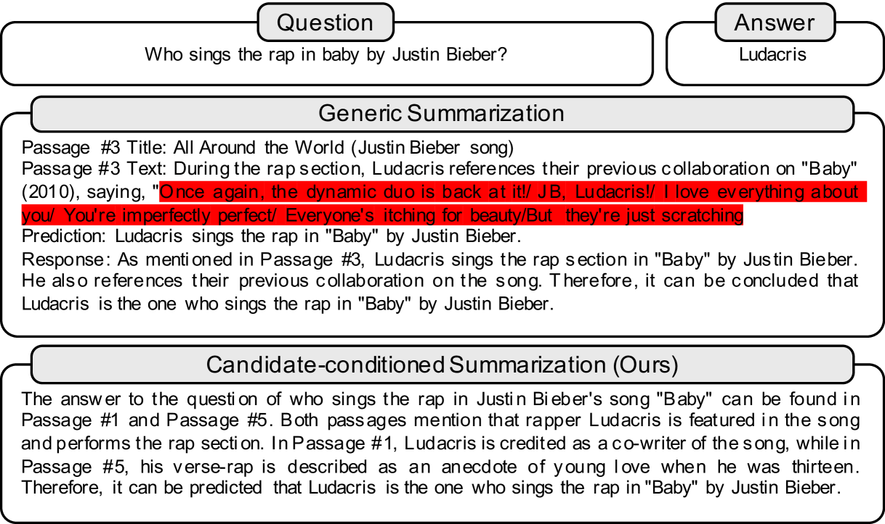

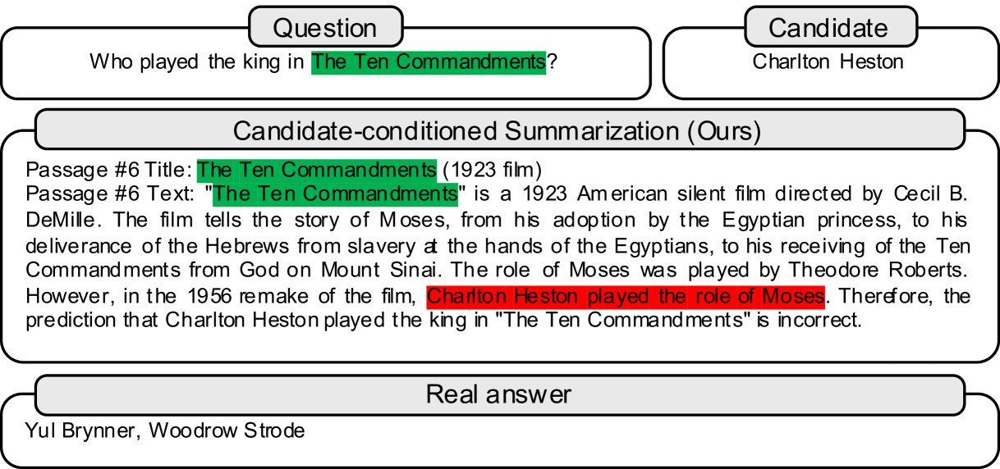

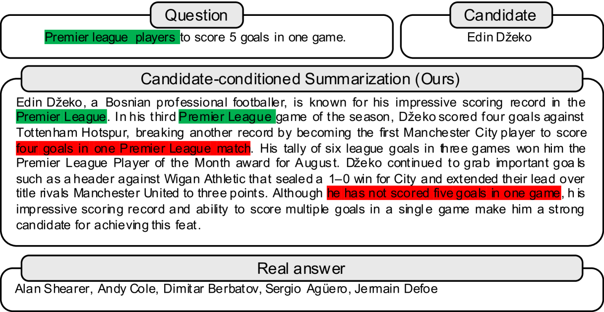

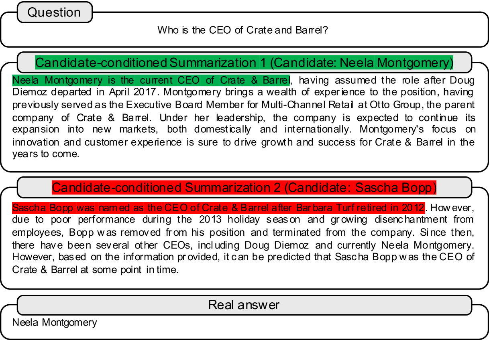

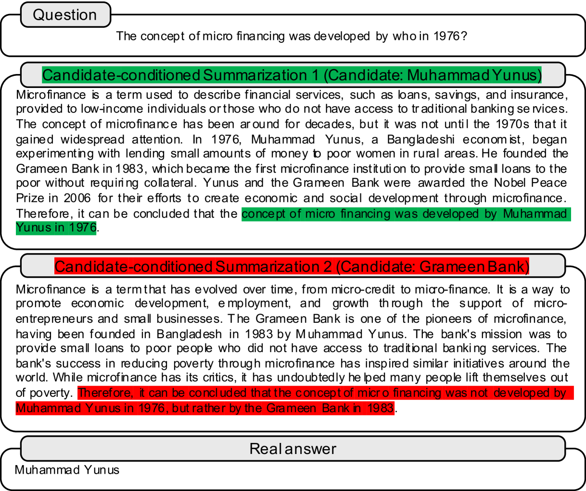

[Arxiv](https://arxiv.org/abs/2404.13081)