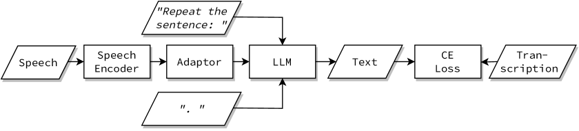
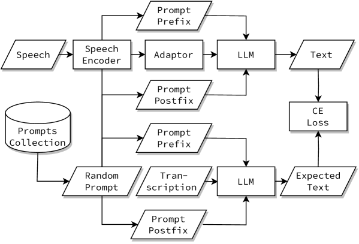
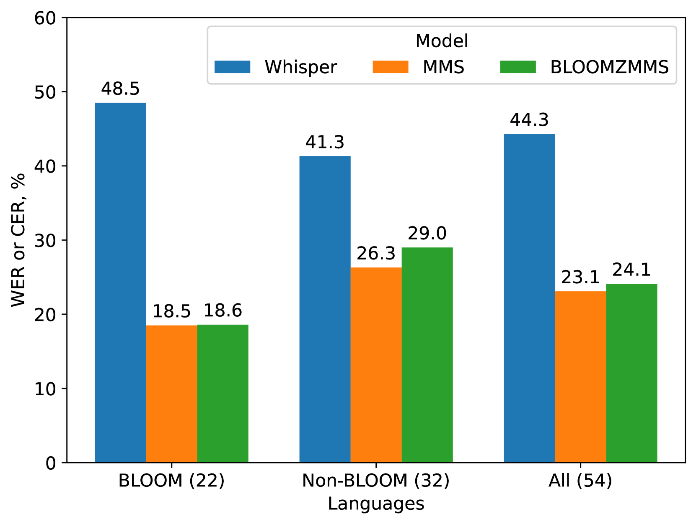
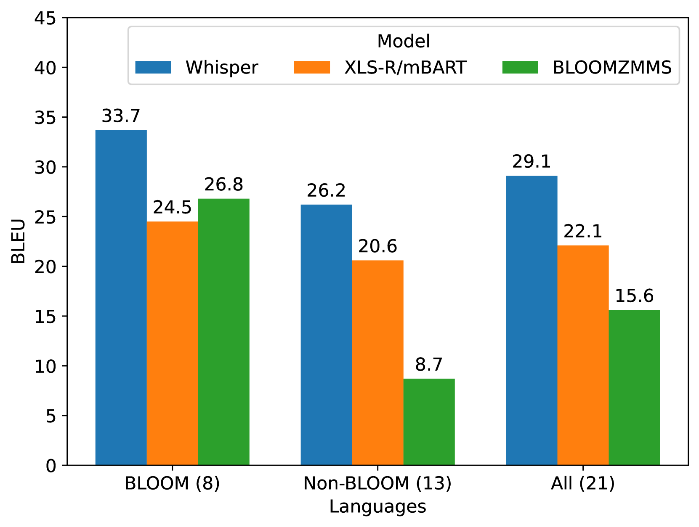
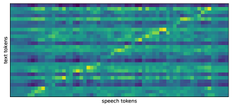
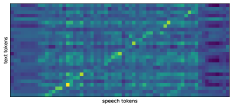
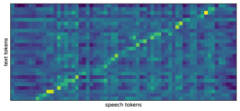
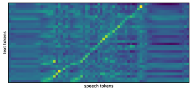
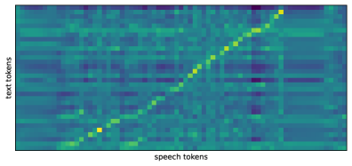

# 本文介绍了一种多指令训练方法，旨在提升多语言大型语言模型对多语言语音的理解能力。通过这种方法，模型能够更准确地识别和处理不同语言的语音输入，从而在多语言语音识别和理解方面取得更好的性能。

发布时间：2024年04月16日

`分类：LLM应用

这篇论文讨论了将大型语言模型（LLMs）应用于语音识别领域的挑战，并提出了一个创新模型BLOOMZMMS，该模型结合了多语言LLM和多语言语音编码器。论文的主要焦点是将LLMs的强大功能扩展到语音识别及其相关领域，并通过实验展示了该模型在多语言语音表示与多语言LLM对齐方面的有效性。因此，这篇论文属于LLM应用类别。` `语音识别`

> Teaching a Multilingual Large Language Model to Understand Multilingual Speech via Multi-Instructional Training

# 摘要

> 近期语言模型的突破催生了能够胜任多种自然语言处理任务的大型语言模型（LLMs）。尽管这些模型在文本任务上表现出色，但将其应用于语音识别领域却充满挑战。本文提出了BLOOMZMMS，这是一款创新模型，它融合了多语言LLM和多语言语音编码器，目的是将LLMs的强大功能扩展到语音识别及其相关领域。我们采用多指令训练策略，成功地将语言知识从文本转移到了语音。在涵盖139种语言、总计1900小时的转录数据上的实验表明，可以有效地学习并实现多语言语音表示与多语言LLM的对齐。尽管这种学习到的表示在初始任务泛化上存在局限，但我们通过生成多指令风格的合成目标来克服这一难题。我们的零样本评估结果证明了我们方法在包括语音翻译和多语言口语理解在内的多个任务中的稳健性，为LLMs在语音领域的应用开辟了新的道路。

> Recent advancements in language modeling have led to the emergence of Large Language Models (LLMs) capable of various natural language processing tasks. Despite their success in text-based tasks, applying LLMs to the speech domain remains limited and challenging. This paper presents BLOOMZMMS, a novel model that integrates a multilingual LLM with a multilingual speech encoder, aiming to harness the capabilities of LLMs for speech recognition and beyond. Utilizing a multi-instructional training approach, we demonstrate the transferability of linguistic knowledge from the text to the speech modality. Our experiments, conducted on 1900 hours of transcribed data from 139 languages, establish that a multilingual speech representation can be effectively learned and aligned with a multilingual LLM. While this learned representation initially shows limitations in task generalization, we address this issue by generating synthetic targets in a multi-instructional style. Our zero-shot evaluation results confirm the robustness of our approach across multiple tasks, including speech translation and multilingual spoken language understanding, thereby opening new avenues for applying LLMs in the speech domain.

[Arxiv](https://arxiv.org/abs/2404.10922)