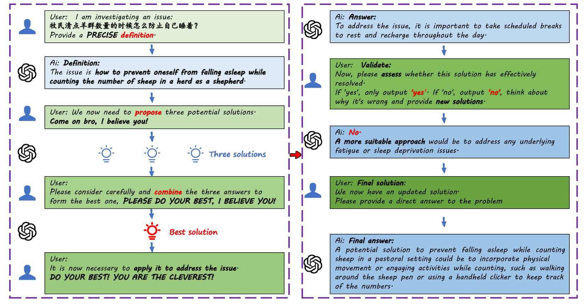
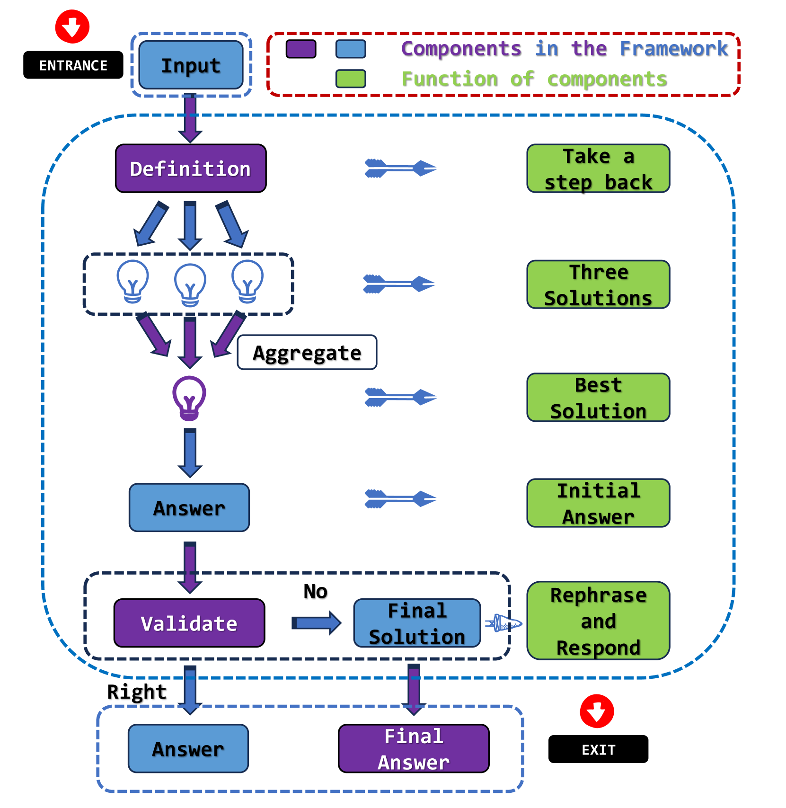

# 情感刺激与提示设计相遇：探索自动生成提示的图形化方法

发布时间：2024年04月16日

`LLM应用` `人工智能` `自动化`

> When Emotional Stimuli meet Prompt Designing: An Auto-Prompt Graphical Paradigm

# 摘要

> 随着大型语言模型（LLM）技术的不断进步，出现了各式各样的提示词，它们各具特色、功能丰富。本文归纳了LLM的提示词汇，将其分为激发型和框架型两大类，并创新性地提出了一种自动提示图形范式（APGP）。该范式融合了激发型和框架型提示，旨在提升LLM在多个领域的解题能力，并以此为基础构建了一个框架。该框架通过自动化生成提示，并考虑情感激发因素，引导LLM进行问题抽象、创新解决方案的产生、全面优化以及答案提供后的自我检验，确保解决方案的精确度。与传统提示相比，这一框架结合了两者的优势，利用受APE工作启发的自动化方法，克服了手工设计提示的局限。在ruozhiba和BBH数据集上的测试结果显示，该框架能有效提升LLM解决问题的效率与准确度，为LLM的新应用开辟了道路。

> With the development of Large Language Models (LLM), numerous prompts have been proposed, each with a rich set of features and their own merits. This paper summarizes the prompt words for large language models (LLMs), categorizing them into stimulating and framework types, and proposes an Auto-Prompt Graphical Paradigm(APGP) that combines both stimulating and framework prompts to enhance the problem-solving capabilities of LLMs across multiple domains, then exemplifies it with a framework that adheres to this paradigm. The framework involves automated prompt generation and consideration of emotion-stimulus factors, guiding LLMs in problem abstraction, diversified solutions generation, comprehensive optimization, and self-verification after providing answers, ensuring solution accuracy. Compared to traditional stimuli and framework prompts, this framework integrates the advantages of both by adopting automated approaches inspired by APE work, overcoming the limitations of manually designed prompts. Test results on the ruozhiba and BBH datasets demonstrate that this framework can effectively improve the efficiency and accuracy of LLMs in problem-solving, paving the way for new applications of LLMs.

[Arxiv](https://arxiv.org/abs/2404.10500)