# 领导之位，白人男性；助力之手，黑人女性：揭秘语言机构内的性别、种族及交叉性偏见。

发布时间：2024年04月16日

`LLM应用` `社会偏见`

> White Men Lead, Black Women Help: Uncovering Gender, Racial, and Intersectional Bias in Language Agency

# 摘要

> 社会偏见在语言行为中表露无遗。通常，白人和男性被刻画为具有“行动力”和目标导向，而黑人和女性则多被描绘为“社群性”和辅助性角色。本研究将行为主体性作为审视人类撰写和大型语言模型（LLM）生成文本中社会偏见的一个关键要素。为精确评估句子级别的“语言行为主体性”，我们创建了一个语言行为主体性分类数据集，用以培养高效的主体性分类器。接着，我们利用这一分类器揭露了6个由人类或LLM撰写的文本数据集中显著的语言行为主体性偏见，涵盖了传记、教授评价和推荐信等。相较于以往自然语言处理（NLP）研究多聚焦于单一维度的主体性偏见，本研究全面探讨了性别、种族及交叉身份的语言行为主体性偏见。研究发现：（1）人类文本中的语言行为主体性偏见与现实社会观察相吻合；（2）LLM生成的文本比人类文本展现出更高程度的语言行为主体性偏见；（3）语言行为主体性的关键偏见针对少数群体，特别是描述黑人女性的语言在各数据集中代理性水平最低。这些发现通过语言行为主体性的视角揭示了人类和LLM文本中的微妙社会偏见，提醒我们在社会情境中使用LLM生成的内容前需进行严格审查。

> Social biases can manifest in language agency. For instance, White individuals and men are often described as "agentic" and achievement-oriented, whereas Black individuals and women are frequently described as "communal" and as assisting roles. This study establishes agency as an important aspect of studying social biases in both human-written and Large Language Model (LLM)-generated texts. To accurately measure "language agency" at sentence level, we propose a Language Agency Classification dataset to train reliable agency classifiers. We then use an agency classifier to reveal notable language agency biases in 6 datasets of human- or LLM-written texts, including biographies, professor reviews, and reference letters. While most prior NLP research on agency biases focused on single dimensions, we comprehensively explore language agency biases in gender, race, and intersectional identities. We observe that (1) language agency biases in human-written texts align with real-world social observations; (2) LLM-generated texts demonstrate remarkably higher levels of language agency bias than human-written texts; and (3) critical biases in language agency target people of minority groups -- for instance, languages used to describe Black females exhibit the lowest level of agency across datasets. Our findings reveal intricate social biases in human- and LLM-written texts through the lens of language agency, warning against using LLM generations in social contexts without scrutiny.

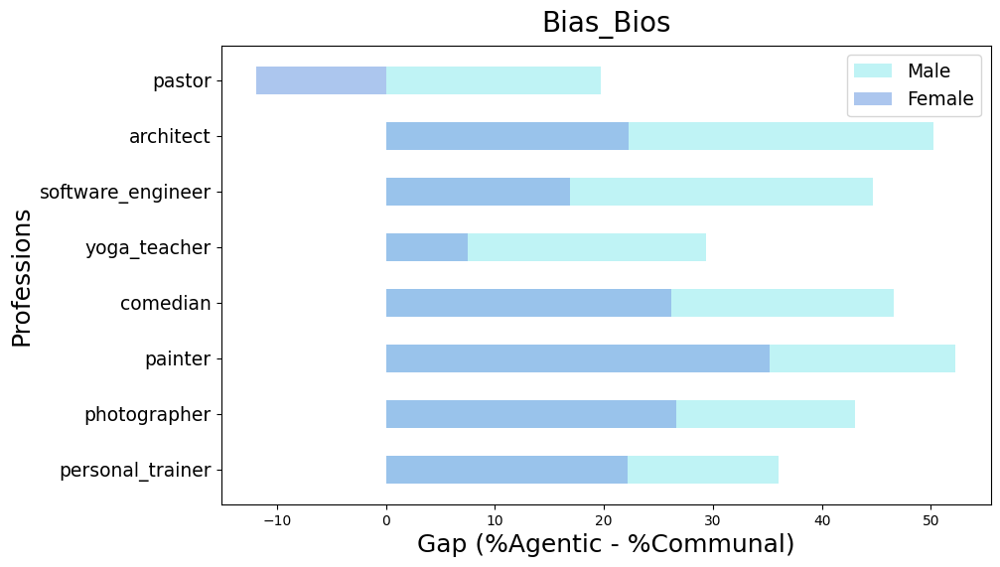

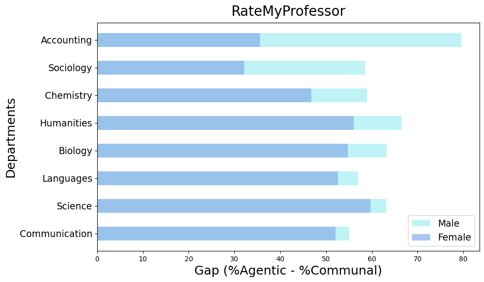

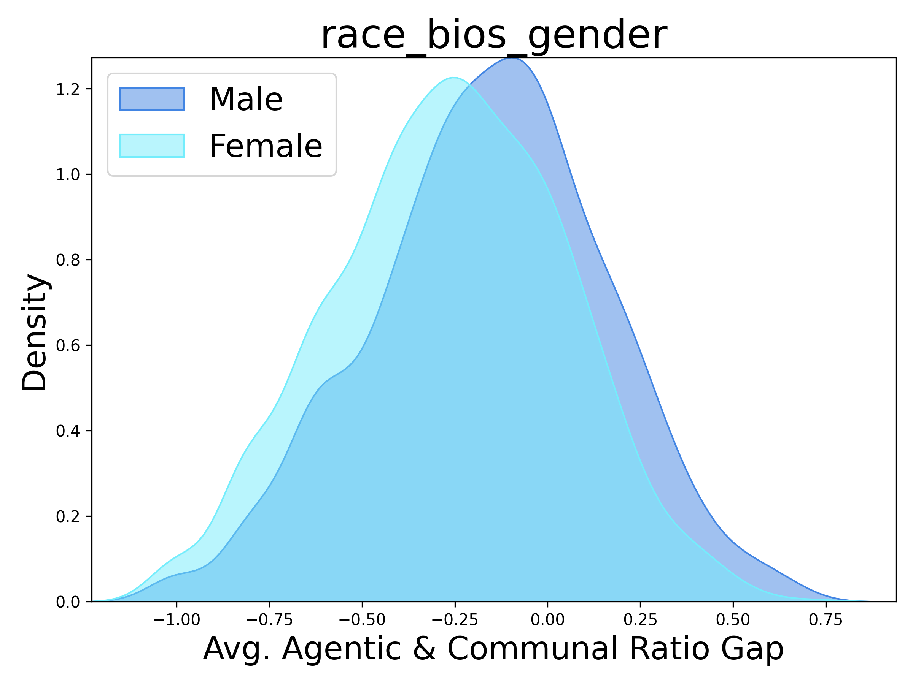

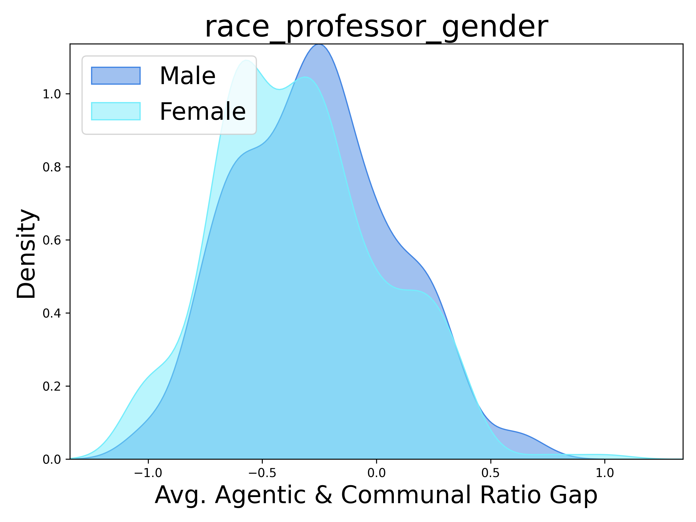

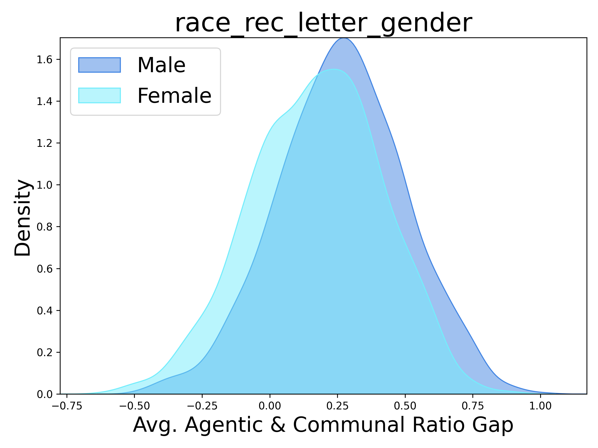

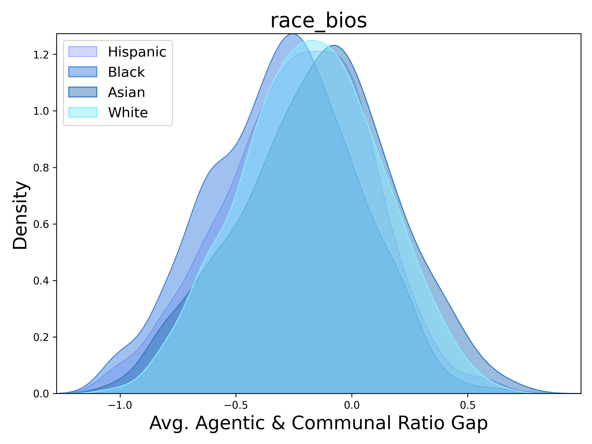

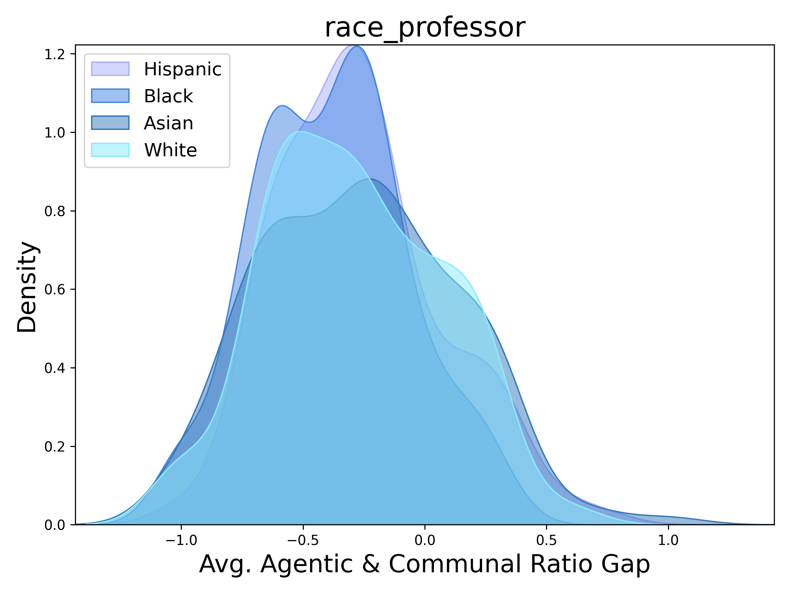

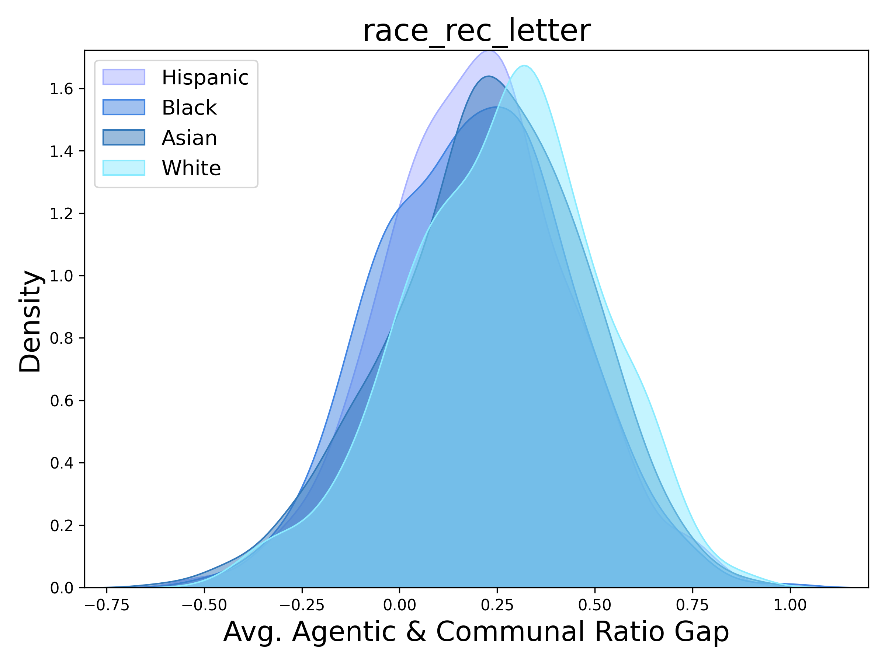

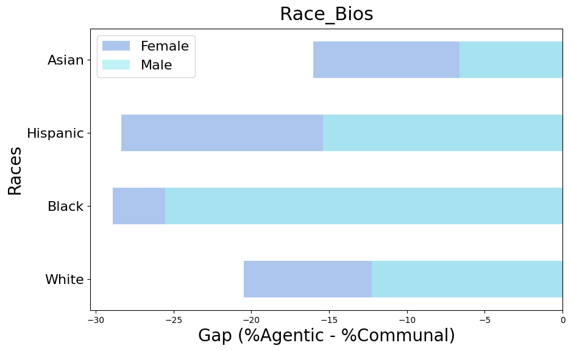

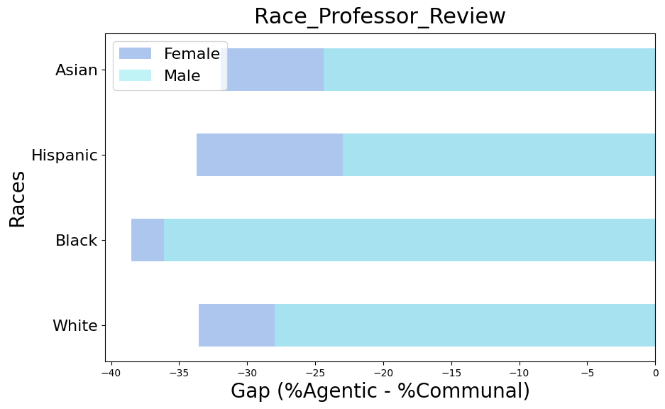

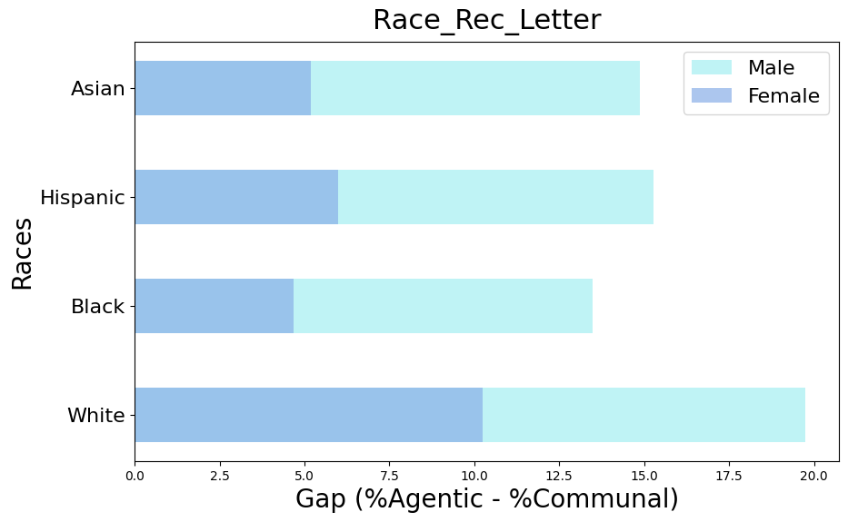

[Arxiv](https://arxiv.org/abs/2404.10508)