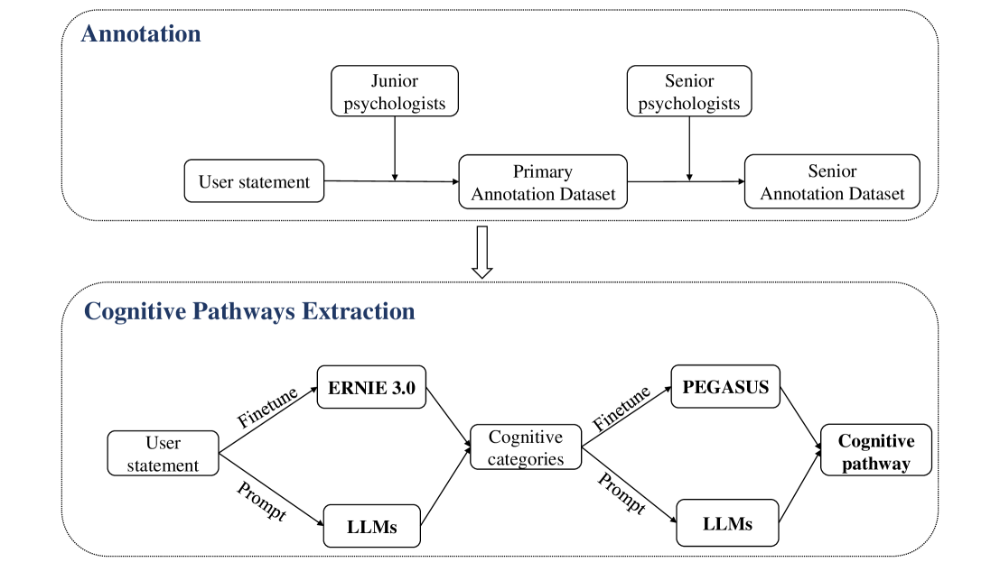
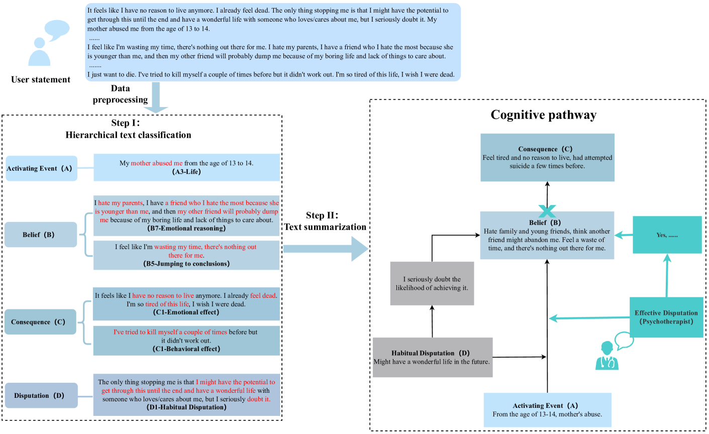
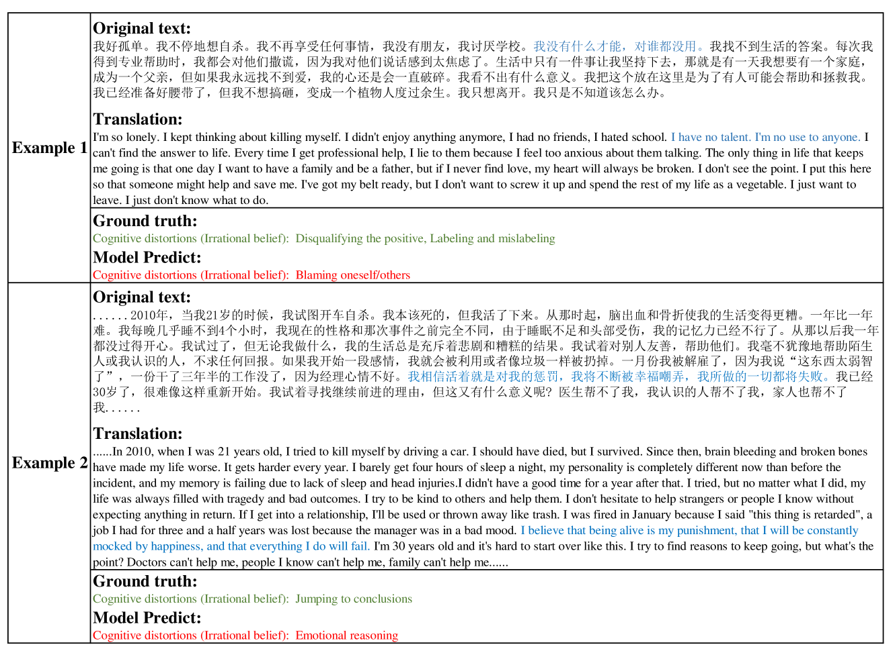

# 利用AI提升认知行为疗法：结合深度学习和大型语言模型，从社交媒体文本中挖掘认知路径。

发布时间：2024年04月17日

`LLM应用` `心理学` `社交媒体`

> AI-Enhanced Cognitive Behavioral Therapy: Deep Learning and Large Language Models for Extracting Cognitive Pathways from Social Media Texts

# 摘要

> 认知行为疗法（CBT）在处理心理疾病引起的非理性思维方面成效显著，但要成功应用于患者治疗，必须准确识别认知路径。现代社会中，人们在社交媒体上对特定话题表达负面情绪，甚至出现认知偏差，极端情况下可能导致自杀行为，但目前尚无有效分析认知路径的方法来辅助在线心理干预。本研究通过社交媒体数据收集，确立了提取认知路径的任务，并依据认知理论框架进行数据标注。我们将认知路径提取任务划分为四个主要类别和十九个子类别的层级化文本分类问题，并进一步构建了文本摘要任务，以便心理治疗师能迅速把握关键信息。实验结果显示，我们的深度学习方法在层级化文本分类任务中达到了62.34%的微F1分数。在文本摘要任务中，GPT-4模型的Rouge-1和Rouge-2分数分别为54.92和30.86，超越了传统深度学习模型的表现，尽管它可能存在信息虚构的问题。为了促进该领域的进一步研究，我们已经将所有模型和代码公之于众。

> Cognitive Behavioral Therapy (CBT) is an effective technique for addressing the irrational thoughts stemming from mental illnesses, but it necessitates precise identification of cognitive pathways to be successfully implemented in patient care. In current society, individuals frequently express negative emotions on social media on specific topics, often exhibiting cognitive distortions, including suicidal behaviors in extreme cases. Yet, there is a notable absence of methodologies for analyzing cognitive pathways that could aid psychotherapists in conducting effective interventions online. In this study, we gathered data from social media and established the task of extracting cognitive pathways, annotating the data based on a cognitive theoretical framework. We initially categorized the task of extracting cognitive pathways as a hierarchical text classification with four main categories and nineteen subcategories. Following this, we structured a text summarization task to help psychotherapists quickly grasp the essential information. Our experiments evaluate the performance of deep learning and large language models (LLMs) on these tasks. The results demonstrate that our deep learning method achieved a micro-F1 score of 62.34% in the hierarchical text classification task. Meanwhile, in the text summarization task, GPT-4 attained a Rouge-1 score of 54.92 and a Rouge-2 score of 30.86, surpassing the experimental deep learning model's performance. However, it may suffer from an issue of hallucination. We have made all models and codes publicly available to support further research in this field.

[Arxiv](https://arxiv.org/abs/2404.11449)