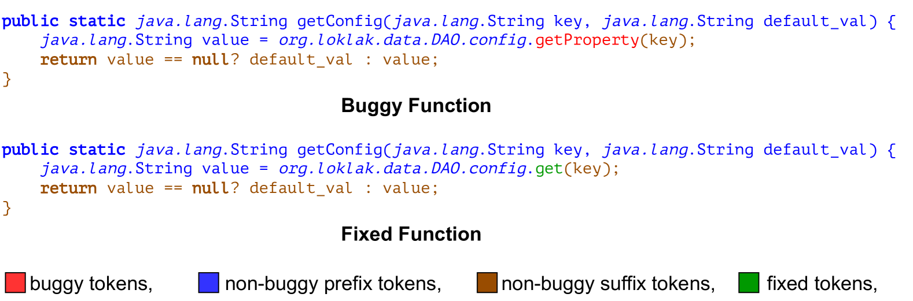
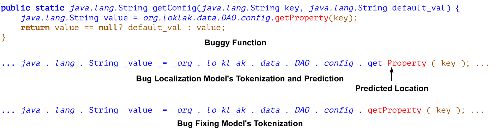
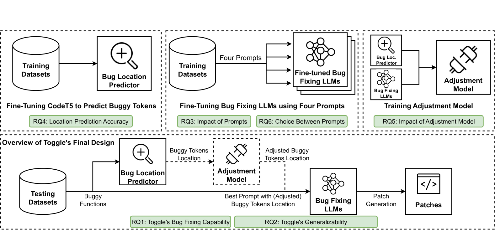
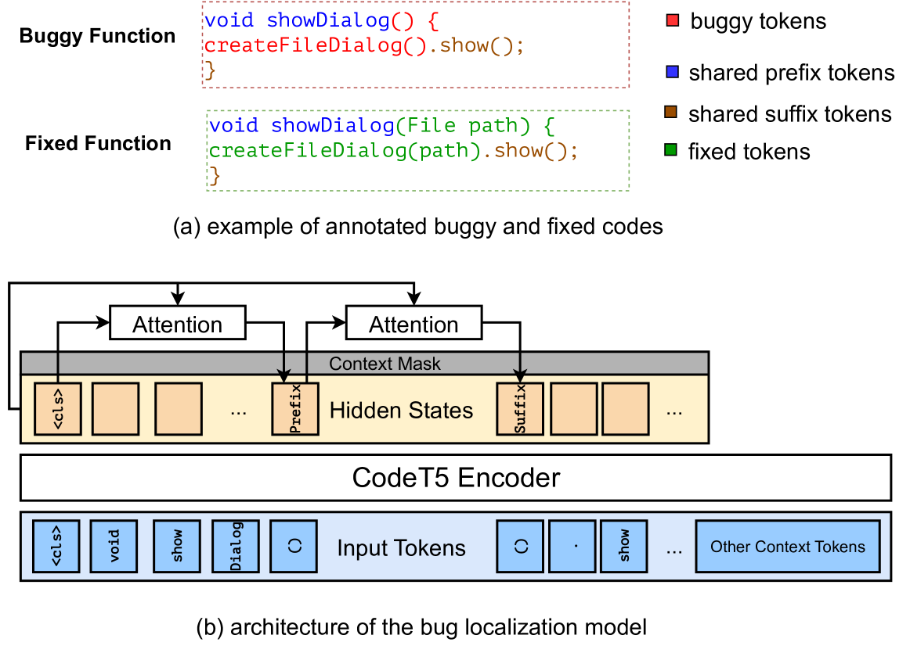
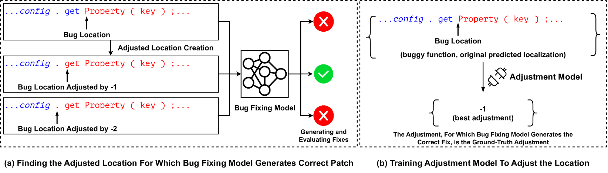
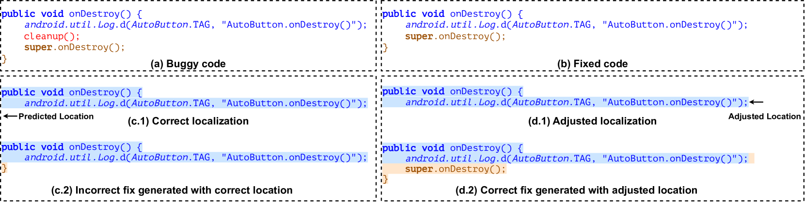

# 本文深入剖析了大型语言模型在自动化缺陷定位与修复领域的应用。

发布时间：2024年04月17日

`LLM应用` `软件工程` `自动化程序修复`

> A Deep Dive into Large Language Models for Automated Bug Localization and Repair

# 摘要

> 大型语言模型（LLMs）在软件工程的多个领域，尤其是自动化程序修复（APR）方面，展现出了卓越的效能。本研究专注于使用LLMs进行自动化缺陷修复的深入分析。与传统的基于深度学习的APR方法相比，我们提出了一种新颖的方法：首先利用LLMs在标记级别定位缺陷，再进行修复。这种方法将缺陷定位和修复的步骤分离开来，不仅有效融合了多样化的上下文信息，还提升了归纳偏置的应用效果。我们推出了Toggle框架，这是一个集成了缺陷定位、调整单元和修复模型的全面程序修复解决方案。Toggle输入一个存在缺陷的函数，并输出一个修正后的完整版本。我们还探索了多种对缺陷修复模型的提示方式，以找出最能发挥模型潜能的最优提示方法。在CodeXGLUE代码精炼基准测试中，Toggle刷新了最佳性能记录，并在包括Defects4J在内的其他多个广泛使用的APR数据集上，也展现了出色的性能。

> Large language models (LLMs) have shown impressive effectiveness in various software engineering tasks, including automated program repair (APR). In this study, we take a deep dive into automated bug fixing utilizing LLMs. In contrast to many deep learning-based APR methods that assume known bug locations, rely on line-level localization tools, or address bug prediction and fixing in one step, our approach uniquely employs LLMs to predict bug location at the token level and subsequently utilizes them for bug fixing. This methodological separation of bug localization and fixing using different LLMs enables effective integration of diverse contextual information and improved incorporation of inductive biases. We introduce Toggle: Token-Granulated Bug Localization and Repair, a comprehensive program repair framework that integrates a bug localization model, an adjustment unit, and a bug-fixing model. Toggle takes a buggy function as input and generates a complete corrected function. We investigate various styles of prompting to the bug fixing model to identify the most effective prompts that better utilize the inductive bias and significantly outperform others. Toggle achieves the new state-of-the-art (SOTA) performance on the CodeXGLUE code refinement benchmark, and exhibits better and comparable performance on several other widely-used APR datasets, including Defects4J.

[Arxiv](https://arxiv.org/abs/2404.11595)