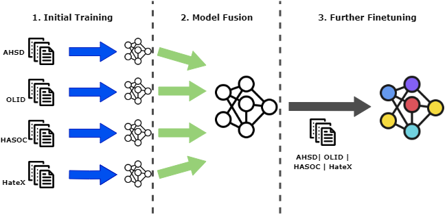
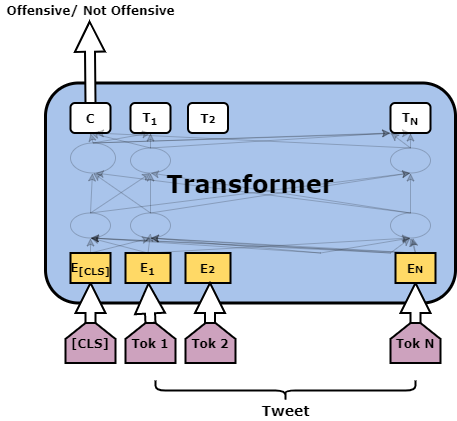

# 本文提出了一种保护隐私的联邦学习方法，用于识别攻击性语言，旨在在不侵犯用户隐私的前提下，提高对网络攻击性言论的识别能力。

发布时间：2024年04月17日

`LLM应用` `社交媒体` `隐私保护`

> A Federated Learning Approach to Privacy Preserving Offensive Language Identification

# 摘要

> 网络中攻击性言论的泛滥是社交媒体面临的一大难题。尽管各大平台正投入巨资应对此问题，但隐私保护的问题却鲜有触及。为了检测社交媒体上的攻击性语言，训练和微调模型往往依赖于大量集中存储的数据。鉴于社交媒体数据大多源自用户，本文提出了一种去中心化的隐私保护架构，通过引入联邦学习（FL）技术来识别网络攻击性语言。FL允许在不共享数据的前提下，多地独立训练多个模型，以维护用户隐私。本研究采用了模型融合策略来实施FL，并在四个公开的英文基准数据集上训练了深度学习模型，对其性能进行了详尽评估。此外，我们还进行了英语和西班牙语的初步跨语言实验。实验结果表明，所提出的模型融合策略在所有数据集上均优于传统基线，同时确保了用户隐私的安全。

> The spread of various forms of offensive speech online is an important concern in social media. While platforms have been investing heavily in ways of coping with this problem, the question of privacy remains largely unaddressed. Models trained to detect offensive language on social media are trained and/or fine-tuned using large amounts of data often stored in centralized servers. Since most social media data originates from end users, we propose a privacy preserving decentralized architecture for identifying offensive language online by introducing Federated Learning (FL) in the context of offensive language identification. FL is a decentralized architecture that allows multiple models to be trained locally without the need for data sharing hence preserving users' privacy. We propose a model fusion approach to perform FL. We trained multiple deep learning models on four publicly available English benchmark datasets (AHSD, HASOC, HateXplain, OLID) and evaluated their performance in detail. We also present initial cross-lingual experiments in English and Spanish. We show that the proposed model fusion approach outperforms baselines in all the datasets while preserving privacy.

[Arxiv](https://arxiv.org/abs/2404.11470)