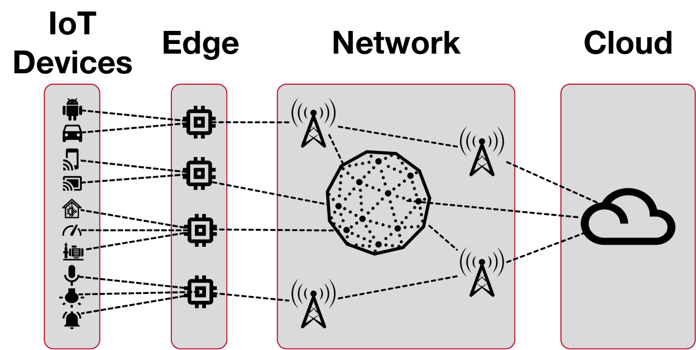
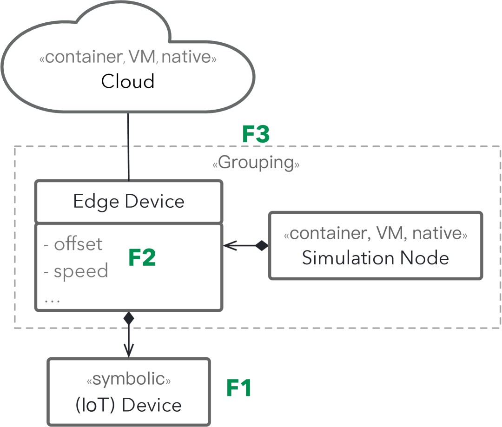
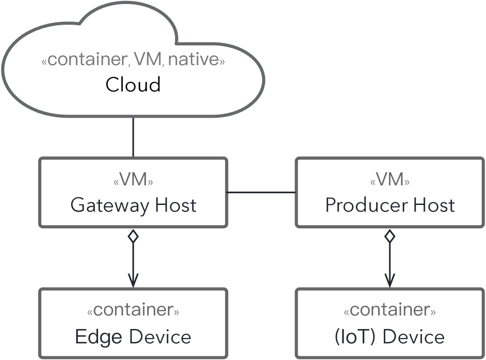
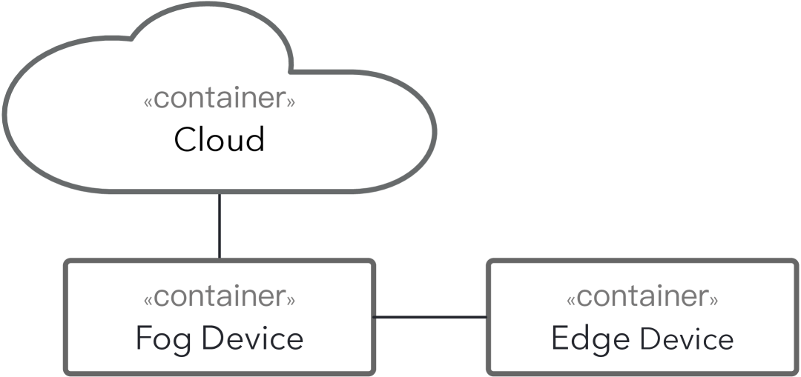
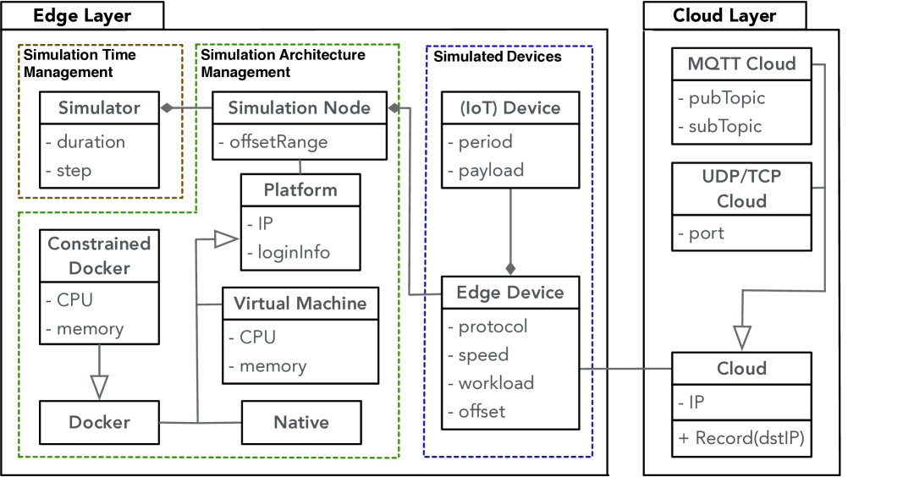
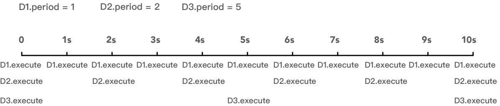
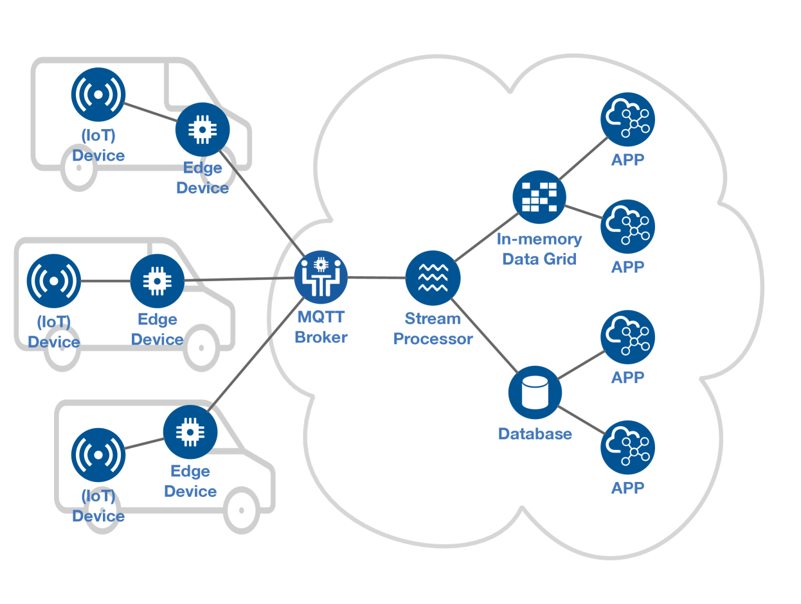
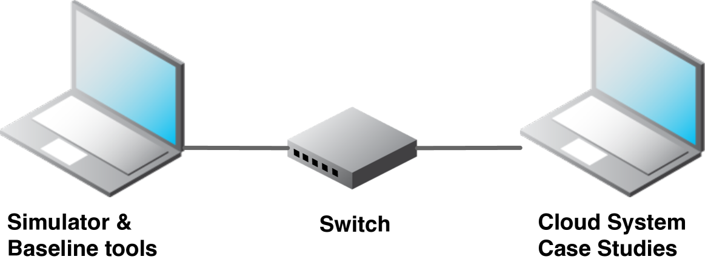

# 本文提出了一个精益的模拟框架，专为物联网云系统的压力测试而设计。

发布时间：2024年04月17日

`Agent` `物联网` `仿真技术`

> A Lean Simulation Framework for Stress Testing IoT Cloud Systems

# 摘要

> 物联网（IoT）将世界各地的智能设备通过各种应用如智能城市、自动驾驶车辆和健康监测等连接起来。在物联网系统的测试中，仿真技术发挥着至关重要的作用，尤其是考虑到对一个完整的物联网产品进行全面的现场测试可能既不现实又成本高昂。本论文聚焦于物联网仿真测试中的一个关键需求：云系统的应力测试。目前针对物联网的应力测试解决方案往往需要巨大的计算资源，这使得它们在实际应用中既不实用又成本昂贵。为此，我们提出了一个精简的仿真框架，专为物联网云环境的应力测试而设计，它能够有效地模拟大量与云平台通信的物联网和边缘设备。为了让从业者能够更容易地构建仿真，我们开发了一个特定于领域的语言（DSL），称为IoTECS，它能够基于模型规范生成仿真器。我们定义了IoTECS的语法和语义，并利用Xtext和Xtend实现了该语言。通过使用IoTECS生成的仿真器，我们对两个真实世界的系统进行了应力测试：一个是云基础的物联网监控系统，另一个是物联网连接的车辆系统。我们的实验结果显示，IoTECS生成的仿真器在配置Docker容器化时性能最佳，能够有效评估案例研究系统的服务容量，并且在相同的硬件资源下，其模拟物联网和边缘设备的数量是工业界常用的应力测试工具JMeter和Locust的3.5倍。为了初步了解IoTECS在实际应用中的效用，我们采访了两位具有IoTECS实践经验的行业合作伙伴工程师。根据这些访谈的反馈，IoTECS在进行物联网云系统的应力测试时非常有效，能够显著节省时间和努力。

> The Internet of Things connects a plethora of smart devices globally across various applications like smart cities, autonomous vehicles and health monitoring. Simulation plays a key role in the testing of IoT systems, noting that field testing of a complete IoT product may be infeasible or prohibitively expensive. This paper addresses a specific yet important need in simulation-based testing for IoT: Stress testing of cloud systems. Existing stress testing solutions for IoT demand significant computational resources, making them ill-suited and costly. We propose a lean simulation framework designed for IoT cloud stress testing which enables efficient simulation of a large array of IoT and edge devices that communicate with the cloud. To facilitate simulation construction for practitioners, we develop a domain-specific language (DSL), named IoTECS, for generating simulators from model-based specifications. We provide the syntax and semantics of IoTECS and implement IoTECS using Xtext and Xtend. We assess simulators generated from IoTECS specifications for stress testing two real-world systems: a cloud-based IoT monitoring system and an IoT-connected vehicle system. Our empirical results indicate that simulators created using IoTECS: (1)achieve best performance when configured with Docker containerization; (2)effectively assess the service capacity of our case-study systems, and (3)outperform industrial stress-testing baseline tools, JMeter and Locust, by a factor of 3.5 in terms of the number of IoT and edge devices they can simulate using identical hardware resources. To gain initial insights about the usefulness of IoTECS in practice, we interviewed two engineers from our industry partner who have firsthand experience with IoTECS. Feedback from these interviews suggests that IoTECS is effective in stress testing IoT cloud systems, saving significant time and effort.

[Arxiv](https://arxiv.org/abs/2404.11542)