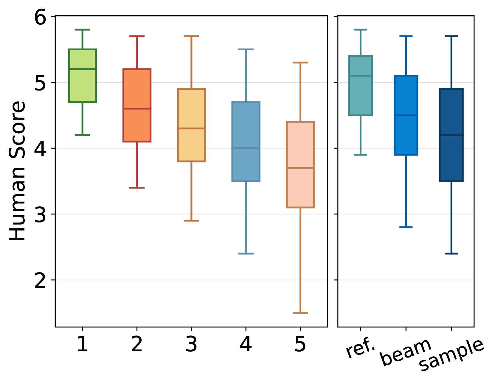
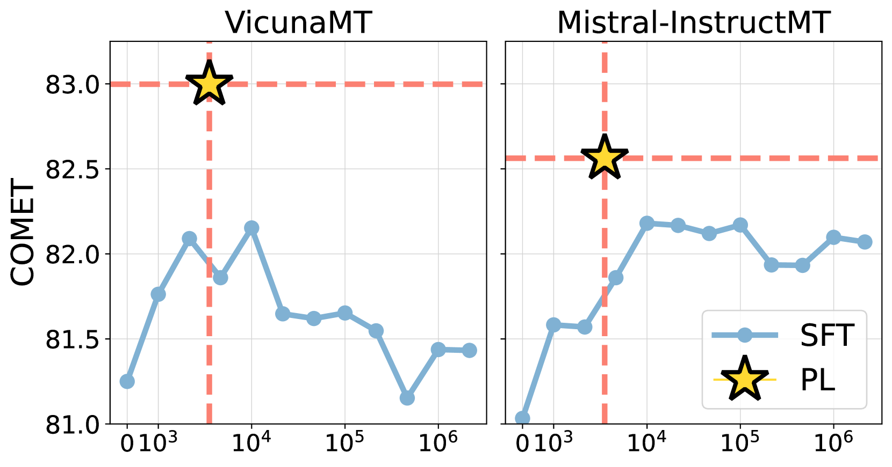
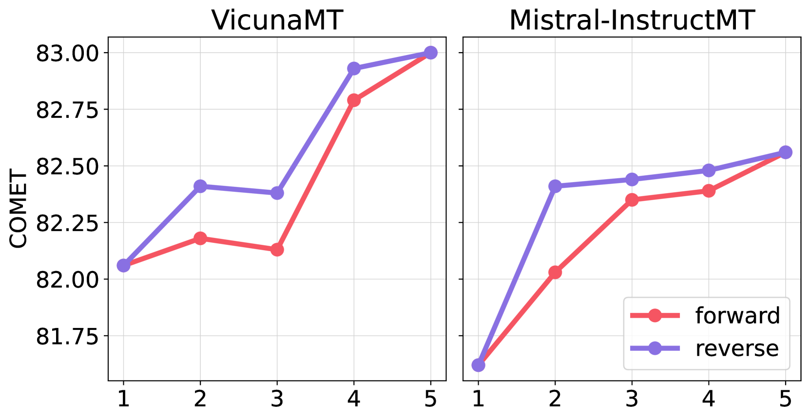
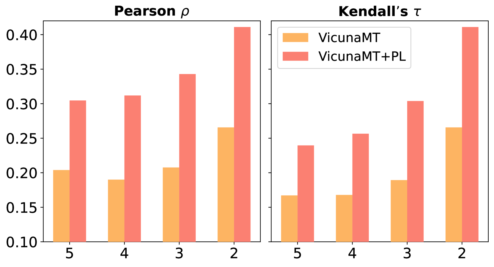
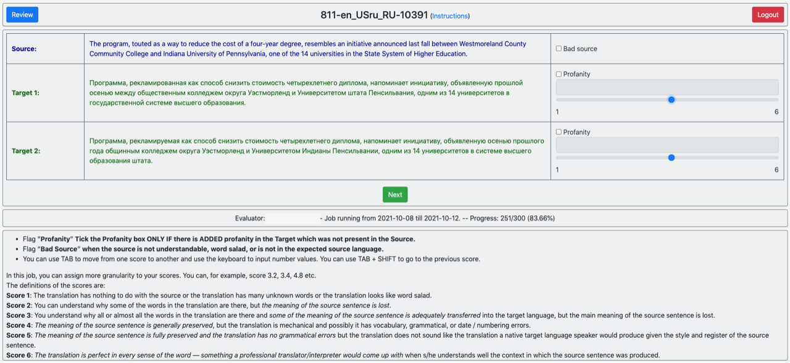

# 一种以用户偏好为驱动的翻译范式，旨在提升大型语言模型的翻译效果。

发布时间：2024年04月17日

`LLM应用` `机器翻译`

> A Preference-driven Paradigm for Enhanced Translation with Large Language Models

# 摘要

> 最新研究发现，大型语言模型（LLMs）仅通过少量平行语料的监督式微调（SFT），便能实现卓越的翻译效果。但SFT仅让模型在词汇层面上模仿参考译文，容易受到参考译文中噪声的干扰。这导致SFT在LLMs翻译能力达到一定程度后，效果便停滞不前，增加平行语料量也难以带来提升。为突破这一瓶颈，我们提出了一种基于Plackett-Luce模型的偏好驱动方法，旨在引导LLMs全面而细致地理解翻译偏好，即使在缺乏标准译文的情况下也能保持稳健。我们还构建了名为MAPLE的数据集，包含每个源句多种不同质量的翻译，用以验证我们方法的有效性。广泛的实验证明，我们的方法能够成功“打破瓶颈”，在多样的LLMs和测试环境下均表现出色。深入分析显示，多样化的翻译选择和准确的偏好评分对我们方法的成功至关重要。

> Recent research has shown that large language models (LLMs) can achieve remarkable translation performance through supervised fine-tuning (SFT) using only a small amount of parallel data. However, SFT simply instructs the model to imitate the reference translations at the token level, making it vulnerable to the noise present in the references. Hence, the assistance from SFT often reaches a plateau once the LLMs have achieved a certain level of translation capability, and further increasing the size of parallel data does not provide additional benefits. To overcome this plateau associated with imitation-based SFT, we propose a preference-based approach built upon the Plackett-Luce model. The objective is to steer LLMs towards a more nuanced understanding of translation preferences from a holistic view, while also being more resilient in the absence of gold translations. We further build a dataset named MAPLE to verify the effectiveness of our approach, which includes multiple translations of varying quality for each source sentence. Extensive experiments demonstrate the superiority of our approach in "breaking the plateau" across diverse LLMs and test settings. Our in-depth analysis underscores the pivotal role of diverse translations and accurate preference scores in the success of our approach.

[Arxiv](https://arxiv.org/abs/2404.11288)