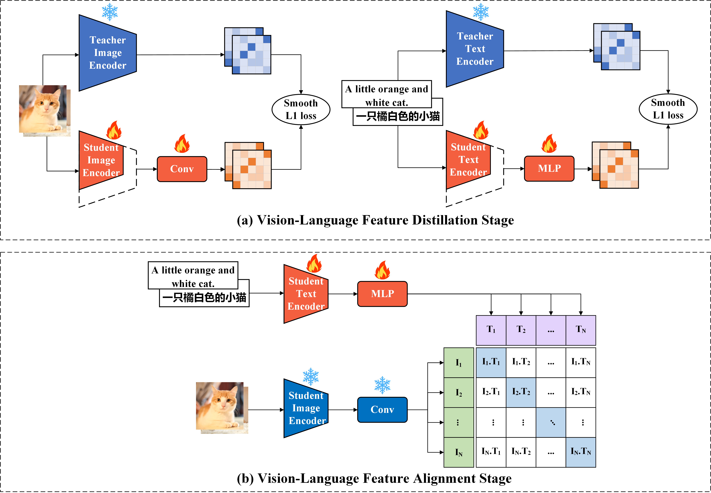

# 提出了一种渐进式框架，用于实现多语言场景中视觉与语言知识的蒸馏和对齐。

发布时间：2024年04月17日

`分类：LLM应用` `计算机视觉`

> A Progressive Framework of Vision-language Knowledge Distillation and Alignment for Multilingual Scene

# 摘要

> CLIP 等预训练视觉-语言模型在跨模态任务上表现卓越，但多局限于英语环境。为了提升模型对中文等其他语言的适用性，研究者提出了 CN-CLIP 和 AltCLIP 等改进模型。然而，这些模型在推理时面临高延迟和内存占用大的挑战，限制了其在资源受限设备上的应用。本研究提出了一个简洁高效的多语言 CLIP 压缩框架，并开发了一款适用于中英文环境的轻量级多语言视觉-语言模型 DC-CLIP。我们收集了优质的中英文图文对，并通过两个训练阶段——多语言视觉-语言特征蒸馏和对齐——来提升模型性能。在第一阶段，轻量级的学生模型学习从教师模型中提取鲁棒的视觉和多语言文本特征。第二阶段则通过视觉和多语言文本特征的有效对齐，进一步提升模型的多语言能力。基于 ELEVATER 基准的零样本图像分类实验显示，DC-CLIP 在英文环境中表现优异，在中文环境中也展现出与同类参数规模模型相竞争的性能，尤其是在训练数据较少的情况下。这一评估验证了我们训练机制设计的有效性。

> Pre-trained vision-language (V-L) models such as CLIP have shown excellent performance in many downstream cross-modal tasks. However, most of them are only applicable to the English context. Subsequent research has focused on this problem and proposed improved models, such as CN-CLIP and AltCLIP, to facilitate their applicability to Chinese and even other languages. Nevertheless, these models suffer from high latency and a large memory footprint in inference, which limits their further deployment on resource-constrained edge devices. In this work, we propose a conceptually simple yet effective multilingual CLIP Compression framework and train a lightweight multilingual vision-language model, called DC-CLIP, for both Chinese and English context. In this framework, we collect high-quality Chinese and English text-image pairs and design two training stages, including multilingual vision-language feature distillation and alignment. During the first stage, lightweight image/text student models are designed to learn robust visual/multilingual textual feature representation ability from corresponding teacher models, respectively. Subsequently, the multilingual vision-language alignment stage enables effective alignment of visual and multilingual textual features to further improve the model's multilingual performance. Comprehensive experiments in zero-shot image classification, conducted based on the ELEVATER benchmark, showcase that DC-CLIP achieves superior performance in the English context and competitive performance in the Chinese context, even with less training data, when compared to existing models of similar parameter magnitude. The evaluation demonstrates the effectiveness of our designed training mechanism.

[Arxiv](https://arxiv.org/abs/2404.11249)