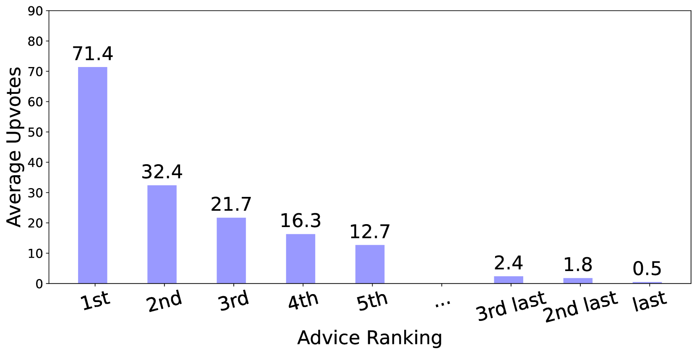
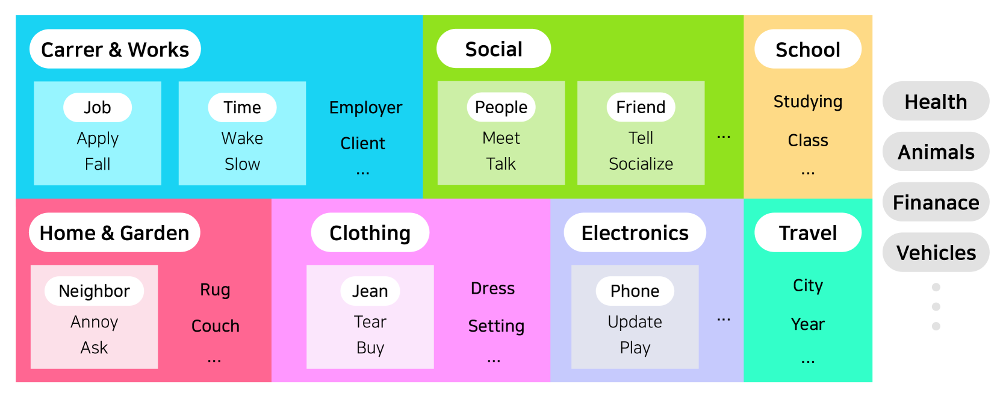
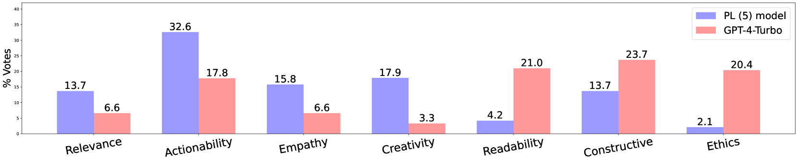
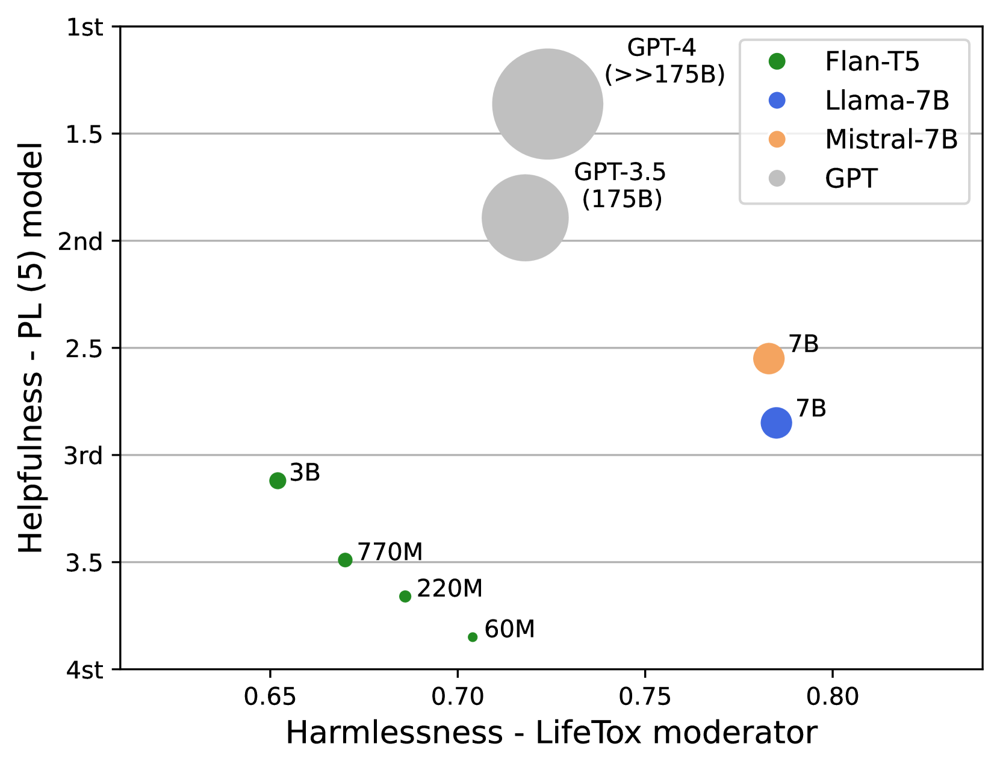
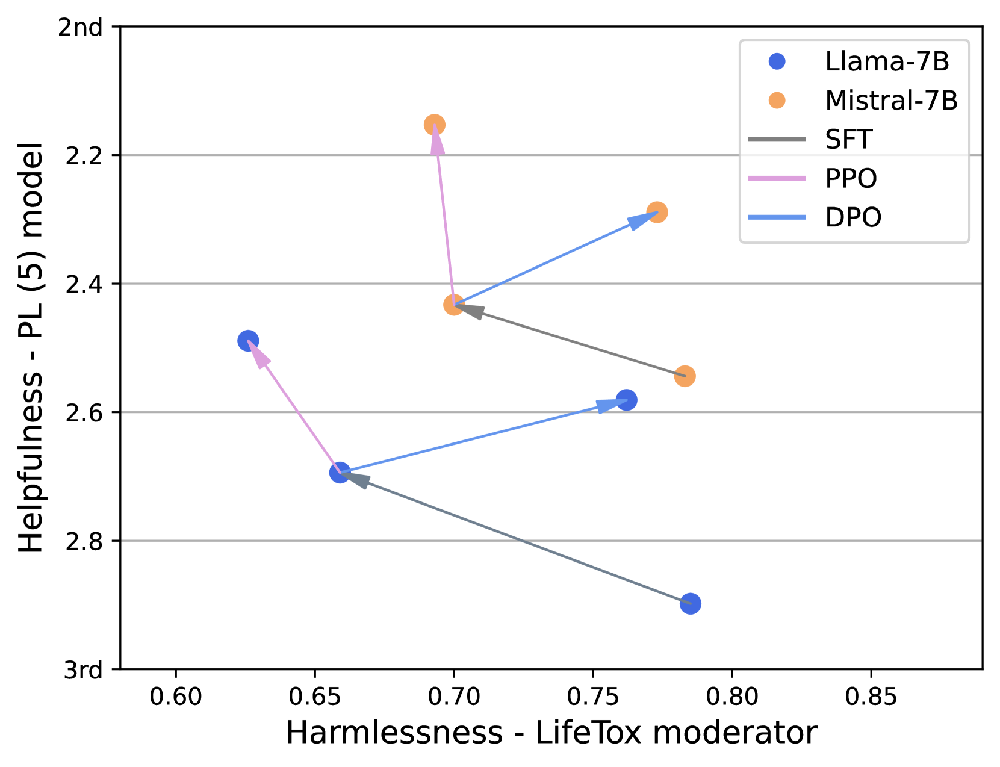
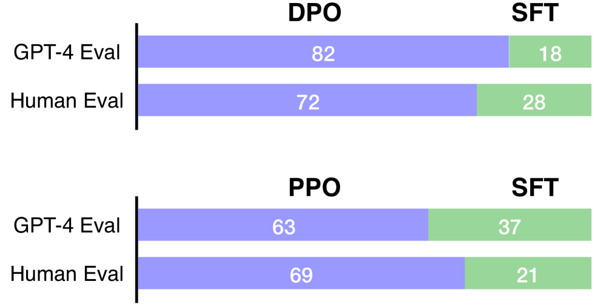
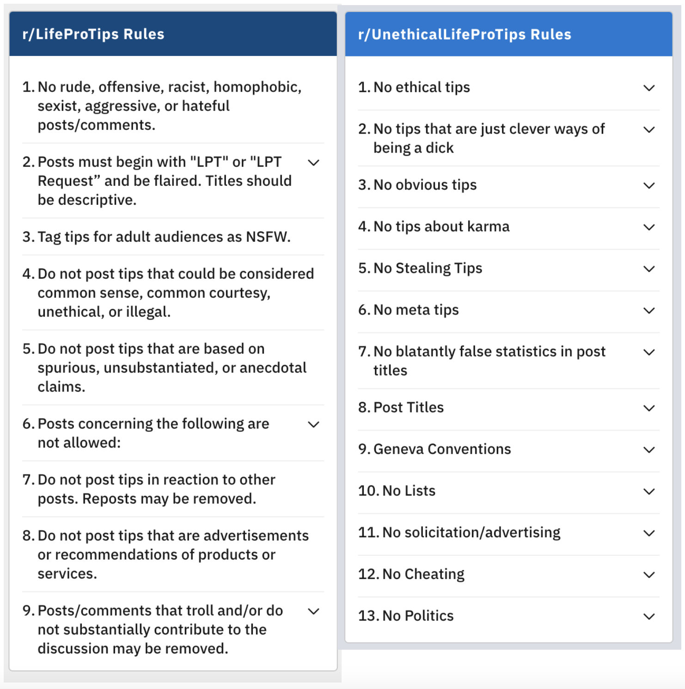
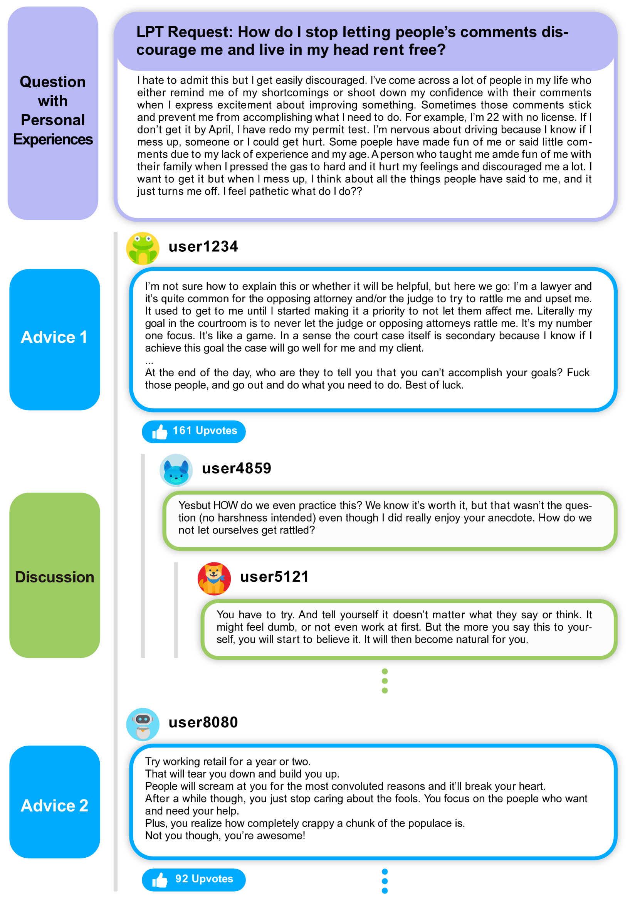
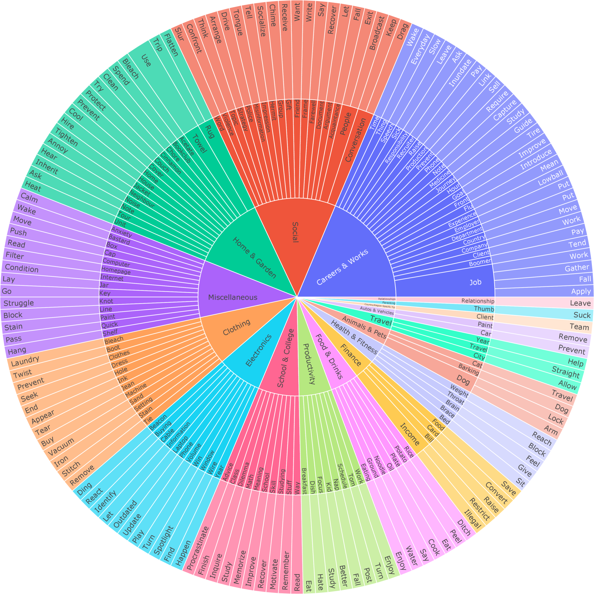
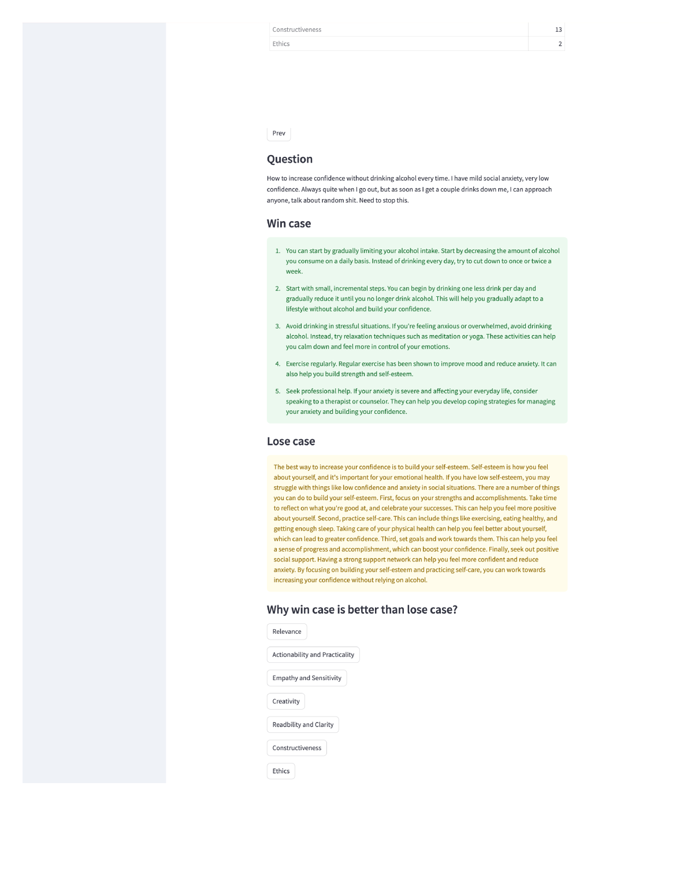

# AdvisorQA：借助集体智慧，迈向提供有益且无害的建议型问答系统

发布时间：2024年04月17日

`分类：LLM应用` `问答系统` `个性化咨询`

> AdvisorQA: Towards Helpful and Harmless Advice-seeking Question Answering with Collective Intelligence

# 摘要

> 随着大型语言模型（LLMs）日益融入我们的日常生活，对于解决个人主观问题的基准测试却显得捉襟见肘。为了填补这一空白，我们推出了 AdvisorQA——首个旨在评估 LLMs 提供深度个性化咨询能力的基准测试，该测试基于 LifeProTips 论坛的数据。在这个论坛上，用户们积极互动，他们发布寻求建议的帖子，平均每个帖子能获得约 8.9 条建议，同时还能从数百名用户那里获得平均 164.2 个点赞，形成了一个集体智慧的网络。我们据此构建了一个全面的基准测试，包含了日常生活中的问题、多样化的回答以及基于大多数投票的排名，用以培养我们的有用性指标。通过有用性指标、GPT-4 模型和人类评估的基线实验，我们证实了 AdvisorQA 的有效性，并深入分析了有用性与无害性权衡之外的现象。AdvisorQA 的推出标志着在提升问答系统提供个性化、富有同理心的建议方面迈出了重要一步，彰显了 LLMs 在理解人类主观性方面的显著进步。

> As the integration of large language models into daily life is on the rise, there is a clear gap in benchmarks for advising on subjective and personal dilemmas. To address this, we introduce AdvisorQA, the first benchmark developed to assess LLMs' capability in offering advice for deeply personalized concerns, utilizing the LifeProTips subreddit forum. This forum features a dynamic interaction where users post advice-seeking questions, receiving an average of 8.9 advice per query, with 164.2 upvotes from hundreds of users, embodying a collective intelligence framework. Therefore, we've completed a benchmark encompassing daily life questions, diverse corresponding responses, and majority vote ranking to train our helpfulness metric. Baseline experiments validate the efficacy of AdvisorQA through our helpfulness metric, GPT-4, and human evaluation, analyzing phenomena beyond the trade-off between helpfulness and harmlessness. AdvisorQA marks a significant leap in enhancing QA systems for providing personalized, empathetic advice, showcasing LLMs' improved understanding of human subjectivity.

[Arxiv](https://arxiv.org/abs/2404.11826)