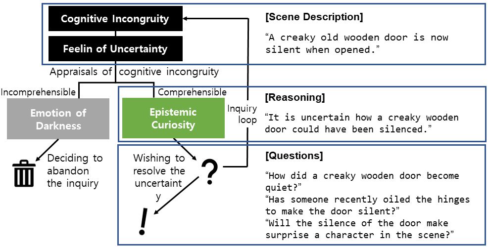
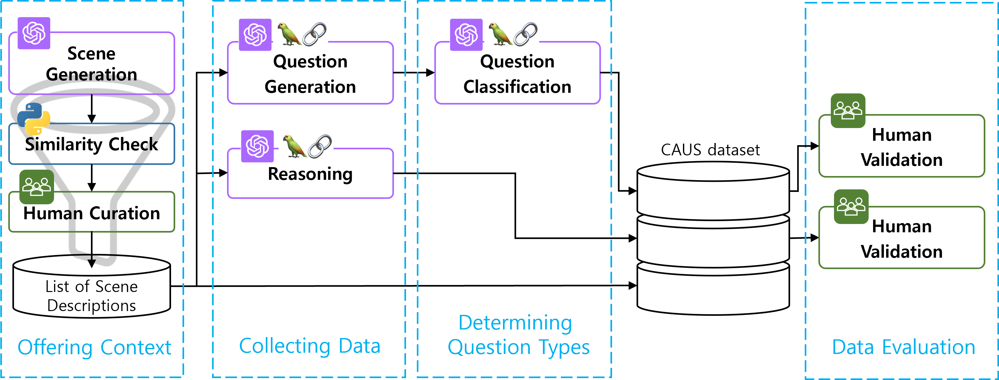
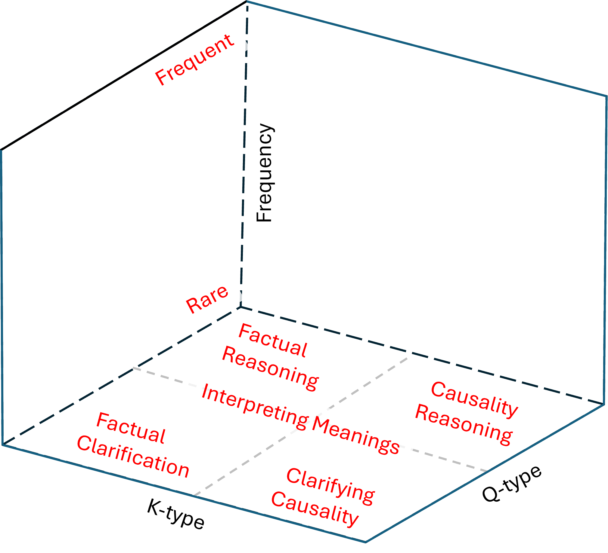
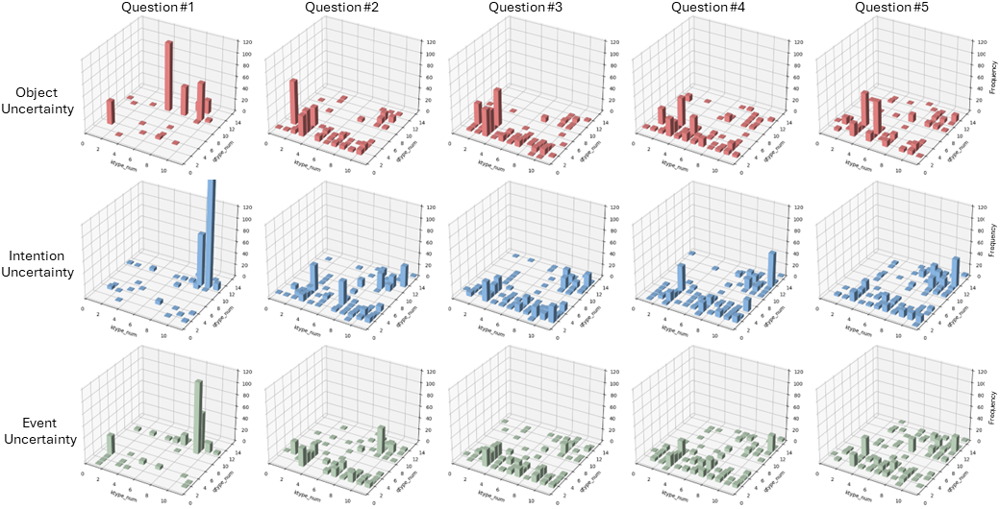

# CAUS：一个依托于人类认知，利用大型语言模型来生成问题的数据集。

发布时间：2024年04月17日

`LLM应用` `人工智能` `认知科学`

> CAUS: A Dataset for Question Generation based on Human Cognition Leveraging Large Language Models

# 摘要

> 我们推出了 CAUS 数据集，该数据集专为训练大型语言模型，尤其是 GPT-4，模拟人类解决不确定性的认知过程而设计。通过这一数据集，我们探究了大型语言模型进行有效提问的能力。我们的方法是通过提供含有不确定性的场景描述，激发推理和问题生成。随后，这些问题会根据多维标准进行分类。整个过程由一个包括大型语言模型和人类研究者在内的协作系统支持。研究结果显示，GPT-4 能够生成相关的问题并捕捉其细节，尤其是在提供恰当的上下文和指导时。这项研究指出，将类似人类的提问机制融入 AI 模型，能够增强其处理不确定性的能力，为人工智能的未来发展开辟了新的道路。

> We introduce the CAUS (Curious About Uncertain Scene) dataset, designed to enable Large Language Models, specifically GPT-4, to emulate human cognitive processes for resolving uncertainties. Leveraging this dataset, we investigate the potential of LLMs to engage in questioning effectively. Our approach involves providing scene descriptions embedded with uncertainties to stimulate the generation of reasoning and queries. The queries are then classified according to multi-dimensional criteria. All procedures are facilitated by a collaborative system involving both LLMs and human researchers. Our results demonstrate that GPT-4 can effectively generate pertinent questions and grasp their nuances, particularly when given appropriate context and instructions. The study suggests that incorporating human-like questioning into AI models improves their ability to manage uncertainties, paving the way for future advancements in Artificial Intelligence (AI).

[Arxiv](https://arxiv.org/abs/2404.11835)