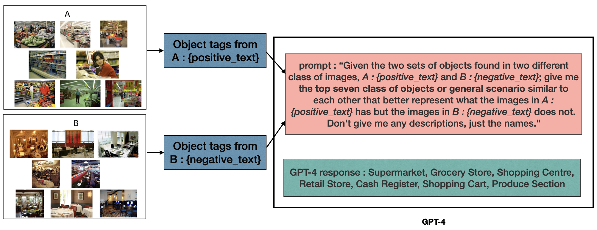
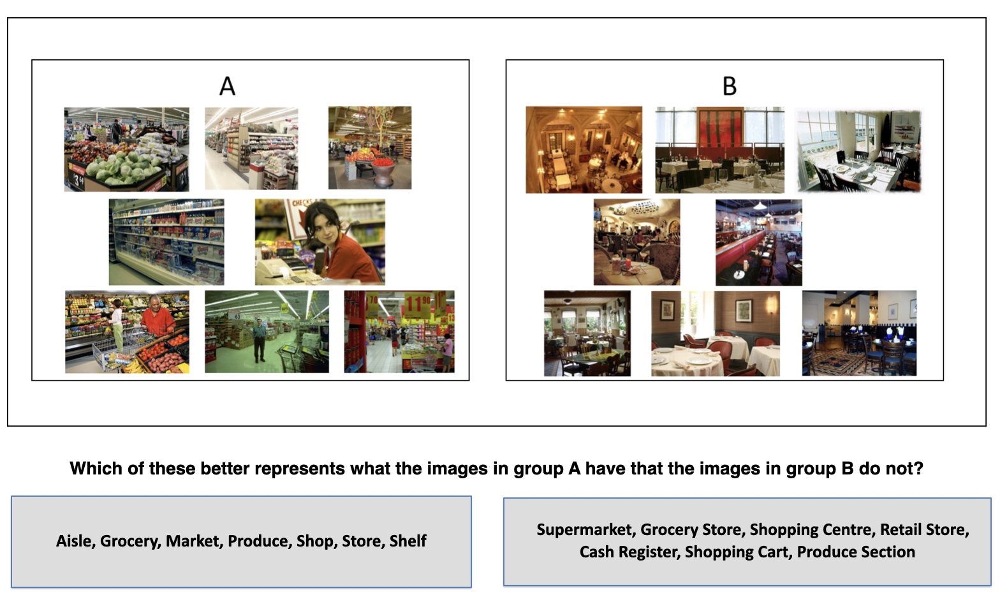
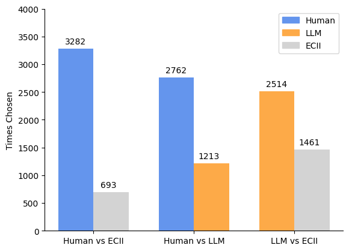
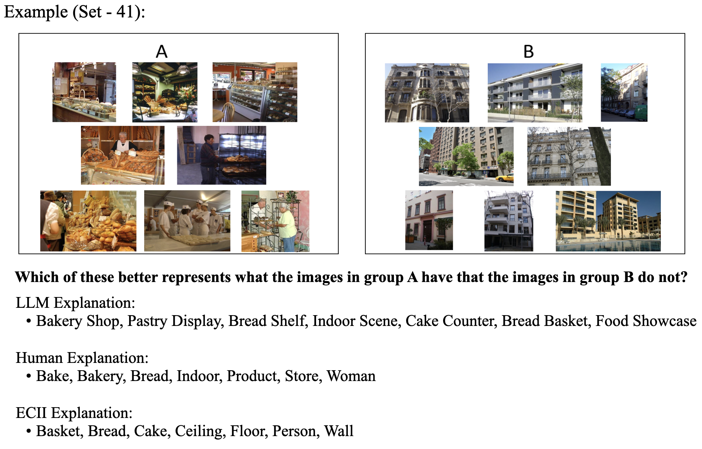

# 通过大型语言模型实现概念归纳：一项旨在评估的用户实验

发布时间：2024年04月17日

`LLM应用` `可解释AI` `图像分类`

> Concept Induction using LLMs: a user experiment for assessment

# 摘要

> 可解释AI（XAI）在揭示复杂AI模型的透明度和可理解性方面遇到了重大难题。尽管传统的事后分析算法具有一定的实用性，但它们往往难以提供易于理解的解释。基于概念的模型通过整合具体概念的明确表达来提升模型的可解释性，这显示出了巨大的潜力。然而，目前关于自动化概念发现的研究常常受限于基础概念的层次较低、人工注释成本高昂以及背景知识领域的局限性。在本项研究中，我们特别利用大型语言模型（LLM）GPT-4的领域知识和常识推理能力，探索其生成对人类具有解释意义的高级概念的潜力，这一研究针对的是图像分类的特定场景。我们通过提示引导，利用数据中有限的文本对象信息来辅助这一过程。为了评估生成的概念，我们将LLM生成的概念与人类生成的概念以及ECII启发式概念归纳系统生成的概念进行了对比。鉴于目前缺乏衡量概念对人类理解度的标准度量，我们开展了一项人类研究来评价LLM生成概念的有效性。研究结果显示，尽管人类生成的解释仍然更为优越，但GPT-4派生的概念相较于ECII生成的概念，对人类而言更易于理解。

> Explainable Artificial Intelligence (XAI) poses a significant challenge in providing transparent and understandable insights into complex AI models. Traditional post-hoc algorithms, while useful, often struggle to deliver interpretable explanations. Concept-based models offer a promising avenue by incorporating explicit representations of concepts to enhance interpretability. However, existing research on automatic concept discovery methods is often limited by lower-level concepts, costly human annotation requirements, and a restricted domain of background knowledge. In this study, we explore the potential of a Large Language Model (LLM), specifically GPT-4, by leveraging its domain knowledge and common-sense capability to generate high-level concepts that are meaningful as explanations for humans, for a specific setting of image classification. We use minimal textual object information available in the data via prompting to facilitate this process. To evaluate the output, we compare the concepts generated by the LLM with two other methods: concepts generated by humans and the ECII heuristic concept induction system. Since there is no established metric to determine the human understandability of concepts, we conducted a human study to assess the effectiveness of the LLM-generated concepts. Our findings indicate that while human-generated explanations remain superior, concepts derived from GPT-4 are more comprehensible to humans compared to those generated by ECII.

[Arxiv](https://arxiv.org/abs/2404.11875)