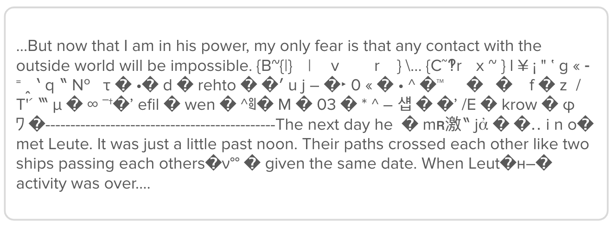

# DUPE：利用提示工程技术揭露深度伪造文本的侦测机制

发布时间：2024年04月17日

`分类：LLM应用

这篇论文主要关注的是大型语言模型（LLMs）在教育领域的应用，特别是教师如何利用AI文本检测工具来辨别学生作业中的人为文本和AI生成文本。论文对几种AI文本检测器进行了评估和比较，探讨了它们的准确性和误报率问题。因此，这篇论文可以归类为LLM应用。` `文本检测`

> DUPE: Detection Undermining via Prompt Engineering for Deepfake Text

# 摘要

> 大型语言模型（LLMs）的普及引发了一系列关于如何辨别人与AI文本的担忧。教师群体尤为关注，他们担心学生可能会利用这些模型来完成作业。在面对这一新兴技术时，教师可能会寻求使用公开的AI文本检测工具。但是，这些检测工具的准确性尚未得到充分验证，这可能导致无辜学生被误判为学术不端。本文对三种AI文本检测器——Kirchenbauer等人的水印技术、ZeroGPT和GPTZero——进行了评估，比较了它们在检测人类与AI撰写的文章方面的表现。研究发现，水印技术的误报率较高，而ZeroGPT的误报率和漏报率均较高。此外，通过使用ChatGPT 3.5对AI生成的原始文本进行改写，我们显著提高了所有检测器的漏报率，有效地规避了这些检测。

> As large language models (LLMs) become increasingly commonplace, concern about distinguishing between human and AI text increases as well. The growing power of these models is of particular concern to teachers, who may worry that students will use LLMs to write school assignments. Facing a technology with which they are unfamiliar, teachers may turn to publicly-available AI text detectors. Yet the accuracy of many of these detectors has not been thoroughly verified, posing potential harm to students who are falsely accused of academic dishonesty. In this paper, we evaluate three different AI text detectors-Kirchenbauer et al. watermarks, ZeroGPT, and GPTZero-against human and AI-generated essays. We find that watermarking results in a high false positive rate, and that ZeroGPT has both high false positive and false negative rates. Further, we are able to significantly increase the false negative rate of all detectors by using ChatGPT 3.5 to paraphrase the original AI-generated texts, thereby effectively bypassing the detectors.

[Arxiv](https://arxiv.org/abs/2404.11408)