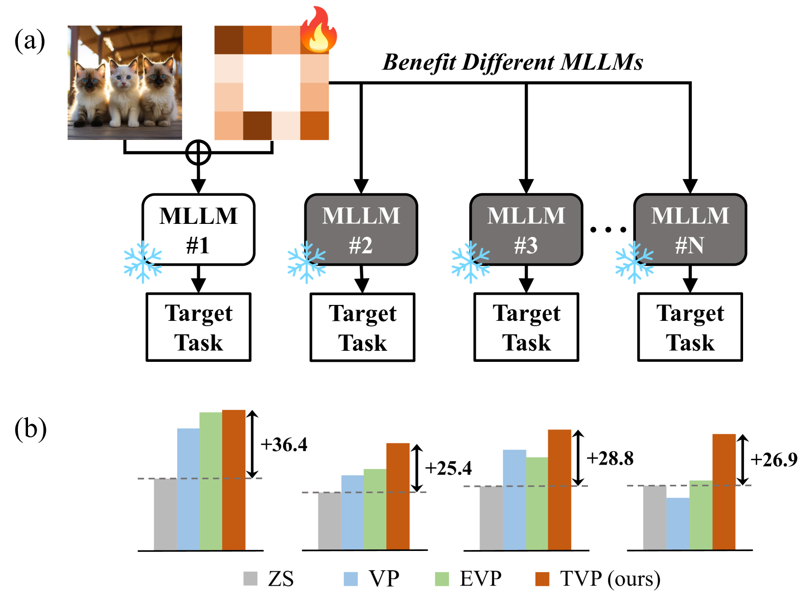
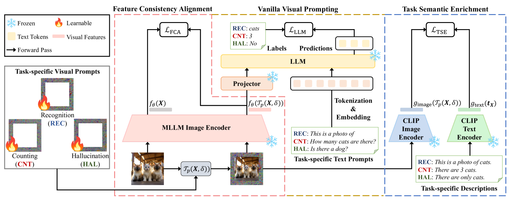
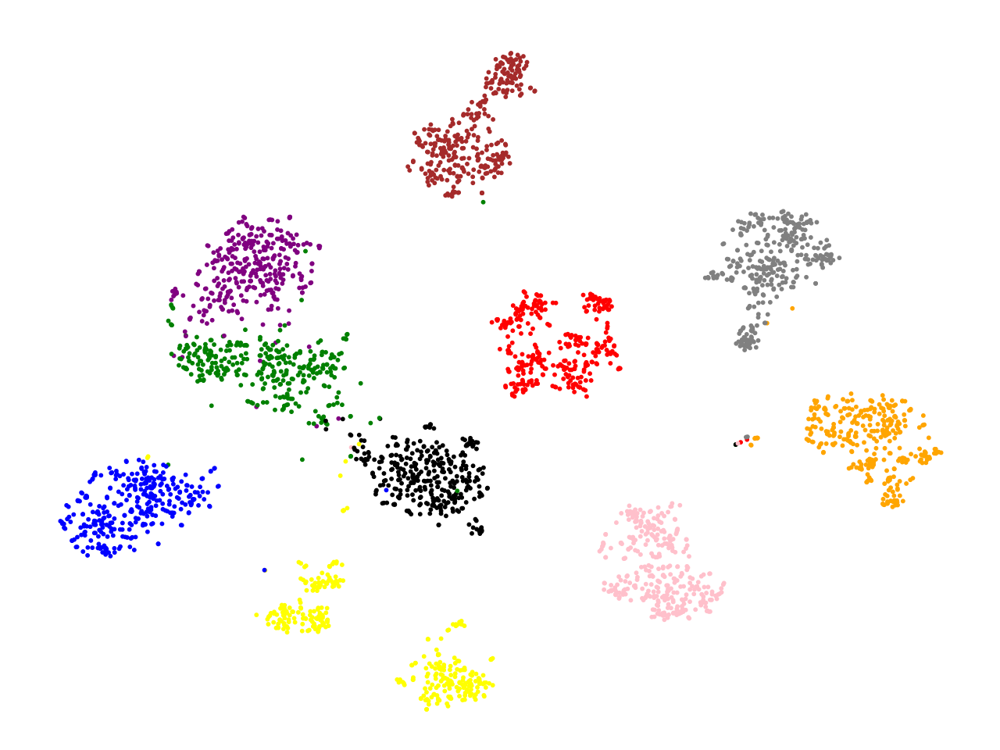
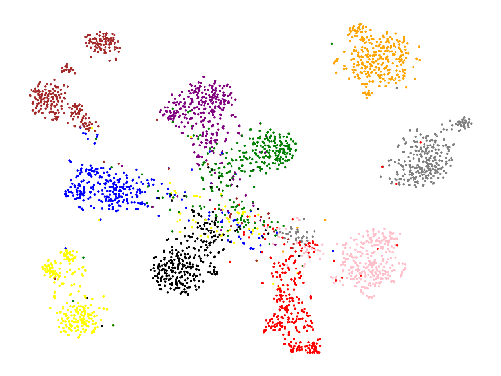
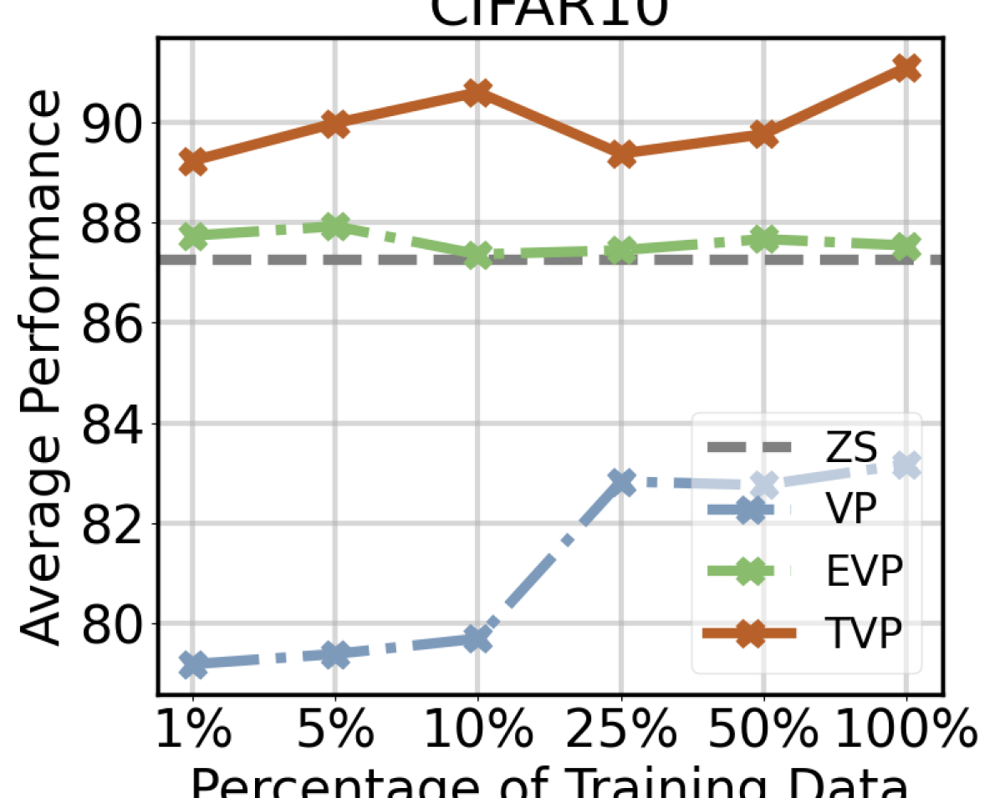
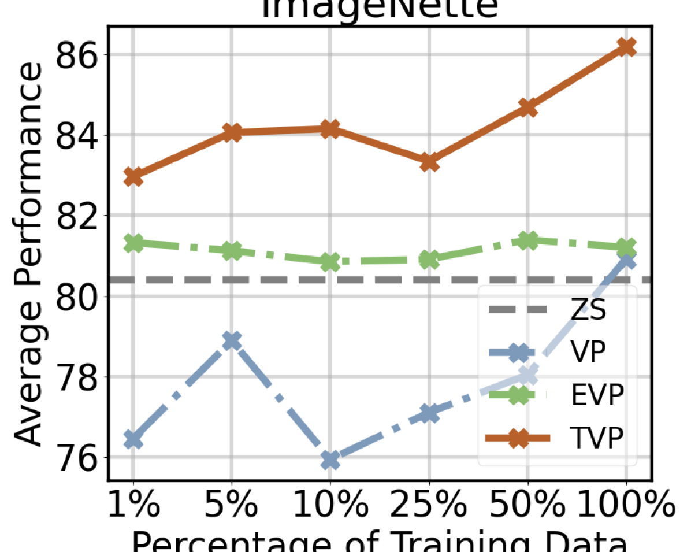
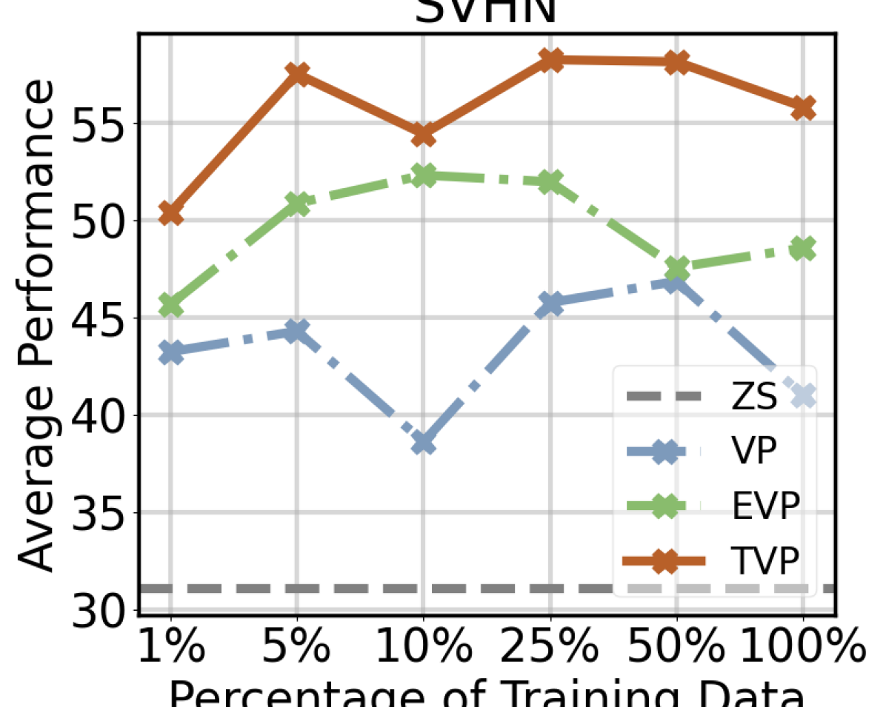
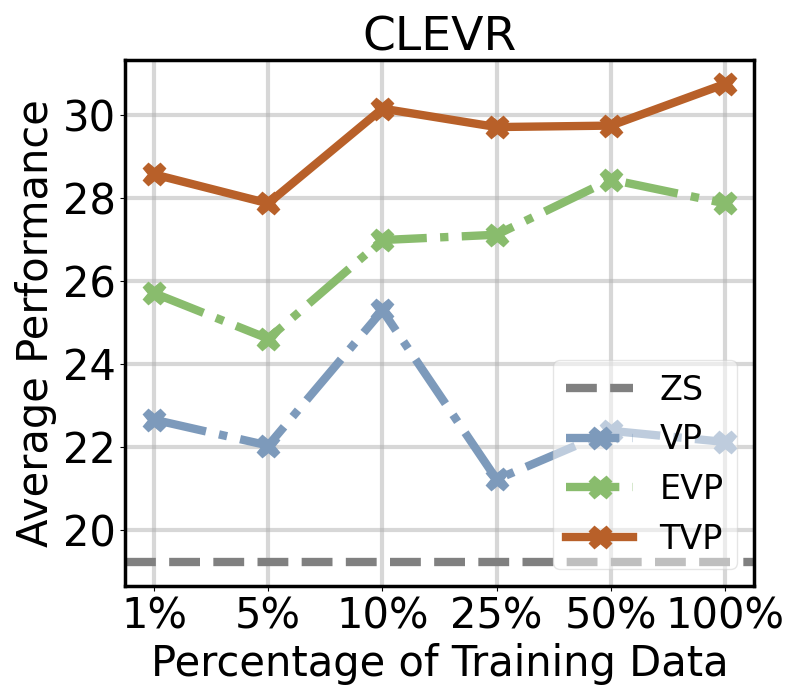
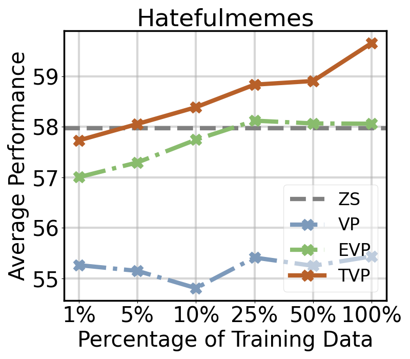
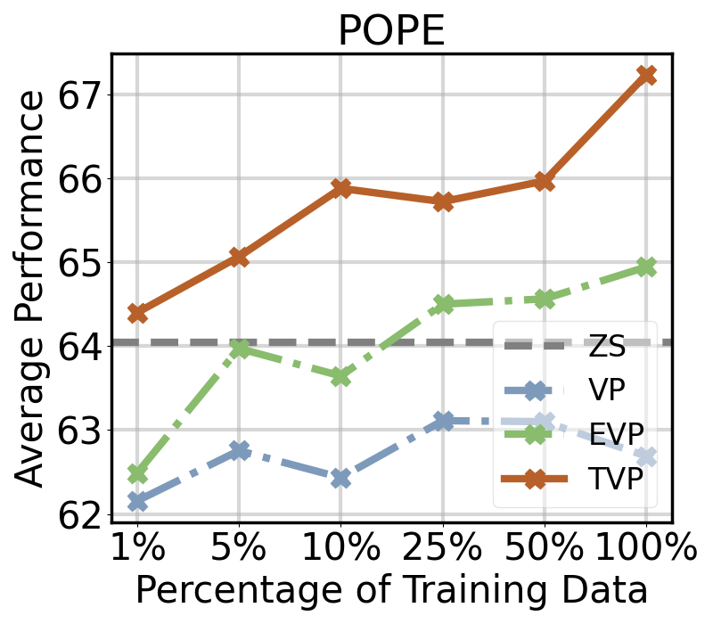

# 本文旨在探讨视觉提示在多模态大型语言模型中的应用迁移性。

发布时间：2024年04月17日

`LLM应用` `人工智能` `多模态学习`

> Exploring the Transferability of Visual Prompting for Multimodal Large Language Models

# 摘要

> 多模态大型语言模型（MLLMs）虽展现出广泛的潜力，但在特定任务上的表现仍不及专业模型，亟需优化以提升其应用价值。传统微调方式需对每个模型单独训练，造成了巨大的计算和内存负担。本文提出了一种创新的框架，通过共享参数集针对特定下游任务进行优化，以提升各类MLLMs的性能。我们引入了“可转移视觉提示”（TVP）方法，它通过生成视觉提示来增强不同模型在下游任务上的表现，且仅需在一个模型上进行训练。为了解决现有方法中跨模型特征干扰的问题，并提升提示的通用性，我们采取了两大策略：一是“特征一致性对齐”，确保提示后的特征变化保持任务通用性；二是“任务语义丰富”，通过语言引导使提示图像富含更深入的任务特定语义。我们通过在6种先进的MLLMs上进行广泛实验，验证了TVP在从物体识别、计数到多模态推理和幻觉校正等多种任务上的有效性。

> Although Multimodal Large Language Models (MLLMs) have demonstrated promising versatile capabilities, their performance is still inferior to specialized models on downstream tasks, which makes adaptation necessary to enhance their utility. However, fine-tuning methods require independent training for every model, leading to huge computation and memory overheads. In this paper, we propose a novel setting where we aim to improve the performance of diverse MLLMs with a group of shared parameters optimized for a downstream task. To achieve this, we propose Transferable Visual Prompting (TVP), a simple and effective approach to generate visual prompts that can transfer to different models and improve their performance on downstream tasks after trained on only one model. We introduce two strategies to address the issue of cross-model feature corruption of existing visual prompting methods and enhance the transferability of the learned prompts, including 1) Feature Consistency Alignment: which imposes constraints to the prompted feature changes to maintain task-agnostic knowledge; 2) Task Semantics Enrichment: which encourages the prompted images to contain richer task-specific semantics with language guidance. We validate the effectiveness of TVP through extensive experiments with 6 modern MLLMs on a wide variety of tasks ranging from object recognition and counting to multimodal reasoning and hallucination correction.

[Arxiv](https://arxiv.org/abs/2404.11207)