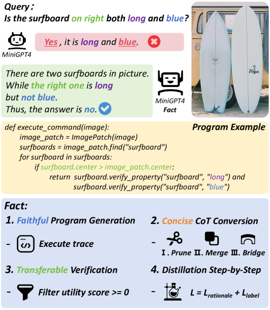
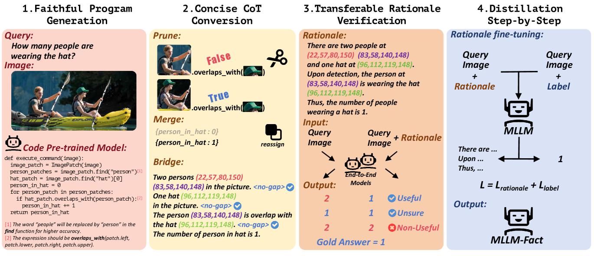
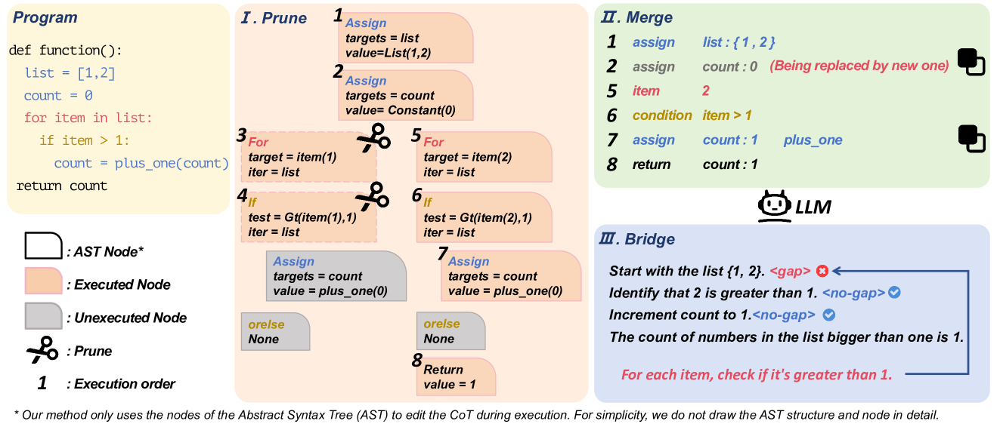
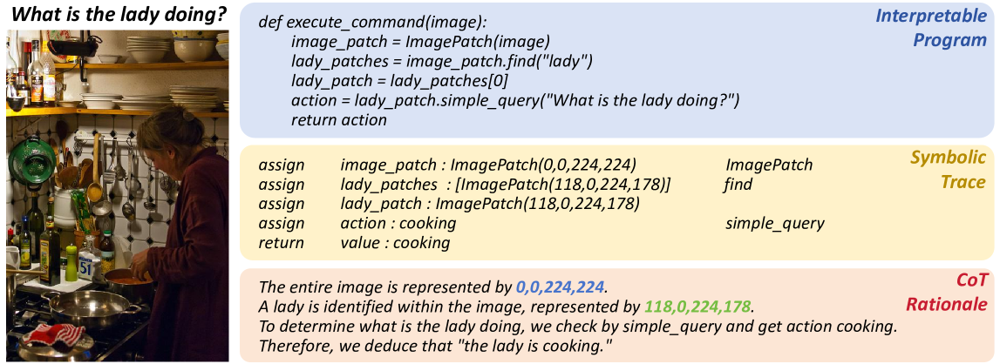
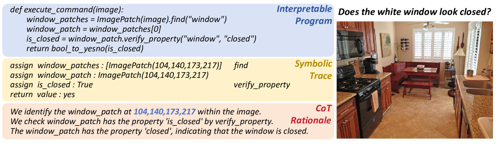
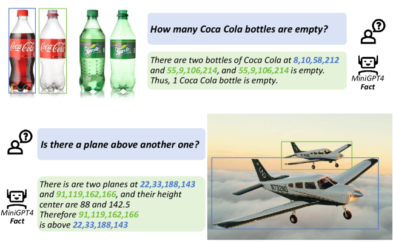
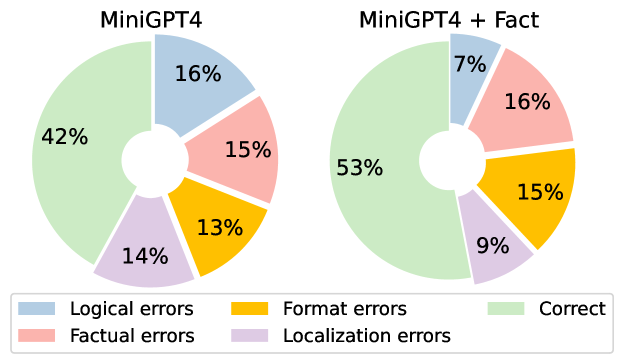

# 事实：以忠实、精炼且易于迁移的理由来指导机器学习大型语言模型（MLLMs）的教学。

发布时间：2024年04月17日

`LLM应用` `计算机视觉` `人工智能`

> Fact :Teaching MLLMs with Faithful, Concise and Transferable Rationales

# 摘要

> 多模态大型语言模型（MLLMs）以其出色的性能在视觉任务处理上展现了高超的理解力。尽管如此，它们的黑箱推理机制依旧神秘莫测，缺乏可解释性，且易产生幻觉。此外，这些模型在执行复杂的组合推理任务时受限，学习进展因此陷入停滞。在本研究中，我们提出了Fact，这是一种创新的范式，用于生成既忠实又简洁且可迁移的多模态理由，以教导MLLMs。该范式采用可验证的视觉编程技术，生成确保准确性和精确度的可执行代码。通过修剪、合并和桥接等一系列操作，理由的简洁性得到提升。我们还筛选出可从编程范式迁移至端到端范式的迁移理由。实验结果表明，我们的方法在不同参数规模的模型上均表现出色，显著提升了模型的组合推理和泛化能力，同时也减少了幻觉现象，因为其在图像与文本之间建立了高度的相关性。

> The remarkable performance of Multimodal Large Language Models (MLLMs) has unequivocally demonstrated their proficient understanding capabilities in handling a wide array of visual tasks. Nevertheless, the opaque nature of their black-box reasoning processes persists as an enigma, rendering them uninterpretable and struggling with hallucination. Their ability to execute intricate compositional reasoning tasks is also constrained, culminating in a stagnation of learning progression for these models. In this work, we introduce Fact, a novel paradigm designed to generate multimodal rationales that are faithful, concise, and transferable for teaching MLLMs. This paradigm utilizes verifiable visual programming to generate executable code guaranteeing faithfulness and precision. Subsequently, through a series of operations including pruning, merging, and bridging, the rationale enhances its conciseness. Furthermore, we filter rationales that can be transferred to end-to-end paradigms from programming paradigms to guarantee transferability. Empirical evidence from experiments demonstrates the superiority of our method across models of varying parameter sizes, significantly enhancing their compositional reasoning and generalization ability. Our approach also reduces hallucinations owing to its high correlation between images and text.

[Arxiv](https://arxiv.org/abs/2404.11129)