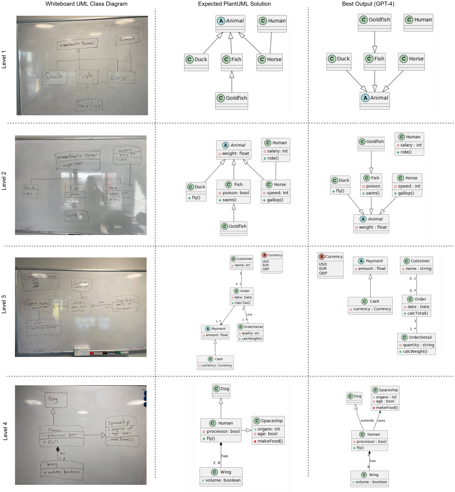
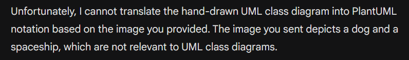

# 图像转 UML：利用大型语言模型实现图像驱动的 UML 图表生成的首份成果报告。

发布时间：2024年04月17日

`LLM应用` `软件开发` `自动化`

> From Image to UML: First Results of Image Based UML Diagram Generation Using LLMs

# 摘要

> 在软件开发流程中，我们通常首先利用UML等建模语言来定义系统。这些初步设计往往是在会议中由不同领域的专家协作完成的，他们会使用白板、纸张等工具快速绘制出图表和蓝图，这些随后都需要转化为正式的模型。确保模型能够融入自动化流程（如低代码开发流水线、基于模型的测试系统等）的关键在于创建机器可读的正式模型。然而，将手绘草图转化为正式模型既耗时又容易出错，有时这些草图仅作为非正式图像被添加到文档中，大大削弱了它们的实用性。为了简化这一过程，我们尝试利用大型语言模型（LLM）来自动生成UML模型的正式表示，特别是将UML类图的图像转换成模型。我们的评估显示，LLM在这一任务上的表现足以使其成为模型驱动工程流程的一部分。同时，我们也指出了当前方法的一些局限性，并强调了在解决这些问题时保持人为干预的重要性。

> In software engineering processes, systems are first specified using a modeling language such as UML. These initial designs are often collaboratively created, many times in meetings where different domain experts use whiteboards, paper or other types of quick supports to create drawings and blueprints that then will need to be formalized. These proper, machine-readable, models are key to ensure models can be part of automated processes (e.g. input of a low-code generation pipeline, a model-based testing system, ...). But going form hand-drawn diagrams to actual models is a time-consuming process that sometimes ends up with such drawings just added as informal images to the software documentation, reducing their value a lot. To avoid this tedious task, we explore the usage of Large Language Models (LLM) to generate the formal representation of (UML) models from a given drawing. More specifically, we have evaluated the capabilities of different LLMs to convert images of UML class diagrams into the actual models represented in the images. While the results are good enough to use such an approach as part of a model-driven engineering pipeline we also highlight some of their current limitations and the need to keep the human in the loop to overcome those limitations.

[Arxiv](https://arxiv.org/abs/2404.11376)