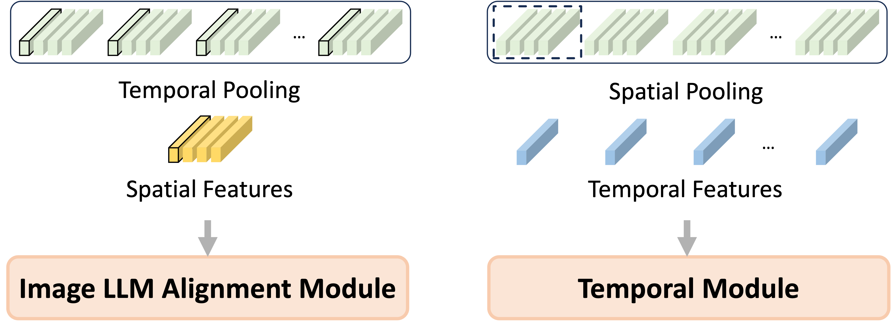

# 在多模态的大型语言模型中，我们如何从图像迈向视频？

发布时间：2024年04月17日

`分类：LLM应用` `计算机视觉`

> From Image to Video, what do we need in multimodal LLMs?

# 摘要

> 多模态大型语言模型（MLLMs）在处理多模态信息方面表现出色，从图像语言模型（Image LLMs）到更为复杂的视频语言模型（Video LLMs）。大量研究证实了它们在跨界模态理解上的卓越表现。近期，有提议将视频基础模型与大型语言模型融合，以构建全面的视频理解系统，突破特定视觉任务的局限。然而，视频LLMs的发展往往忽略了图像LLMs的基石作用，倾向于采用更复杂的结构和多样化的多模态数据进行预训练，这大幅提高了相关方法的成本。为应对这些挑战，本研究提出了一种高效的方法，它巧妙地利用了图像LLMs的先验知识，实现了从图像到视频LLMs的资源节约型转变。我们引入了RED-VILLM，这是一个从图像LLMs到视频LLMs的资源高效开发流程，它在图像LLMs的图像融合模块中采用了时间适应的即插即用结构。这一改进不仅扩展了模型对时间信息的理解能力，还使得视频LLMs在性能上超越了基准水平，且只需最少的指导数据和训练资源。我们的方法展现了在多模态模型中实现成本效益更高、更可扩展进步的可能性，有效地在图像LLMs的基石工作上进行了创新。

> Multimodal Large Language Models (MLLMs) have demonstrated profound capabilities in understanding multimodal information, covering from Image LLMs to the more complex Video LLMs. Numerous studies have illustrated their exceptional cross-modal comprehension. Recently, integrating video foundation models with large language models to build a comprehensive video understanding system has been proposed to overcome the limitations of specific pre-defined vision tasks. However, the current advancements in Video LLMs tend to overlook the foundational contributions of Image LLMs, often opting for more complicated structures and a wide variety of multimodal data for pre-training. This approach significantly increases the costs associated with these methods.In response to these challenges, this work introduces an efficient method that strategically leverages the priors of Image LLMs, facilitating a resource-efficient transition from Image to Video LLMs. We propose RED-VILLM, a Resource-Efficient Development pipeline for Video LLMs from Image LLMs, which utilizes a temporal adaptation plug-and-play structure within the image fusion module of Image LLMs. This adaptation extends their understanding capabilities to include temporal information, enabling the development of Video LLMs that not only surpass baseline performances but also do so with minimal instructional data and training resources. Our approach highlights the potential for a more cost-effective and scalable advancement in multimodal models, effectively building upon the foundational work of Image LLMs.

[Arxiv](https://arxiv.org/abs/2404.11865)