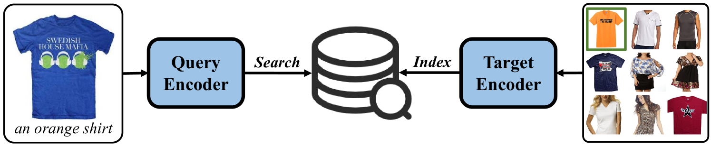
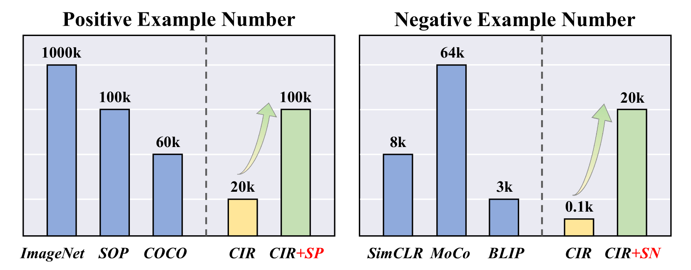
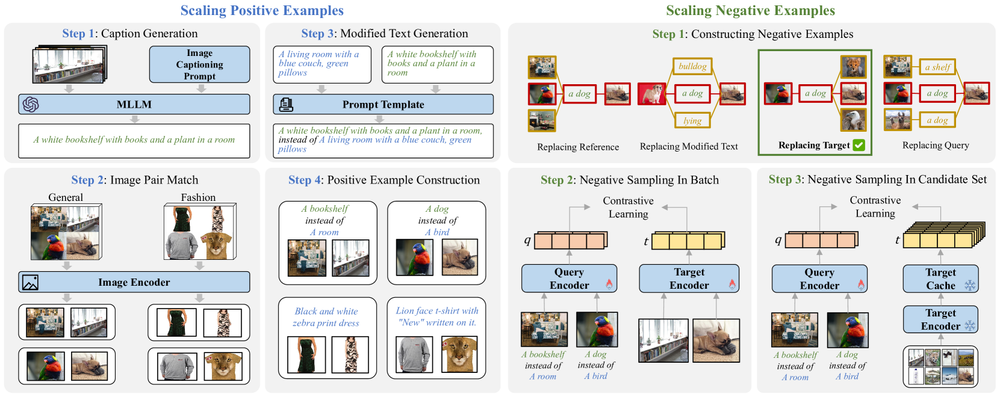
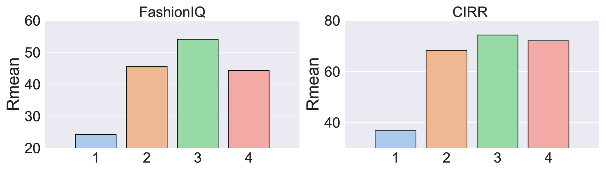
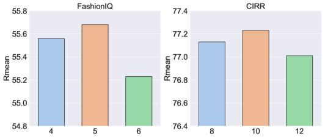
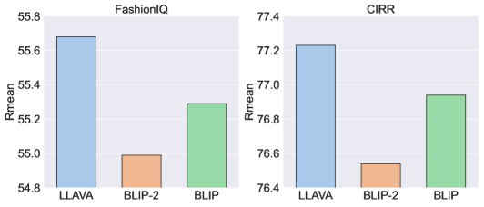
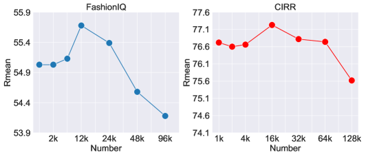
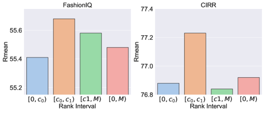
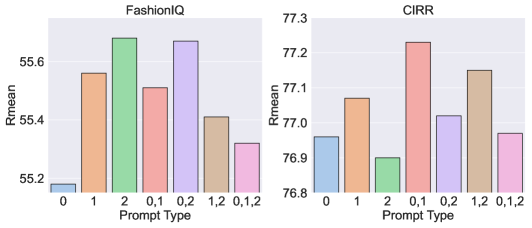
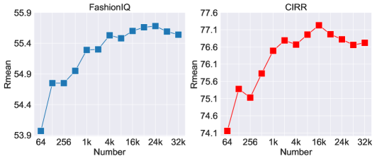

# 通过扩展正负样本的对比学习优化组合图像检索对比学习在提升组合图像检索性能方面展现出巨大潜力。现有技术在平衡正负样本时面临挑战，这限制了检索效果。本研究引入了一种创新的对比学习方法，通过优化正负样本的扩展来克服这一难题。该方法不仅显著提升了检索效率，还增强了模型对多样化图像内容的适应性和泛化力。

发布时间：2024年04月17日

`LLM应用` `图像检索` `人工智能`

> Improving Composed Image Retrieval via Contrastive Learning with Scaling Positives and Negatives

# 摘要

> 组合图像检索（CIR）任务的目的是通过结合参考图像和修改文本的复合查询来检索目标图像。通常采用对比学习作为优化目标，这种方法依赖于充足的正负样本。然而，CIR任务中的三元组标注成本高昂，导致可用的正样本数量受限。此外，现有技术多采用批内负采样，进一步减少了模型可利用的负样本数量。为克服正样本不足的难题，我们提出了一种利用多模态大型语言模型生成数据的方法，以构建CIR任务中的三元组。在微调阶段，我们设计了一个双阶段框架，第二阶段大量引入静态负样本表示，以加速优化表示空间。这两个创新点可以高效叠加，且设计为即插即用模式，能够无缝集成到现有的CIR模型中，无需改变原有架构。广泛的实验和消融分析验证了我们方法的有效性，它不仅在FashionIQ和CIRR数据集上取得了最佳成绩，而且在零样本组合图像检索任务中也表现优异，为资源匮乏的场景下提供了一种新的解决方案。

> The Composed Image Retrieval (CIR) task aims to retrieve target images using a composed query consisting of a reference image and a modified text. Advanced methods often utilize contrastive learning as the optimization objective, which benefits from adequate positive and negative examples. However, the triplet for CIR incurs high manual annotation costs, resulting in limited positive examples. Furthermore, existing methods commonly use in-batch negative sampling, which reduces the negative number available for the model. To address the problem of lack of positives, we propose a data generation method by leveraging a multi-modal large language model to construct triplets for CIR. To introduce more negatives during fine-tuning, we design a two-stage fine-tuning framework for CIR, whose second stage introduces plenty of static representations of negatives to optimize the representation space rapidly. The above two improvements can be effectively stacked and designed to be plug-and-play, easily applied to existing CIR models without changing their original architectures. Extensive experiments and ablation analysis demonstrate that our method effectively scales positives and negatives and achieves state-of-the-art results on both FashionIQ and CIRR datasets. In addition, our methods also perform well in zero-shot composed image retrieval, providing a new CIR solution for the low-resources scenario.

[Arxiv](https://arxiv.org/abs/2404.11317)