# 通过内嵌式和动量优化提升上下文学习状态向量。

发布时间：2024年04月17日

`LLM理论` `机器学习` `人工智能`

> In-Context Learning State Vector with Inner and Momentum Optimization

# 摘要

> 大型语言模型（LLMs）展现了仅凭借少数样本便能实现上下文学习（ICL）的卓越能力。研究表明，ICL所习得的功能可以通过变换器生成的压缩向量来表示，但这些向量的内在机制和优化策略尚未深入探讨。本文旨在填补这一研究空白，通过深入分析这些压缩向量，并将其与梯度下降训练的参数相比较，引入了状态向量的新概念。借鉴模型汤和动量梯度下降的研究，我们提出了内部优化和动量优化方法，用于逐步精细化状态向量以适应测试阶段。此外，我们还模拟了在多示例情境下的状态向量聚合，面对常规ICL难以处理的冗长示例，提出了一种分而治之的聚合策略。我们在Llama-2和GPT-J模型上进行了广泛的实验，包括零样本和少样本场景。实验结果显示，我们的优化策略显著提升了状态向量的性能，并在多项任务上达到了业界领先水平。相关代码已在 https://github.com/HITsz-TMG/ICL-State-Vector 发布。

> Large Language Models (LLMs) have exhibited an impressive ability to perform In-Context Learning (ICL) from only a few examples. Recent works have indicated that the functions learned by ICL can be represented through compressed vectors derived from the transformer. However, the working mechanisms and optimization of these vectors are yet to be thoroughly explored. In this paper, we address this gap by presenting a comprehensive analysis of these compressed vectors, drawing parallels to the parameters trained with gradient descent, and introduce the concept of state vector. Inspired by the works on model soup and momentum-based gradient descent, we propose inner and momentum optimization methods that are applied to refine the state vector progressively as test-time adaptation. Moreover, we simulate state vector aggregation in the multiple example setting, where demonstrations comprising numerous examples are usually too lengthy for regular ICL, and further propose a divide-and-conquer aggregation method to address this challenge. We conduct extensive experiments using Llama-2 and GPT-J in both zero-shot setting and few-shot setting. The experimental results show that our optimization method effectively enhances the state vector and achieves the state-of-the-art performance on diverse tasks. Code is available at https://github.com/HITsz-TMG/ICL-State-Vector

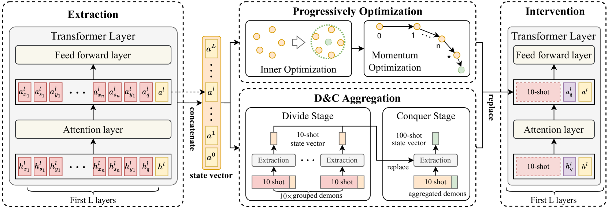

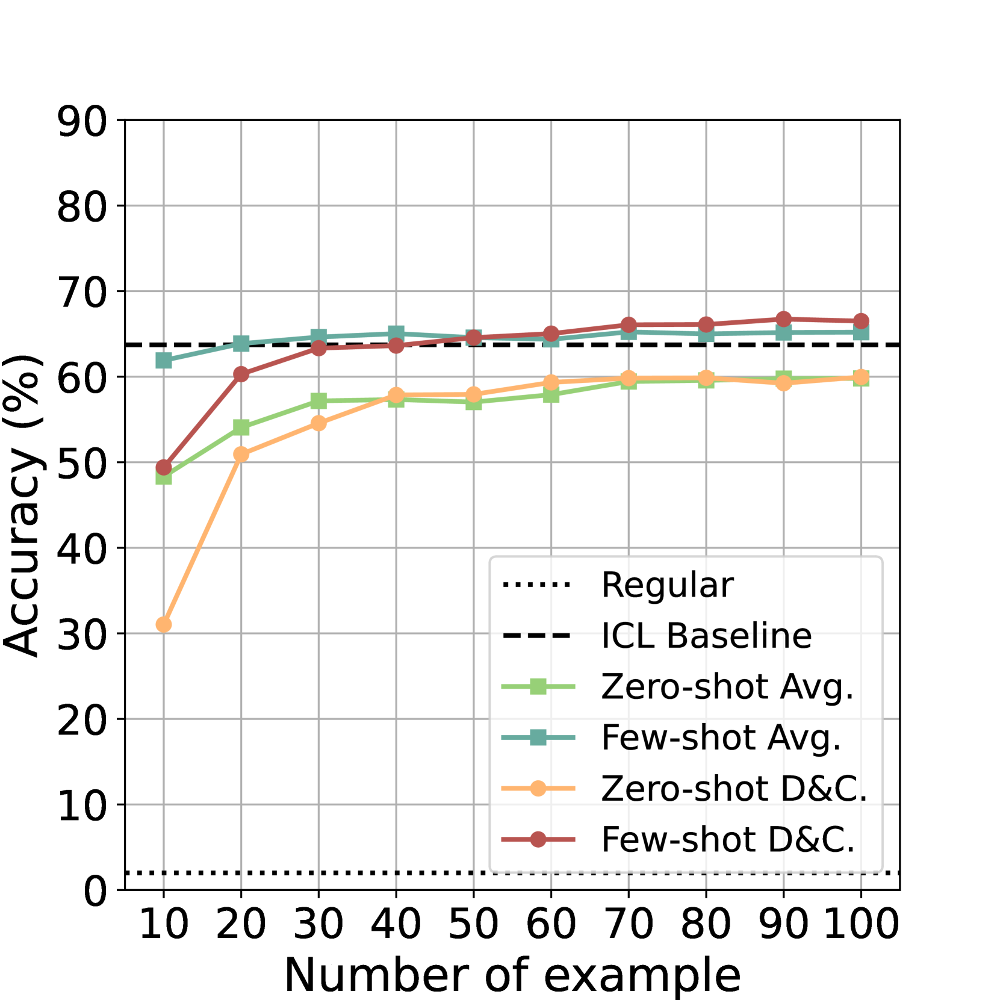

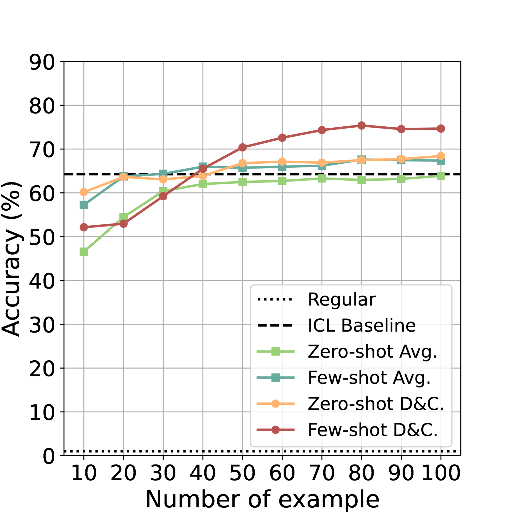

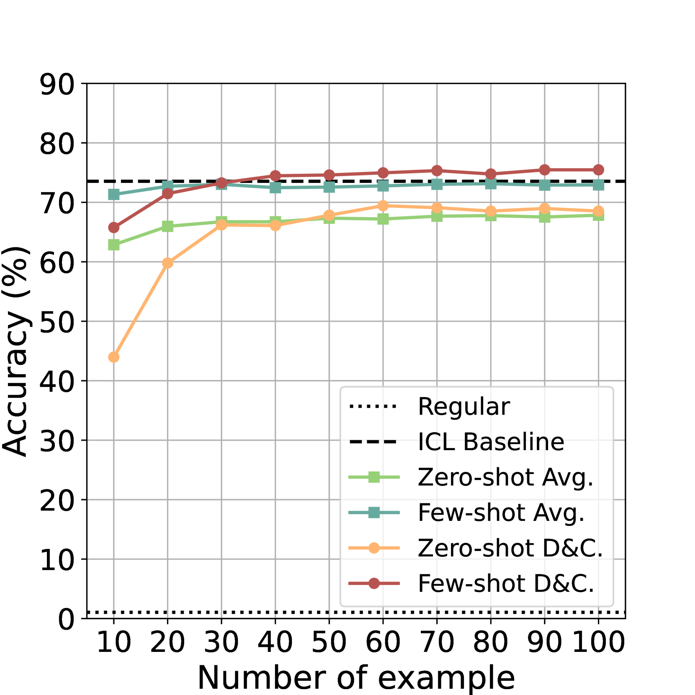

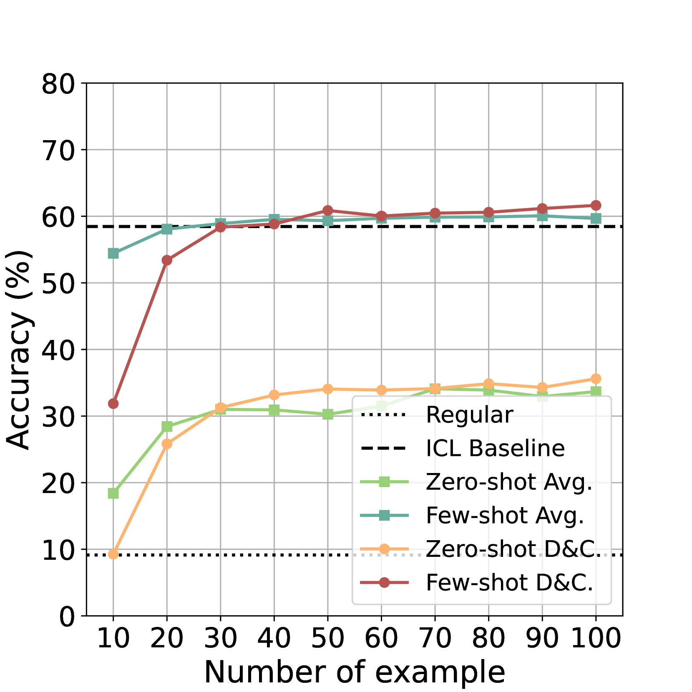

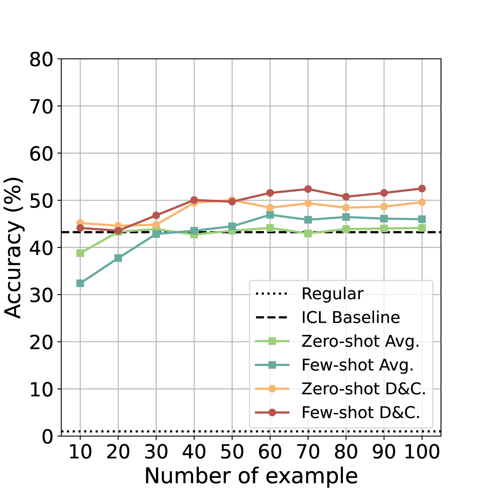

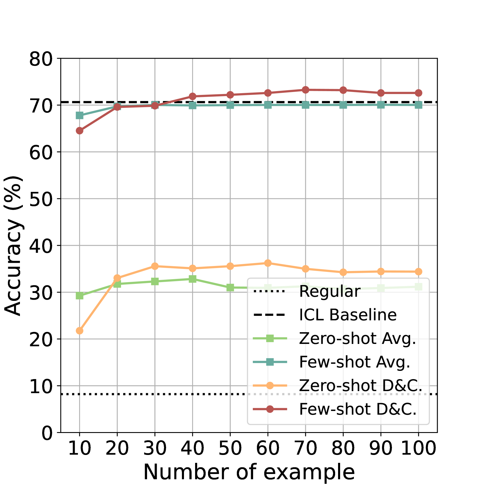

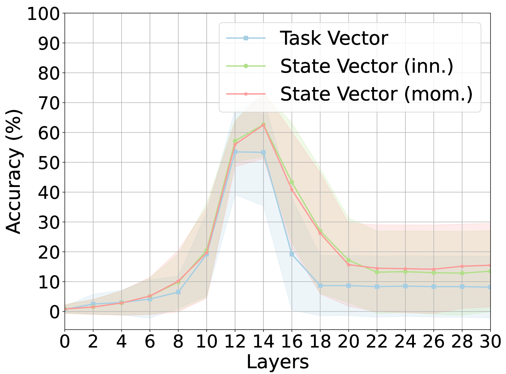

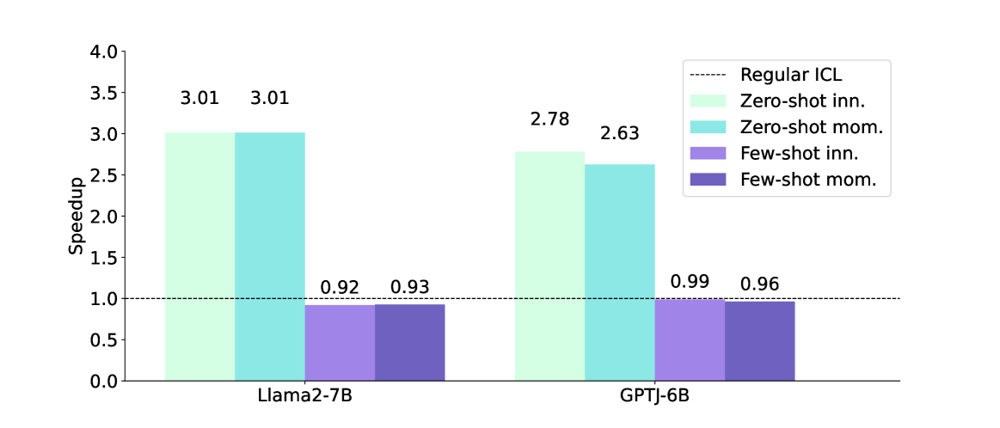

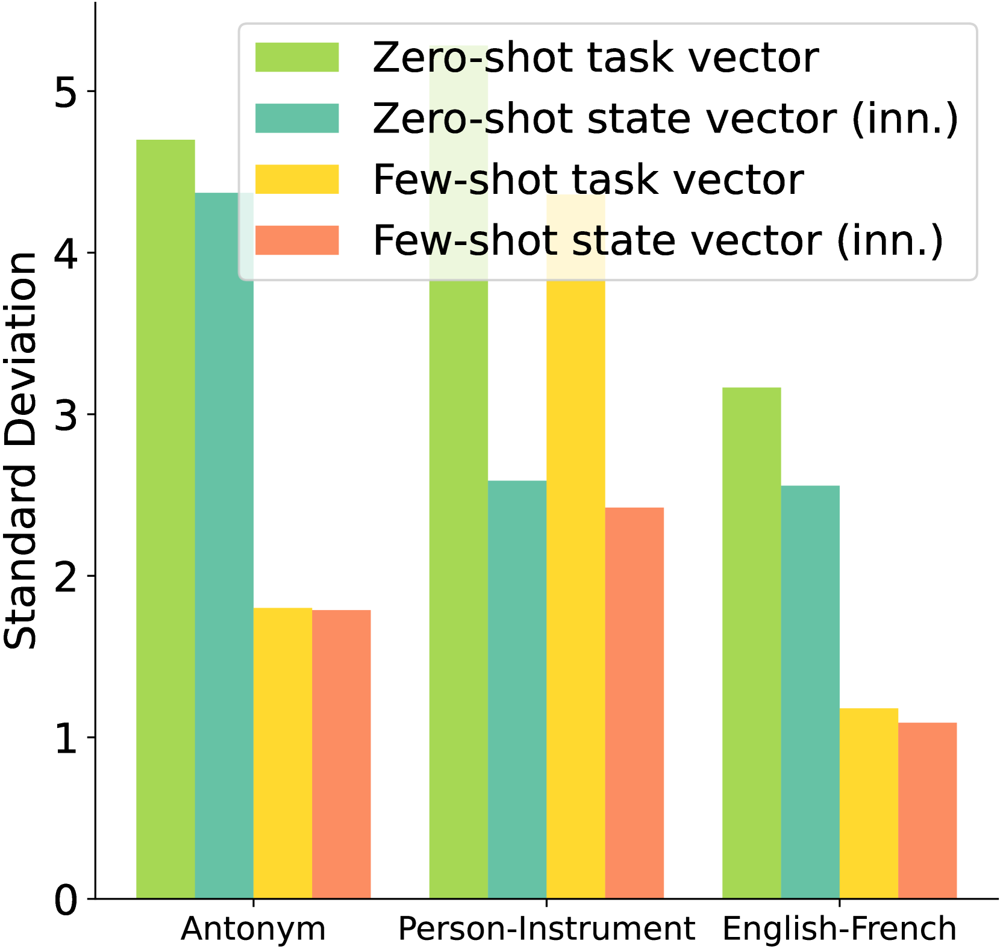

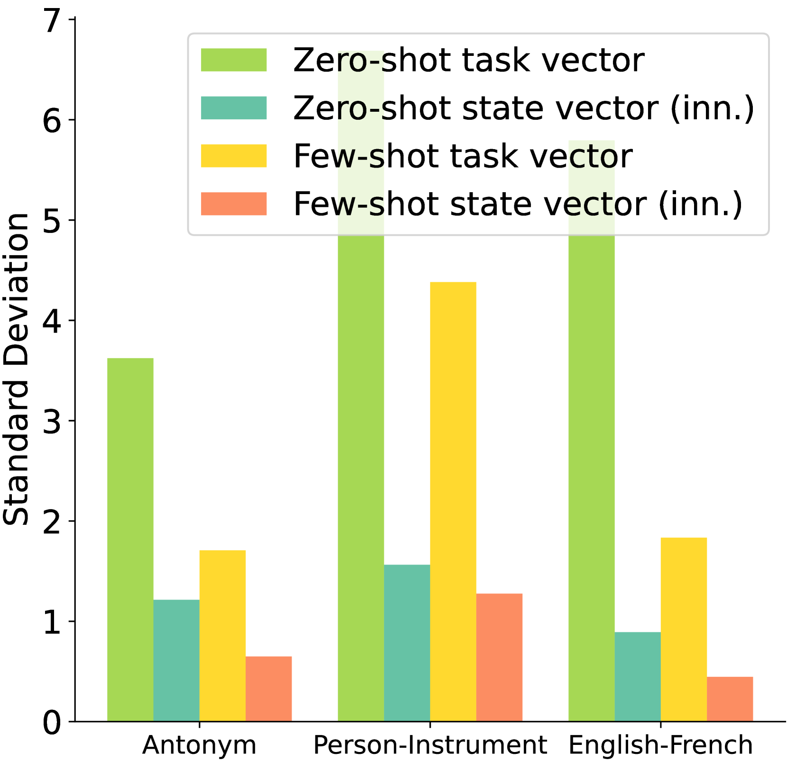

[Arxiv](https://arxiv.org/abs/2404.11225)