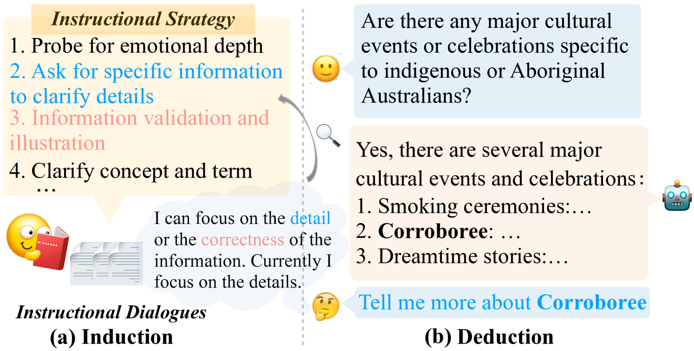
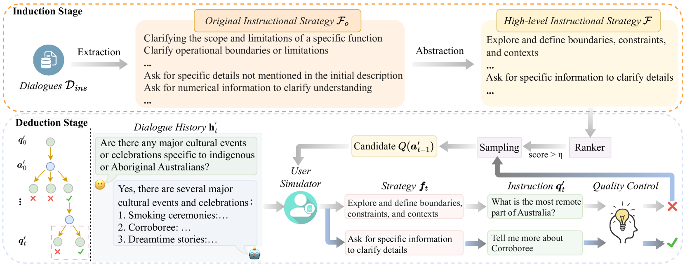
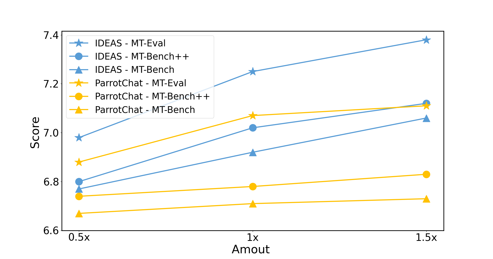

# 在多轮指导性对话中，归纳与演绎策略的巧妙运用

发布时间：2024年04月17日

`分类：LLM应用` `对话系统` `人工智能教育`

> Inductive-Deductive Strategy Reuse for Multi-Turn Instructional Dialogues

# 摘要

> 为了让大型语言模型（LLMs）满足人类的期望，我们需要通过精心设计的对话指令来提升互动的深度。这些指令不仅要多样化，还要深入且具有洞察力。目前的方法尝试从真实的教学对话中提取指令，以此作为学习目标，并微调用户模拟器来生成这些指令。但现有的用户模拟器在隐式处理复杂对话流程和生成高质量指令方面存在挑战。在本文中，我们借鉴人类学习过程中的认知能力，提出了一种新的方法：通过教学策略的重用来显式地模拟复杂的对话流程。我们首先从真实教学对话中提炼出高级策略，然后将这些策略演绎性地应用于新的对话情境，以促进高质量指令的生成。实验结果显示，我们的方法能够为特定的对话历史生成多样化、深入且富有洞察力的指令，并且在构建多轮教学对话方面，我们的方法在下游聊天模型的性能上超越了现有的竞争基线。

> Aligning large language models (LLMs) with human expectations requires high-quality instructional dialogues, which can be achieved by raising diverse, in-depth, and insightful instructions that deepen interactions. Existing methods target instructions from real instruction dialogues as a learning goal and fine-tune a user simulator for posing instructions. However, the user simulator struggles to implicitly model complex dialogue flows and pose high-quality instructions. In this paper, we take inspiration from the cognitive abilities inherent in human learning and propose the explicit modeling of complex dialogue flows through instructional strategy reuse. Specifically, we first induce high-level strategies from various real instruction dialogues. These strategies are applied to new dialogue scenarios deductively, where the instructional strategies facilitate high-quality instructions. Experimental results show that our method can generate diverse, in-depth, and insightful instructions for a given dialogue history. The constructed multi-turn instructional dialogues can outperform competitive baselines on the downstream chat model.

[Arxiv](https://arxiv.org/abs/2404.11095)